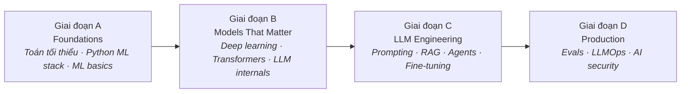

Vài năm trước, muốn đưa machine learning vào sản phẩm cần cả một team nghiên cứu, một dataset gán nhãn, và nhiều tháng training. Hôm nay một engineer với một API key có thể ship tính năng đọc tài liệu, trả lời câu hỏi, gọi tool. Cú dịch chuyển đó sinh ra một vai trò mới — **AI Engineer** — và series này là roadmap để trở thành một AI Engineer giỏi.

## Bạn sẽ học được gì

- Giải thích được AI Engineer làm gì, khác Data Scientist và ML Engineer chỗ nào.
- Gọi tên 4 giai đoạn của lộ trình và mỗi giai đoạn thêm gì.
- Biết học gì — và bỏ qua gì một cách an toàn — trong năm 2026.
- Chọn điểm vào phù hợp trong 14 bài.

**Cần biết trước:** lập trình Python thoải mái. Không cần nền toán hay ML — giai đoạn A phủ đúng phần cần thiết.

## 1. AI Engineer chính xác là gì?

Bối rối là dễ hiểu, vì có tới ba vai trò cùng dính chữ "AI":

| Vai trò | Trọng tâm | Một ngày điển hình |
|---|---|---|
| Data Scientist | Insight & thử nghiệm | Notebook, metrics, kiểm định giả thuyết |
| ML Engineer | Training & serving model cổ điển | Feature pipeline, model registry |
| **AI Engineer** | **Xây sản phẩm trên nền foundation model** | Prompt, RAG, agents, evals, latency & cost |

Đặc điểm nhận dạng của AI Engineer: **bạn thường không train model — bạn engineer mọi thứ xung quanh nó.** Model là một linh kiện mạnh mẽ nhưng hơi thất thường; việc của bạn là biến nó thành sản phẩm đáng tin. Đó là một công việc software engineering, cộng thêm một lớp kỹ năng mới.

Cũng vì thế mà roadmap này xuất phát từ software engineering, không phải từ tấm bằng PhD.

## 2. Bốn giai đoạn

### Giai đoạn A — Foundations (Phần 2–4)

Lý thuyết vừa đủ để suy luận, không phải để đăng paper:

- **Toán tối thiểu** — vector và matrix bằng hình vẽ, probability bằng trực giác, gradient descent là "đi bộ xuống dốc". Bạn cần *ý tưởng*; thư viện lo phần số học.
- **Python ML stack** — numpy, pandas, scikit-learn, và kỷ luật giữ notebook trung thực.
- **ML fundamentals** — "học" nghĩa là gì, đánh giá thế nào, và vì sao overfitting là sai lầm ai cũng mắc ít nhất một lần.

Bỏ qua Giai đoạn A là sai lầm phổ biến nhất của nghề. Thiếu nó, mọi lần model hỏng đều trông như ma thuật — mà ma thuật thì không debug được.

### Giai đoạn B — Models that matter (Phần 5–7)

Bạn hiếm khi tự train những model này, nhưng phải hiểu động cơ:

- **Deep learning, thực dụng** — neural network thực sự tính gì, một training loop tử tế bằng PyTorch.
- **Transformer giải ảo** — attention bằng trực giác, vì sao một kiến trúc nuốt trọn cả ngành.
- **LLM hoạt động thế nào** — token, context window, sampling, và vì sao model ảo giác (spoiler: luôn luôn, by design; engineering là để quản trị nó).

Sau Giai đoạn B, hành vi model hết bí ẩn. Giới hạn context, bug tokenizer kỳ quặc, hiệu ứng temperature — tất cả trở nên dự đoán được.

### Giai đoạn C — LLM engineering (Phần 8–11)

Công việc hằng ngày. Bốn kỹ năng, theo đúng thứ tự nên với tới:

1. **Prompting như một kỷ luật** — prompt có version, có test, structured output. Không phải "prompt magic", mà là engineering.
2. **RAG** — đưa dữ liệu của bạn cho model: embeddings, chunking, vector search, và chất lượng retrieval quyết định thành bại.
3. **Agents** — cho model hành động: tool use, agent loop, guardrails. Và cả: khi nào một workflow thường thắng agent (thường xuyên).
4. **Fine-tuning** — phương án cuối, không phải đầu tiên: khi prompting và RAG thật sự không đủ, mới tới LoRA và bạn bè.

Thứ tự đó quan trọng. Với tới fine-tuning trong khi một prompt tốt hơn là đủ — đó là sai lầm đắt đỏ kinh điển.

### Giai đoạn D — Production (Phần 12–14)

Demo mất một cuối tuần; sản phẩm mất phần còn lại:

- **Evals & observability** — demo chạy được ba lần không phải bằng chứng. Eval dataset, LLM-as-judge, tracing.
- **LLMOps** — latency, cost mỗi request, caching, model routing, quota. Hoá đơn là một thuộc tính của kiến trúc.
- **AI security & senior craft** — prompt injection, data leakage, và thiết kế cả hệ thống một cách có trách nhiệm.

Giai đoạn D là nơi AI Engineer thành senior. Thị trường đầy người build được demo; thị trường trả tiền cho người giữ được nó sống.

## 3. Học gì — và bỏ gì (phiên bản 2026)

**Học:** Python vững + một API stack, embeddings & vector search, structured outputs, công cụ eval, bài toán cost/latency khi serving.

**Bỏ (tạm thời):** train foundation model từ đầu, quản trị GPU cluster, chạy theo mọi model mới ra — fundamentals trong series này chuyển giao được; bảng xếp hạng tuần này thì không.

## 4. Cách dùng series này

- **Theo thứ tự** — giai đoạn sau mặc định bạn đã qua giai đoạn trước.
- **Mỗi giai đoạn ship một thứ** — một classifier (A), một training loop (B), một app RAG rồi một agent (C), một tính năng có eval + monitoring (D).
- **Ngân sách thật thà** — vài đô la API credit là đi được rất xa; bạn không cần GPU để bắt đầu.

## Thực hành (10 phút)

Đặt mốc trước khi vào bài 2:

1. Viết ra, mỗi câu một dòng, câu trả lời hiện tại của bạn cho: "Embedding là gì?", "Token là gì?", "Khi nào fine-tune thay vì prompt?". Trả lời sai cũng không sao — đó là tấm ảnh-trước của bạn.
2. Giữ file đó. Bạn sẽ viết lại 3 câu sau bài 2, 7 và 11 — phần khác biệt chính là tiến bộ của bạn.
3. Chọn một use case AI nhỏ từ công việc hằng ngày (tóm tắt X, phân loại Y). Các phần hands-on của series sẽ dựng nó từng bước.

## Tự kiểm tra

1. Công ty muốn một chatbot trả lời trên tài liệu nội bộ. Đó chủ yếu là việc của Data Scientist hay AI Engineer, vì sao?
2. Giai đoạn nào phủ RAG và agents?
3. Năm 2026, vì sao lộ trình này dành nhiều thời gian cho evals hơn là train model từ đầu?

Xem đáp án

1. AI Engineer — đây là việc xây một *hệ thống* đáng tin quanh model có sẵn (retrieval, prompt, guardrails, evals), không phải train model mới hay chạy thí nghiệm.
2. Giai đoạn C — LLM engineering (Phần 8–11): prompting, RAG, agents, fine-tuning.
3. Vì gần như không ai còn train foundation model từ đầu; kỹ năng khan hiếm là khiến hệ thống dựa trên model trở nên *đáng tin*, và evals là cách đo điều đó. Train từ đầu là ngách chuyên gia.

## Điều cần nhớ

- AI Engineer xây sản phẩm trên nền foundation model — engineer mọi thứ xung quanh một model mình thường không train.
- Lộ trình gồm bốn giai đoạn: foundations, hiểu model, LLM engineering, và production.
- Thứ tự Giai đoạn C là một kỷ luật: prompt → RAG → agents → fine-tune, chỉ leo thang khi mức trước thật sự không đủ.

**Lộ trình liên quan:** [CS Foundations](/vi/series/cs-foundations) cho phần nền software engineering mà roadmap này mặc định; [Lộ trình Data Engineer](/vi/series/de-roadmap) nếu mảng data của AI hút bạn hơn.

*Tiếp theo — Phần 2: Lượng toán tối thiểu thực sự cần.*
