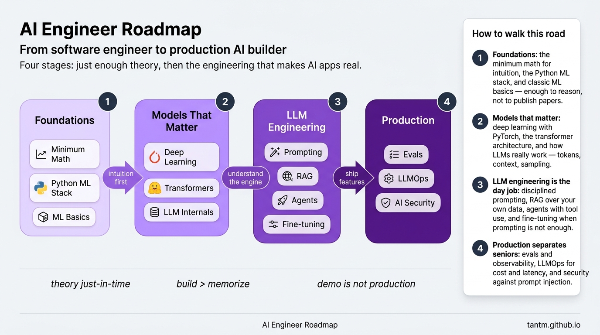
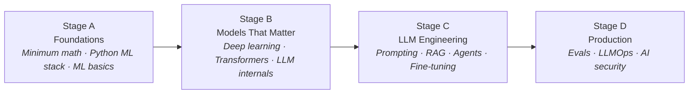
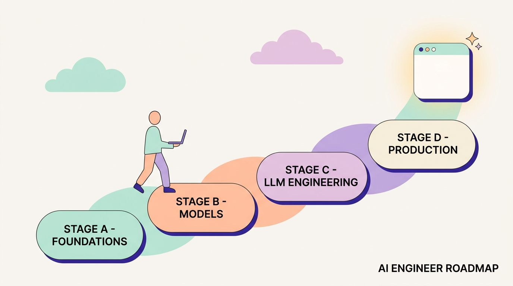

A few years ago, putting machine learning in a product required a research team, a labeled dataset, and months of training. Today a single engineer with an API key can ship a feature that reads documents, answers questions, and calls tools. That shift created a new role — the **AI Engineer** — and this series is a roadmap for becoming a good one.

## What you'll learn

- Explain what an AI Engineer does, and how the role differs from Data Scientist and ML Engineer.
- Name the four stages of this roadmap and what each stage adds.
- Know what to learn — and what to safely skip — in 2026.
- Pick your entry point into the 14 parts.

**Prerequisites:** comfortable programming in Python. No math or ML background needed — Stage A covers exactly what's required.

## 1. What is an AI Engineer, exactly?

The confusion is understandable, because three roles share the word "AI":

| Role | Center of gravity | Typical day |
|---|---|---|
| Data Scientist | Insight & experimentation | Notebooks, metrics, hypothesis tests |
| ML Engineer | Training & serving classic models | Feature pipelines, model registries |
| **AI Engineer** | **Building products on top of foundation models** | Prompts, RAG, agents, evals, latency & cost |

The AI Engineer's defining trait: **you usually don't train the model — you engineer everything around it.** The model is a powerful, slightly unreliable component; your job is to turn it into a dependable product. That is a software engineering job, with a new set of skills layered on top.

That is also why this roadmap starts from software engineering, not from a PhD.

## 2. The four stages

### Stage A — Foundations (Parts 2–4)

Just enough theory to reason, not to publish papers:

- **Minimum math** — vectors and matrices as pictures, probability as intuition, gradient descent as "walking downhill". You need the *ideas*; the libraries do the arithmetic.
- **The Python ML stack** — numpy, pandas, scikit-learn, and the discipline to keep notebooks honest.
- **ML fundamentals** — what "learning" means, how to evaluate it, and why overfitting is the mistake everyone makes at least once.

Skipping Stage A is the most common mistake in the field. Without it, every model failure looks like magic — and you can't debug magic.

### Stage B — Models that matter (Parts 5–7)

You will rarely train these models yourself, but you must understand the engine:

- **Deep learning, practically** — what a neural network actually computes, one honest training loop in PyTorch.
- **Transformers demystified** — attention as intuition, why this one architecture ate the field.
- **How LLMs work** — tokens, context windows, sampling, and why models hallucinate (spoiler: they always do, by design; engineering manages it).

After Stage B, model behavior stops being mysterious. Context limits, weird tokenizer bugs, temperature effects — all become predictable.

### Stage C — LLM engineering (Parts 8–11)

The day job. Four skills, in the order you should reach for them:

1. **Prompting as a discipline** — versioned, tested, structured-output prompts. Not "prompt magic", engineering.
2. **RAG** — giving the model your data: embeddings, chunking, vector search, and the retrieval quality that makes or breaks it.
3. **Agents** — letting the model act: tool use, the agent loop, and guardrails. Also: when a plain workflow beats an agent (often).
4. **Fine-tuning** — the last resort, not the first: when prompting and RAG genuinely aren't enough, LoRA and friends.

That order matters. Reaching for fine-tuning when a better prompt would do is the classic expensive mistake.

### Stage D — Production (Parts 12–14)

The demo took a weekend; the product takes the rest:

- **Evals & observability** — a demo that works three times is not evidence. Eval datasets, LLM-as-judge, tracing.
- **LLMOps** — latency, cost per request, caching, model routing, quota. The bill is a feature of your architecture.
- **AI security & senior craft** — prompt injection, data leakage, and designing the whole system responsibly.

Stage D is where AI Engineers become seniors. The market is full of people who can build a demo; it pays for people who can keep one alive.

## 3. What to learn — and what to skip (2026 edition)

**Learn:** solid Python + one API stack, embeddings & vector search, structured outputs, eval tooling, the cost/latency math of serving.

**Skip (for now):** training foundation models from scratch, GPU cluster management, chasing every new model release — the fundamentals in this series transfer; the leaderboard of the week does not.

## 4. How to use this series

- **In order** — each stage assumes the previous one.
- **Ship something per stage** — a classifier (A), a training loop (B), a RAG app then an agent (C), an eval'd, monitored feature (D).
- **Budget honestly** — a few dollars of API credits go a long way; you do not need a GPU to start.

## Practice (10 minutes)

Set your baseline before Part 2:

1. Write down, in one sentence each, your current answer to: "What is an embedding?", "What is a token?", "When would you fine-tune instead of prompt?". Wrong answers are fine — they are your before-photo.
2. Keep the file. You will rewrite the three sentences after Parts 2, 7, and 11 — the diff is your progress.
3. Pick one small AI use case from your daily work (summarize X, classify Y). The hands-on parts of this series will build it step by step.

## Check yourself

1. A company wants a chatbot over its internal documents. Is that primarily a Data Scientist task or an AI Engineer task, and why?
2. Which stage covers RAG and agents?
3. In 2026, why does this roadmap spend more time on evals than on training models from scratch?

See answers

1. AI Engineer — it's about building a reliable *system* around an existing model (retrieval, prompts, guardrails, evals), not about training a new model or running experiments.
2. Stage C — LLM engineering (Parts 8–11): prompting, RAG, agents, fine-tuning.
3. Because almost nobody trains foundation models from scratch anymore; the scarce skill is making model-based systems *trustworthy*, and evals are how you measure that. Training from scratch is a specialist niche.

## Key takeaways

- An AI Engineer builds products on top of foundation models — engineering everything around a model they usually didn't train.
- The path has four stages: foundations, understanding the models, LLM engineering, and production.
- The order of Stage C is a discipline: prompt → RAG → agents → fine-tune, escalating only when the previous level genuinely falls short.

**Related paths:** [CS Foundations](/series/cs-foundations) for the software-engineering base this roadmap assumes; the [Data Engineer Roadmap](/series/de-roadmap) if the data side of AI pulls you harder.

*Next up — Part 2: The Minimum Math That Actually Matters.*
