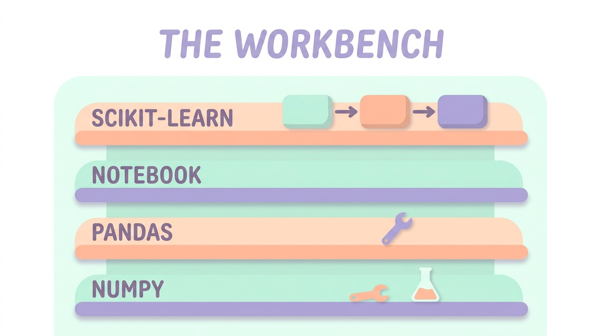

Part 2 gave you four math intuitions. This part installs the workbench where they become executable: numpy, pandas, the notebook, and scikit-learn. The goal is not tool tourism — it's the *stack discipline* that Part 4's ML fundamentals will assume, and that separates "ran a tutorial once" from "I trust my own results."

## What you'll learn

- Think in arrays with numpy: shapes, broadcasting, masks — vectorization instead of loops.
- Run the fixed pandas inspection ritual that catches dirty data before it reaches a model.
- Keep notebooks honest with three rules, so results are reproducible.
- Build a scikit-learn pipeline that makes leakage — ML's most common silent bug — structurally hard.

**Prerequisites:** Part 2 (the four math intuitions — especially "points in space"). Python basics; S02-P03's border-typing habit helps but isn't required.

## 1. numpy: stop writing loops over numbers

Part 2 said a neural network is stacked matrix machines. numpy is where you *feel* that:

```python
import numpy as np

emb = np.random.rand(10_000, 768)     # 10k embeddings (Part 2's points-in-space)
q   = np.random.rand(768)

# cosine similarity to ALL 10k at once — no Python loop:
sims = emb @ q / (np.linalg.norm(emb, axis=1) * np.linalg.norm(q))
top5 = np.argsort(sims)[-5:][::-1]    # retrieval, in four lines (hello, RAG)
```

The mental shift is **vectorization**: describe the operation on the *whole array* and let compiled C do the loop (CS Foundations P2 explained why that's ~100× faster). The three ideas that cover daily use: **shapes** (`(10000, 768) @ (768,) → (10000,)` — read shapes like sentences and most bugs vanish), **broadcasting** (`emb - emb.mean(axis=0)` stretches the small array over the big one), and **boolean masks** (`sims[sims > 0.8]`). When you meet PyTorch in Part 5, it will be numpy with gradients and a GPU — this layer transfers wholesale.

## 2. pandas: the janitor before the science

Every ML dataset arrives dirty, and pandas is where you look it in the eye. The workflow that matters is a fixed opening ritual, not an API tour:

```python
df = pd.read_csv("churn.csv")
df.shape, df.dtypes                 # what am I holding?
df.isna().sum()                     # where are the holes?
df["plan"].value_counts(dropna=False)   # what's actually in this column?
df.describe()                       # ranges sane? (age = -1? amount = 9e9?)
```

Ten minutes of this ritual per dataset prevents the classic ML embarrassments: the `object` column that's secretly numbers-with-commas, the "boolean" with three values, the duplicate customers that will leak across your train/test split (S02-P03's border-typing habit applies here unchanged). One honest heuristic from the DE world: **fix data problems at this layer, not inside the model** — a model trained around dirty data institutionalizes the dirt.

## 3. The notebook, with discipline

Notebooks are ML's superpower and its crime scene. The superpower: see a distribution *now*, iterate in seconds. The crime: hidden state — cells run out of order until the notebook lies about what it computes. Three rules keep the power without the lies:

1. **"Restart & Run All" must pass before you believe anything** — it's the notebook's equivalent of the re-run test from S02-P03.
2. **Config and seeds in the first cell** (`SEED = 42`, paths, params) — reproducibility is a Part 2 expectation-over-trials thing, not a luxury.
3. **Graduate stable code out**: when a cleaning function survives three sessions, it moves to a `.py` module the notebook imports. Notebooks are for *exploring*; modules are for *keeping*.

## 4. scikit-learn: the API that teaches ML

scikit-learn earns its place not by having every model, but by encoding ML's workflow into one repeating grammar — `fit` / `predict` / `transform` — and one object that quietly prevents the field's most common mistake:

```python
from sklearn.model_selection import train_test_split
from sklearn.pipeline import make_pipeline
from sklearn.preprocessing import StandardScaler
from sklearn.linear_model import LogisticRegression

X_tr, X_te, y_tr, y_te = train_test_split(X, y, test_size=0.2,
                                          random_state=42, stratify=y)

pipe = make_pipeline(StandardScaler(), LogisticRegression(max_iter=1000))
pipe.fit(X_tr, y_tr)                  # scaler LEARNS mean/std on train ONLY
print(pipe.score(X_te, y_te))
```

The pipeline object is the whole lesson. Scale *before* splitting, and the scaler has seen the test set's statistics — your accuracy is now a small lie (**leakage**, Part 2's silent killer, in its most common costume). The pipeline makes the right order structural: every preprocessing step fits on train only, applies to test blindly. This idea — *the model artifact includes its preprocessing* — comes back at production scale in S07-P11's feature platform, where the same leakage rule wears the name "point-in-time correctness."

Two split rules that will save you real pain: **stratify** on the label when classes are imbalanced (fraud at 2% needs both splits to contain fraud), and when data is temporal, **split by time, never randomly** — predicting last month from next month's rows is a time machine, not a model.

## Practice (45 minutes — installs the whole stack)

Take any public tabular dataset (a churn or titanic-style CSV):

1. **Ritual:** run the four pandas inspection lines from section 2. Write down two real problems you find (there are always at least two).
2. **Janitor:** fix one of them properly at the pandas layer — parse the numbers-with-commas, collapse the three-valued boolean, drop the duplicates.
3. **Pipeline:** build the section 4 pipeline, get a test score, note it.
4. **Break it on purpose:** move the scaling *before* the split (fit the scaler on all data), rerun, and compare scores. Then remove `stratify` and watch class counts in both splits.
5. **Honesty check:** Restart & Run All from the top — same numbers?

Expected results: step 4's leaked version scores slightly *better* — that's the lie, seen with your own eyes: the model borrowed test-set statistics. Step 5 passing means your numbers are real. Feeling the leakage move the number teaches more than ten articles — including this one.

## Check yourself

1. Why is `emb @ q` on a `(10000, 768)` matrix hundreds of times faster than a Python loop doing the same math?
2. Your pipeline scores 0.94 with scaling done before the split, and 0.91 with a proper pipeline. Which number do you report, and what happened?
3. You're predicting next month's churn from a year of user history. How do you split — and why is `train_test_split`'s default wrong here?

<details><summary>See answers</summary>

1. Vectorization: numpy dispatches the whole operation to compiled C (with SIMD and cache-friendly memory layout) instead of interpreting a Python bytecode loop per element — the CS Foundations P2 argument, applied.
2. Report 0.91. The 0.94 leaked: the scaler fit on all rows, so test-set statistics (mean/std) informed training-time preprocessing. The pipeline's number is the honest estimate of performance on unseen data.
3. Split by time: train on months 1–10, validate on 11, test on 12. A random split scatters future rows into training — the model "predicts" the past using the future, and the score won't survive contact with production.

</details>

## Key takeaways

- numpy is vectorized thinking: shapes, broadcasting, masks — and it transfers wholesale to PyTorch later.
- pandas is the janitor layer: a fixed inspection ritual per dataset, and dirt fixed *there*, not inside the model.
- Notebooks need three rules — Restart & Run All, seeds up front, graduate stable code to modules.
- scikit-learn's pipeline makes leakage structurally hard: preprocessing fits on train only; stratify imbalanced labels; split temporal data by time.

*Next up — Part 4: ML Fundamentals: Learn, Evaluate, Don't Overfit.*
