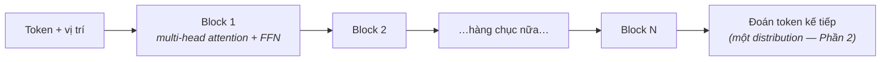

Mọi model bạn chạm vào từ đây tới cuối roadmap — mọi model chat, model embedding, trợ lý code — đều là transformer. Bạn sẽ không bao giờ tự cài một cái ở chỗ làm; bạn sẽ *suy luận về* chúng hằng ngày: vì sao context window tốn tiền, vì sao model xử lý tài liệu dài một cách kỳ lạ, fine-tuning thật sự thay đổi cái gì. Lối suy luận đó cần một ý tưởng được hiểu cho tử tế: **attention**.

## Bài toán: nghĩa phụ thuộc vào những từ ở xa

Xét câu: *"Chiếc cúp không vừa cái vali vì **nó** quá to."* "Nó" là gì? Não bạn lập tức nối "nó" với "chiếc cúp" — hai từ nằm cách xa nhau. Các model tiền-transformer xử lý văn bản như những cỗ máy tuần tự của Phần 5: từng từ một, ép lịch sử vào một bộ nhớ cỡ cố định cứ xa dần là nhoè dần. Các kết nối tầm xa — đúng thứ ngôn ngữ vận hành trên đó — thoái hoá thành nhiễu.

Câu trả lời của attention gần như xấc xược: **thôi nén lịch sử; cho mỗi từ nhìn thẳng vào mọi từ khác và tự quyết cái gì quan trọng.**

## Attention: phép ví von tra thư viện

Với mỗi từ (token), model tính ba vector — các máy-matrix của Phần 2 sản xuất chúng:

- **Query** — "tôi đang tìm gì?" (từ "nó" hỏi: *chủ thể đang được bàn là ai?*)
- **Key** — "tôi có thể được tìm thấy bằng gì?" (nhãn thẻ mục lục của mỗi từ)
- **Value** — "nếu được chọn, tôi đóng góp gì?" (nội dung thật của từ)

Cơ chế: so Query của một token với Key của mọi token (một phép dot product — anh em họ của cosine similarity Phần 2), softmax các điểm số thành bộ trọng số có tổng bằng 1 (một distribution xác suất — lại Phần 2), rồi lấy **trung bình có trọng số của các Value**. Với "nó", trọng số rơi vào "chiếc cúp" cao vót, vào "cái vali" thấp tịt — và vector đại diện cho "nó" giờ *chứa phần lớn chất-cúp*. Nghĩa của mỗi token trở thành một hỗn hợp có trọng số theo ngữ cảnh của cả câu, tính song song.

Attention là thế. Mọi thứ còn lại là engineering vây quanh vòng lặp này.

## Multi-head, xếp tầng: nhiều quan hệ, tinh luyện nhiều lần

Một lượt attention bắt được một *loại* quan hệ. Ngôn ngữ thật có nhiều loại — ngữ pháp, tham chiếu, giọng điệu, chủ đề. Nên transformer chạy nhiều **head** song song (mỗi head có bộ máy Q/K/V học riêng, tự do chuyên môn hoá) và xếp hàng chục **layer**, mỗi layer tinh luyện các hỗn hợp của layer trước:

Hai chú thích trả lời các câu hỏi thật về sau: token mang **thông tin vị trí** (bản thân attention mù thứ tự — "chó cắn người" cần vị trí để khác "người cắn chó"), và các LLM chat là **decoder-only**: mỗi token chỉ được attend các token *đứng trước* nó, vì trò chơi huấn luyện là "đoán token kế tiếp" và nhìn trộm là ăn gian. Model kiểu encoder (embedding, retrieval của Phần 9) attend cả hai chiều — cùng linh kiện, khác cách đi dây.

## Vì sao kiến trúc này nuốt trọn cả ngành

Không phải vì attention "thông minh hơn" — mà vì nó **song song**. Model tuần tự phải xử lý token 2 sau token 1; transformer tính attention của mọi token cùng lúc — đúng cái hình dạng nhân-matrix-khổng-lồ mà GPU nghiến ngấu (Phần 5). Đột nhiên việc training scale theo phần cứng, và một quy luật thực nghiệm lộ ra: **thêm tham số + thêm dữ liệu + thêm compute = model tốt lên một cách dự đoán được** (scaling laws). Transformer thắng vì nó là kiến trúc đầu tiên cho phép bạn *mua* năng lực bằng compute — và thập kỷ AI vừa qua là tờ đơn đặt hàng đó, lặp đi lặp lại.

## Pretraining: gã khổng lồ đến từ đâu

Phần 5 nói "thích nghi gã khổng lồ pretrained, đừng bao giờ bắt đầu từ số không." Đây là thứ gã khổng lồ đã học và học thế nào: **đoán token kế tiếp trên một lát cắt khổng lồ của văn bản**. Không nhãn, không người gán — chính văn bản là sự giám sát (cú mánh "tự-giám-sát" đã mở khoá quy mô). Để đoán token kế tiếp *cho giỏi*, model bị ép nội tâm hoá ngữ pháp, sự kiện, văn phong, các hoa văn suy luận — không phải như mục tiêu, mà như *tác dụng phụ* của trò chơi dự đoán.

Kết quả là một **base model**: một cỗ autocomplete tráng lệ, không phải một trợ lý (hỏi nó một câu và nó có thể tiếp tục bằng *thêm các câu hỏi khác* — tài liệu trên đời vốn thế). Hành vi trợ lý đến từ pha thứ hai nhỏ hơn nhiều — instruction tuning và huấn luyện theo sở thích — lại đúng nước đi thích-nghi-gã-khổng-lồ, thứ mà Phần 8 và 11 sẽ biến thành hộp đồ nghề *của bạn*.

## Món này mua được gì trong thực tế

Những suy luận giờ bạn tự làm được từ nguyên lý:

- **Context window tốn theo bậc hai** — mỗi token attend mọi token: context gấp 10 ≈ khối lượng attention gấp 100 (bảng growth của Phần 4, phiên bản production). Đây là *lý do* long context được định giá và engineering vây quanh, và "cứ dán hết vào" có một tờ hoá đơn (Phần 7 nối tiếp).
- **Serving có cache** — sinh từng token mà tính lại attention trên cả prefix mỗi lần thì chết; **KV cache** lưu Key/Value của mọi token cũ để token mới chỉ tính cú tra của riêng nó. Khi Phần 13 bàn chi phí serving và "sao token đầu chậm mà phần sau stream nhanh," đây là cơ chế.
- **"Nó đã đọc cả tài liệu của tôi" có chữ nhỏ** — trọng số attention là một *ngân sách* chú ý hữu hạn; model attend không đều trên context dài một cách rất thật. Retrieval (Phần 9) tồn tại một phần vì *chọn lọc* văn bản liên quan thắng *hy vọng* attention tự tìm ra.

## Điều cần nhớ

- Attention = mỗi token query mọi token khác (Q/K/V) và trở thành hỗn hợp có trọng số của thứ quan trọng — nghĩa tầm xa mà không cần bộ nhớ nén.
- Multi-head + xếp tầng bắt nhiều loại quan hệ, tinh luyện nhiều lần; model decoder-only chỉ attend về trước, vì trò chơi là đoán token kế tiếp.
- Transformer thắng nhờ song song: năng lực trở thành thứ mua được bằng compute (scaling laws), và tác dụng phụ của pretraining — sự hiểu — chính là gã khổng lồ bạn thích nghi.
- Chi phí attention bậc hai và KV cache giải thích giá context, hành vi streaming, và vì sao retrieval thắng hy vọng.

*Tiếp theo — Phần 7: LLM hoạt động thế nào: token, context, sampling.*
