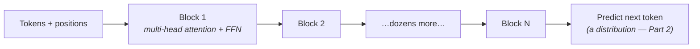

Every model you'll touch from here to the end of this roadmap — every chat model, embedding model, code assistant — is a transformer. You will never implement one at work; you will *reason about* them daily: why context windows cost money, why models handle long documents strangely, what fine-tuning actually changes. That reasoning needs one idea understood properly: **attention**.

## The problem: meaning depends on far-away words

Take: *"The trophy didn't fit in the suitcase because **it** was too big."* What does "it" mean? Your brain instantly connects "it" to "trophy" — words that sit far apart. Pre-transformer models processed text like Part 5's sequential machines: word by word, squeezing history into a fixed-size memory that blurred with distance. Long-range connections — exactly what language runs on — degraded into noise.

Attention's answer is almost cheeky: **stop compressing history; let every word look directly at every other word and decide what matters.**

## Attention: the library lookup metaphor

For each word (token), the model computes three vectors — Part 2's matrix machines produce them:

- **Query** — "what am I looking for?" (the word "it" asks: *who's the thing being discussed?*)
- **Key** — "what can I be found by?" (each word's index-card label)
- **Value** — "what do I contribute if selected?" (the word's actual content)

The mechanic: compare a token's Query with every token's Key (a dot product — Part 2's cosine-similarity cousin), softmax the scores into weights that sum to 1 (a probability distribution — Part 2 again), then take the **weighted average of the Values**. For "it", the weight on "trophy" comes out high, on "suitcase" low — and the vector representing "it" now *contains mostly trophy-ness*. Every token's meaning becomes a context-weighted blend of the whole sentence, computed in parallel.

That's attention. Everything else is engineering around this loop.

## Multi-head, stacked: many relationships, refined repeatedly

One attention pass captures one *kind* of relationship. Real language has many — grammar, reference, tone, topic. So the transformer runs many **heads** in parallel (each with its own learned Q/K/V machines, each free to specialize) and stacks dozens of **layers**, each refining the previous layer's blends:

Two footnotes that answer real questions later: tokens carry **position information** (attention itself is order-blind — "dog bites man" needs positions to differ from "man bites dog"), and chat LLMs are **decoder-only**: each token may attend only to tokens *before* it, because the training game is "predict the next token" and peeking would be cheating. Encoder-style models (embeddings, Part 9's retrieval) attend both ways — same parts, different wiring.

## Why this architecture ate the field

Not because attention is "smarter" — because it is **parallel**. Sequential models had to process token 2 after token 1; the transformer computes all tokens' attention simultaneously — which is exactly the giant-matrix-multiplication shape GPUs devour (Part 5). Suddenly training scaled with hardware, and an empirical pattern emerged: **more parameters + more data + more compute = predictably better models** (the scaling laws). The transformer won because it was the first architecture that let you *buy* capability with compute — and the last decade of AI is that purchase order, repeated.

## Pretraining: where the giant comes from

Part 5 said "adapt a pretrained giant, never start from zero." Here's what the giant learned and how: **next-token prediction over a huge slice of text**. No labels, no annotators — the text itself is the supervision (the "self-supervised" trick that unlocked scale). To predict the next token *well*, the model is forced to internalize grammar, facts, styles, reasoning patterns — not as a goal, but as a *side effect* of the prediction game.

The result is a **base model**: a magnificent autocomplete, not an assistant (ask it a question and it may continue with *more questions* — that's what documents do). The assistant behavior comes from a comparatively tiny second phase — instruction tuning and preference training — the same adapt-the-giant move again, which Parts 8 and 11 will treat as *your* toolbox.

## What this buys you in practice

Reasoning you can now do from first principles:

- **Context windows cost quadratically** — every token attends to every token: 10× the context ≈ 100× the attention work (Part 4's growth table, in production). This is *why* long context is priced and engineered around, and why "just paste everything in" has a bill (Part 7 continues this).
- **Serving is cached** — generating token-by-token would recompute attention over the whole prefix each time; the **KV cache** stores every token's Keys/Values so each new token only computes its own lookup. When Part 13 discusses serving costs and "why is the first token slow but the rest stream fast," this is the mechanism.
- **"It read my whole document" has fine print** — attention weights are finite attention *budget*; models genuinely attend unevenly across long contexts. Retrieval (Part 9) exists partly because *selecting* relevant text beats *hoping* attention finds it.

## Key takeaways

- Attention = every token queries every other token (Q/K/V) and becomes a weighted blend of what matters — long-range meaning without compressed memory.
- Multi-head + stacked layers capture many relationship types, refined repeatedly; decoder-only models attend backwards only, because the game is next-token prediction.
- The transformer won on parallelism: capability became purchasable with compute (scaling laws), and pretraining's side effect — understanding — is the giant you adapt.
- Quadratic attention cost and the KV cache explain context pricing, streaming behavior, and why retrieval beats hoping.

*Next up — Part 7: How LLMs Work: Tokens, Context, Sampling.*
