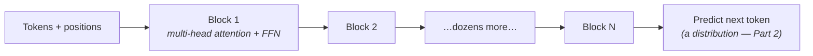

Every model you'll touch from here to the end of this roadmap — every chat model, embedding model, code assistant — is a transformer. You will never implement one at work; you will *reason about* them daily: why context windows cost money, why models handle long documents strangely, what fine-tuning actually changes. That reasoning needs one idea understood properly: **attention**.

## What you'll learn

- Explain attention as a lookup: what the query, key, and value each do.
- Say why stacking many heads and many layers produces understanding rather than one big blend.
- Derive the practical consequences yourself: quadratic context cost, the KV cache, uneven long-context attention.
- Read a model card's architecture line and know what it implies for your bill.

**Prerequisites:** Part 2 (vectors, matrices) and Part 4's growth table for the quadratic-cost argument.

## 1. The problem: meaning depends on far-away words

Take: *"The trophy didn't fit in the suitcase because **it** was too big."* What does "it" mean? Your brain instantly connects "it" to "trophy" — words that sit far apart. Pre-transformer models processed text like Part 5's sequential machines: word by word, squeezing history into a fixed-size memory that blurred with distance. Long-range connections — exactly what language runs on — degraded into noise.

Attention's answer is almost cheeky: **stop compressing history; let every word look directly at every other word and decide what matters.**

## 2. Attention: the library lookup metaphor

For each word (token), the model computes three vectors — Part 2's matrix machines produce them:

- **Query** — "what am I looking for?" (the word "it" asks: *who's the thing being discussed?*)
- **Key** — "what can I be found by?" (each word's index-card label)
- **Value** — "what do I contribute if selected?" (the word's actual content)

The mechanic: compare a token's Query with every token's Key (a dot product — Part 2's cosine-similarity cousin), softmax the scores into weights that sum to 1 (a probability distribution — Part 2 again), then take the **weighted average of the Values**. For "it", the weight on "trophy" comes out high, on "suitcase" low — and the vector representing "it" now *contains mostly trophy-ness*. Every token's meaning becomes a context-weighted blend of the whole sentence, computed in parallel.

That's attention. Everything else is engineering around this loop.

## 3. Multi-head, stacked: many relationships, refined repeatedly

One attention pass captures one *kind* of relationship. Real language has many — grammar, reference, tone, topic. So the transformer runs many **heads** in parallel (each with its own learned Q/K/V machines, each free to specialize) and stacks dozens of **layers**, each refining the previous layer's blends:



Two footnotes that answer real questions later: tokens carry **position information** (attention itself is order-blind — "dog bites man" needs positions to differ from "man bites dog"), and chat LLMs are **decoder-only**: each token may attend only to tokens *before* it, because the training game is "predict the next token" and peeking would be cheating. Encoder-style models (embeddings, Part 9's retrieval) attend both ways — same parts, different wiring.

## 4. Why this architecture ate the field

Not because attention is "smarter" — because it is **parallel**. Sequential models had to process token 2 after token 1; the transformer computes all tokens' attention simultaneously — which is exactly the giant-matrix-multiplication shape GPUs devour (Part 5). Suddenly training scaled with hardware, and an empirical pattern emerged: **more parameters + more data + more compute = predictably better models** (the scaling laws). The transformer won because it was the first architecture that let you *buy* capability with compute — and the last decade of AI is that purchase order, repeated.

## 5. Pretraining: where the giant comes from

Part 5 said "adapt a pretrained giant, never start from zero." Here's what the giant learned and how: **next-token prediction over a huge slice of text**. No labels, no annotators — the text itself is the supervision (the "self-supervised" trick that unlocked scale). To predict the next token *well*, the model is forced to internalize grammar, facts, styles, reasoning patterns — not as a goal, but as a *side effect* of the prediction game.

The result is a **base model**: a magnificent autocomplete, not an assistant (ask it a question and it may continue with *more questions* — that's what documents do). The assistant behavior comes from a comparatively tiny second phase — instruction tuning and preference training — the same adapt-the-giant move again, which Parts 8 and 11 will treat as *your* toolbox.

## 6. What this buys you in practice

Reasoning you can now do from first principles:

- **Context windows cost quadratically.** Every token attends to every token, so 10× the context is roughly 100× the attention work. This is *why* long context is priced the way it is, and why "just paste everything in" arrives with a bill.
- **Serving is cached.** Generating token by token would recompute attention over the whole prefix every time. The **KV cache** stores each token's keys and values so a new token only computes its own lookup — this is why the first token is slow and the rest stream fast.
- **"It read my whole document" has fine print.** Attention weights are a finite attention *budget*, and models genuinely attend unevenly across long contexts. Retrieval exists partly because *selecting* the relevant text beats *hoping* attention finds it.

## Practice (20 minutes — compute attention by hand, then watch it cost quadratically)

Pure numpy, about thirty lines. You'll see the lookup work on toy vectors, and then measure the cost curve that prices every long-context API call:

```python
import numpy as np
np.random.seed(0)

# Four "tokens", each a 6-dimensional vector (Part 2's embeddings, in miniature)
tokens = ["the", "bank", "of", "river"]
X = np.random.randn(4, 6)
X[1] = X[3] * 0.8 + np.random.randn(6) * 0.2      # make "bank" and "river" genuinely related

# One attention head: three learned matrices turn each token into Q, K, V
Wq, Wk, Wv = (np.random.randn(6, 6) for _ in range(3))
Q, K, V = X @ Wq, X @ Wk, X @ Wv

scores  = Q @ K.T / np.sqrt(6)                     # every token scores every token
weights = np.exp(scores) / np.exp(scores).sum(1, keepdims=True)   # softmax: a blend recipe
out     = weights @ V                              # each token becomes a weighted blend

print("attention weights (row = token doing the looking):")
for t, row in zip(tokens, weights):
    print(f"  {t:>6} → " + "  ".join(f"{w:.2f}" for w in row))
print("shape in:", X.shape, " shape out:", out.shape)   # same shape — layers stack

# Now the cost curve: attention work grows with the SQUARE of context length
import time
for n in (256, 512, 1024, 2048):
    q = k = np.random.randn(n, 64)
    t0 = time.perf_counter(); s = q @ k.T; np.exp(s - s.max(1, keepdims=True))
    print(f"context {n:>5} tokens → {time.perf_counter()-t0:7.4f}s   ({n*n:,} pairwise scores)")
```

Expected results: each row of the weight matrix sums to 1 — that's the blend recipe for one token — and the row for "bank" puts noticeably more weight on "river" than the random pairs do, because you built that relationship into the vectors. The output has the same shape as the input, which is exactly why these blocks stack dozens deep. Then the timing loop: doubling the context roughly quadruples the work, and the pairwise-score count printed beside it is the reason. That curve is the whole economics of long context — you just measured what you're billed for.

## Check yourself

1. In the lookup metaphor, what do the query, the key, and the value each represent — and why are they three separate things rather than one?
2. Your API bill doubles after you move from 4k to 8k context, but your token count only doubled. Why isn't the attention cost merely doubled too, and where does the discrepancy hide?
3. A colleague says "we don't need retrieval, the model has a 200k context — just paste the whole handbook in." Give two technical objections.

<details><summary>See answers</summary>

1. The query is what this token is looking for; the key is what each other token advertises about itself; the value is the content actually retrieved when a match is strong. They're separate because "what I'm looking for" and "what I offer" are different questions — one matrix couldn't express both, and the value can carry information the matching never used.
2. Attention work scales with the square of the sequence length, so doubling context is roughly 4× the attention computation. Providers price by tokens, so the discrepancy is absorbed into their pricing tiers and latency rather than appearing as a 4× line item — you feel it as slower responses and as why very long contexts cost disproportionately more per request.
3. First, cost and latency grow quadratically in attention, so a 200k-token prompt is expensive and slow on every single call, forever. Second, attention is a finite budget spread unevenly — models demonstrably attend less reliably to material buried in the middle of very long contexts, so pasting everything reduces the chance the relevant paragraph actually drives the answer. Retrieval selects instead of hoping.

</details>

## Key takeaways

- Attention = every token queries every other token (Q/K/V) and becomes a weighted blend of what matters — long-range meaning without compressed memory.
- Multi-head + stacked layers capture many relationship types, refined repeatedly; decoder-only models attend backwards only, because the game is next-token prediction.
- The transformer won on parallelism: capability became purchasable with compute (scaling laws), and pretraining's side effect — understanding — is the giant you adapt.
- Quadratic attention cost and the KV cache explain context pricing, streaming behavior, and why retrieval beats hoping.

*Next up — Part 7: How LLMs Work: Tokens, Context, Sampling.*
