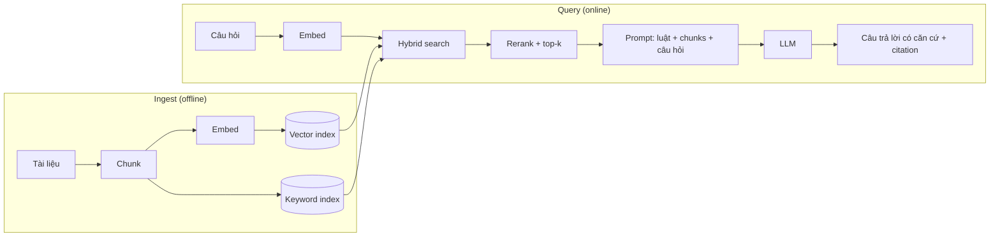

Cơn đau khai sinh, thẳng từ P07: model chưa từng thấy tài liệu của bạn, và context window là trần cứng — bạn không thể dán cả wiki công ty vào mỗi request. **RAG** (Retrieval-Augmented Generation) là câu trả lời chuẩn: *tìm* vài đoạn văn quan trọng, đặt vào prompt, và yêu cầu model trả lời từ chúng ("retrieval thắng hy vọng" của P06, giờ thành một hệ thống). Và đây là cú đổi khung giúp bạn giỏi nó: **RAG là một cỗ máy search có gắn thêm LLM — và gần như mọi thất bại của RAG là thất bại của search.** Bạn sẽ dành 20% công sức cho LLM và 80% cho retrieval, và tỷ lệ đó là đúng.

## Hai pipeline

Hai pipeline, hai bề mặt lỗi. Ingest là một *data pipeline* (chunk, embed, index — với đầy đủ vệ sinh của S02: chạy lại idempotent, xử lý tài liệu được cập nhật). Query là một pipeline *search + prompt*. Debug chúng tách biệt — đó là toàn bộ phương pháp luận.

## Embeddings: khoản lãi của P02

Embedding model ánh xạ văn bản thành vector sao cho *nghĩa giống nhau → vector gần nhau* — cosine similarity (bốn ý tưởng của P02, tới lúc gặt) biến "tìm đoạn liên quan" thành "tìm hàng xóm gần nhất." Ba sự thật thực chiến: **dùng một model duy nhất cho cả tài liệu lẫn câu hỏi** (vector từ model khác nhau sống trong không gian khác nhau — so sánh chúng là vô nghĩa); **embedding bắt được nghĩa, không phải chuỗi ký tự chính xác** — "làm sao reset mật khẩu" tìm ra "quy trình khôi phục credential", đó là siêu năng lực; nhưng `ERR_CONN_5023` thì tìm không ra gì đáng tin, đó là điểm yếu mà hybrid search bên dưới vá lại; và **đổi embedding model nghĩa là re-embed toàn bộ** — hãy version cái index như một schema, vì nó chính là schema.

## Chunking: quyết định thiết kế thật sự

Bạn không retrieve tài liệu; bạn retrieve **chunk** — và cỡ chunk là một trade-off thật, không phải config phụ. Quá nhỏ: chunk match nhưng thiếu ngữ cảnh để trả lời ("Có." — có cái gì?). Quá to: câu trả lời nằm trong đó, nhưng bị pha loãng giữa các chủ đề lẫn lộn, vector của nó nhão ra và retrieval trượt. Các mặc định đứng vững:

- **Bắt đầu quanh 300–800 token với ~10–15% overlap**, rồi tune theo eval set (bên dưới) — không phải theo cảm giác.
- **Cắt theo cấu trúc, không phải theo số ký tự**: heading, đoạn văn, ranh giới bảng. Một chunk bắt đầu giữa câu thì retrieve tệ và đọc còn tệ hơn.
- **Gắn metadata cho mọi chunk** — tài liệu nguồn, tiêu đề mục, ngày, mức truy cập. Nó nuôi filtered retrieval ("chỉ tài liệu policy hiện hành"), citation, và khoảnh khắc ai đó hỏi "sao nó trả lời từ sổ tay 2023?"

Chunking là nơi kiến thức domain đi vào hệ thống. Một giờ đọc tài liệu thật của bạn thắng mọi setting splitter vạn năng.

## Vector DB: một cái index, không phải đền thờ

Vector database làm đúng một việc: **approximate nearest-neighbor search ở quy mô lớn** — so một query vector với hàng triệu chunk vector thật nhanh. Lời khuyên thực dụng năm 2026: **bắt đầu với năng lực vector bên trong hạ tầng bạn đang chạy sẵn** (pattern pgvector — database quan hệ của bạn mọc thêm cột vector và index; các managed search service cũng vậy). Một vector DB chuyên dụng xứng chỗ khi scale nghiêm túc hoặc nhu cầu filter nghiêm túc, không phải ở mốc 50k chunk. Và hãy coi nó là *index*, không phải nguồn sự thật: tài liệu sống ở storage thật (S04-P04); index rebuild được — chính điều đó khiến chuyện re-embed (ở trên) sống sót được.

## Hybrid search: vì nghĩa không phải là tất cả

Vector search thuần thất bại đúng chỗ exact matching thắng: mã sản phẩm, chuỗi lỗi, tên riêng, số điều khoản hợp đồng. Retrieval production vì thế là **hybrid** — vector search cho nghĩa + keyword search (họ BM25) cho từ chính xác, kết quả gộp lại, rồi một **reranker** (model nhỏ chấm điểm cặp câu-hỏi↔chunk thật chuẩn) sắp xếp cái pool đã gộp để những chunk thật-sự-tốt-nhất lấp vào ngân sách context hạn hẹp (attention bậc hai của P06, hoá đơn token của P07 — top-*k* nhỏ là có lý do). Nếu chỉ thêm một thành phần ngoài RAG ngây thơ, hãy thêm reranker; nó là chiếc hộp đòn bẩy cao nhất trong sơ đồ.

## Đo retrieval trước khi đổ lỗi cho model

Kỷ luật debug phân biệt RAG chạy thật với RAG demo: **khi câu trả lời sai, nhìn vào thứ được retrieve trước tiên.** Chín trên mười lần, đoạn văn đúng chưa bao giờ tới được prompt — và không lượng prompt engineering nào sửa được điều đó. Vậy nên đo từng tầng tách biệt:

- **Xây golden set** — 30–50 câu hỏi thật, mỗi câu gắn nhãn chunk/tài liệu lẽ ra phải tìm thấy. Nhàm chán, không né được, và là khoản đầu tư tốt nhất của cả hệ thống.
- **Metric retrieval**: recall@k ("chunk đúng có nằm trong top k không?") là con số cần nhìn. Nếu recall@5 là 60%, trần của bạn là 60% — ngừng tune prompt đi.
- **Metric câu trả lời**: retrieval đã verify rồi mới đánh giá generation — faithfulness (câu trả lời có bám vào chunk không?) và kỷ luật lối-thoát của P08: prompt phải *bắt buộc* "tôi không biết dựa trên tài liệu được cung cấp" thay vì ứng biến, và eval của bạn phải có những câu hỏi mà đáp án đúng chính xác là câu đó.
- **Chạy golden set ở mọi thay đổi** — cỡ chunk mới, embedding model mới, reranker mới. Đó là luật prompt-là-code của P08 mở rộng cho cả pipeline: không eval, không merge.

## Điều cần nhớ

- RAG là cỗ máy search gắn thêm LLM: debug pipeline ingest và pipeline query tách biệt, và hãy chờ sẵn đa số lỗi là lỗi retrieval.
- Chunking là quyết định thiết kế: cắt theo cấu trúc, 300–800 token, có overlap, metadata trên mọi chunk — tune bằng eval set.
- Chơi hybrid: vector cho nghĩa, keyword cho từ chính xác, reranker để tiêu top-k nhỏ bé cho khôn; index đặt trong hạ tầng nhàm chán cho tới khi scale lên tiếng.
- Golden set + recall@k trước khi tune prompt; bắt buộc citation và "tôi không biết" có căn cứ — và chạy lại eval ở mọi thay đổi pipeline.

*Tiếp theo — Phần 10: Agents: LLM biết dùng tool.*
