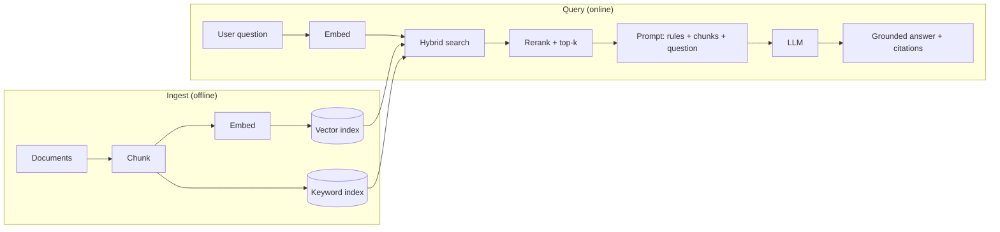

The birth pain, straight from P07: the model has never seen your documents, and the context window is a hard ceiling — you can't paste the company wiki into every request. **RAG** (Retrieval-Augmented Generation) is the standard answer: *find* the few passages that matter, put them in the prompt, and instruct the model to answer from them (P06's "retrieval beats hope," now as a system). Here's the reframe that makes you good at it: **RAG is a search engine with an LLM bolted on — and almost every RAG failure is a search failure.** You'll spend 20% of your effort on the LLM and 80% on retrieval, and that ratio is correct.

## The two pipelines

Two pipelines, two failure surfaces. Ingest is a *data pipeline* (chunk, embed, index — with all of S02's hygiene: idempotent re-runs, handling updated documents). Query is a *search + prompt* pipeline. Debug them separately — that's the whole methodology.

## Embeddings: the P02 payoff

An embedding model maps text to a vector such that *similar meaning → nearby vectors* — cosine similarity (P02's four ideas, cashing in) turns "find relevant passages" into "find nearest neighbors." Three working facts: **use one model for both documents and queries** (vectors from different models live in different spaces — comparing them is meaningless); **embeddings capture meaning, not exact strings** — "how do I reset my password" finds "credential recovery procedure," which is the superpower, but `ERR_CONN_5023` finds nothing reliable, which is the weakness hybrid search fixes below; and **swapping embedding models means re-embedding everything** — version your index like the schema it is.

## Chunking: the real design decision

You don't retrieve documents; you retrieve **chunks** — and chunk size is a genuine trade-off, not a config afterthought. Too small: the chunk matches but lacks the context to answer ("Yes." — of what?). Too large: the answer is inside, but diluted across mixed topics, so its vector is mushy and retrieval misses it. The defaults that hold up:

- **Start around 300–800 tokens with ~10–15% overlap**, then tune against your eval set (below) — not against vibes.
- **Split on structure, not character count**: headings, paragraphs, table boundaries. A chunk that starts mid-sentence retrieves badly and reads worse.
- **Attach metadata to every chunk** — source document, section title, date, access level. It powers filtered retrieval ("only current policy docs"), citations, and the moment someone asks "why did it answer from the 2023 handbook?"

Chunking is where domain knowledge enters the system. An hour reading your actual documents beats any universal splitter setting.

## Vector DB: an index, not a temple

A vector database does one job: **approximate nearest-neighbor search at scale** — comparing a query vector against millions of chunk vectors fast. The pragmatic advice for 2026: **start with the vector capability inside infrastructure you already run** (the pgvector pattern — your relational database gains a vector column and index; managed search services do the same). A dedicated vector DB earns its place at serious scale or serious filtering needs, not at 50k chunks. And treat it as an *index*, not the source of truth: documents live in real storage (S04-P04); the index is rebuildable — which is what makes re-embedding (above) survivable.

## Hybrid search: because meaning isn't everything

Pure vector search fails exactly where exact matching wins: product codes, error strings, names, legal clause numbers. Production retrieval is therefore **hybrid** — vector search for meaning + keyword search (BM25-family) for exact terms, results merged, then a **reranker** (a small model scoring query↔chunk pairs precisely) ordering the merged pool so the truly-best chunks fill your limited context budget (P06's quadratic attention, P07's token bill — top-*k* is small for a reason). If you add only one component beyond naive RAG, add the reranker; it's the highest-leverage box in the diagram.

## Evaluate retrieval before blaming the model

The debugging discipline that separates working RAG from demo RAG: **when the answer is wrong, first look at what was retrieved.** Nine times out of ten the right passage never reached the prompt — no amount of prompt engineering fixes that. So measure the stages separately:

- **Build a golden set** — 30–50 real questions, each labeled with the chunks/documents that should be found. Tedious, unavoidable, and the single best investment in the system.
- **Retrieval metrics**: recall@k ("was the right chunk in the top k?") is the one to watch. If recall@5 is 60%, your ceiling is 60% — stop tuning prompts.
- **Answer metrics**: with retrieval verified, evaluate generation — faithfulness (does the answer stick to the chunks?) and the P08 discipline of an escape hatch: the prompt must *require* "I don't know based on the provided documents" over improvisation, and your eval must include questions whose correct answer is exactly that.
- **Run the golden set on every change** — new chunk size, new embedding model, new reranker. It's P08's prompt-is-code rule extended to the whole pipeline: no eval, no merge.

## Key takeaways

- RAG is a search engine with an LLM attached: debug the ingest pipeline and the query pipeline separately, and expect most failures to be retrieval failures.
- Chunking is the design decision: structure-aware splits, 300–800 tokens, overlap, metadata on every chunk — tuned against an eval set.
- Go hybrid: vectors for meaning, keywords for exact terms, a reranker to spend your small top-k wisely; index in boring infrastructure until scale says otherwise.
- Golden question set + recall@k before prompt tuning; require citations and a grounded "I don't know" — and re-run the eval on every pipeline change.

*Next up — Part 10: Agents: LLMs That Use Tools.*
