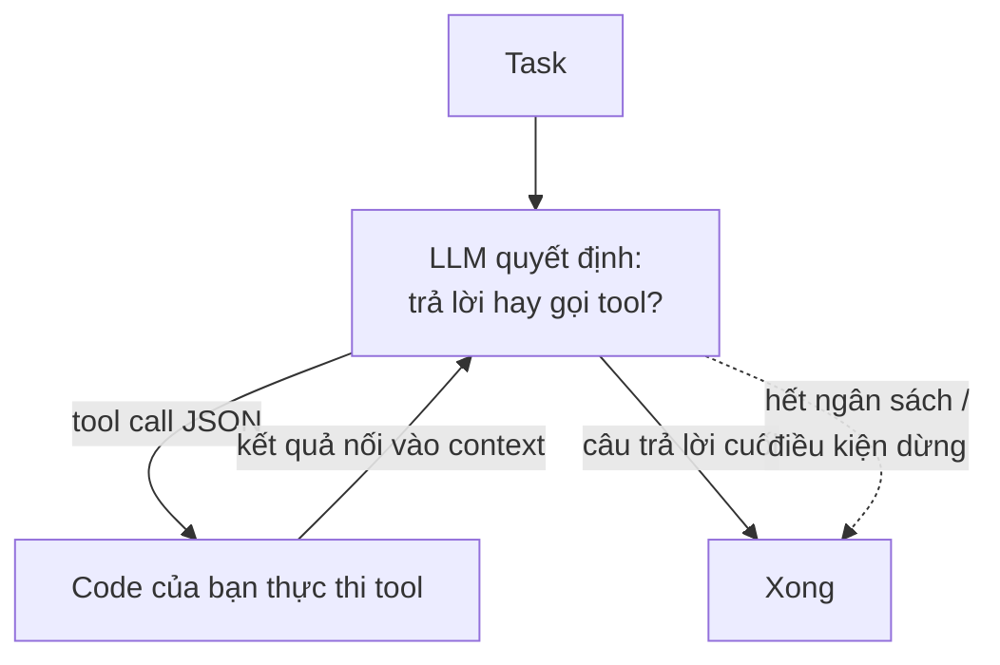

P08 đưa model chỉ thị; P09 đưa nó kiến thức. **Agent** là thứ bạn có khi đưa nó *đôi tay*: khả năng gọi tool, quan sát kết quả, và quyết định làm gì tiếp. Bóc lớp buzzword ra thì kiến trúc nhỏ tới mức vẽ được từ trí nhớ — và bạn nên vẽ được, vì mọi thứ hỏng hóc trong production đều truy về một trong các chiếc hộp đó.

## Vòng lặp bạn phải vẽ được

Chỉ vậy: một vòng while nơi model phát ra hoặc một câu trả lời hoặc một **tool call** (JSON có cấu trúc — bản hợp đồng structured-output của P08, lại gánh trọng lượng), code của bạn thực thi nó, và kết quả quay lại context cho quyết định kế tiếp. Hai sự thật rơi ra ngay. Thứ nhất, **model không bao giờ thực thi gì cả — code của bạn thực thi**: model *đề xuất*, runtime của bạn *định đoạt*, và sự tách bạch đó là nơi mọi thuộc tính an toàn cư ngụ. Thứ hai, **vòng lặp dùng chung context window** (P07): một phiên 20 bước với tool output to sẽ lặng lẽ đẩy văng chính phần suy luận đầu của nó — agent đường-dài thất bại như bài toán *quản lý context* trước khi thất bại như bài toán trí tuệ. Tóm tắt các bước cũ, cắt gọn tool output, và coi context là ngân sách bộ nhớ của vòng lặp.

## Tool là bản hợp đồng

Một tool là một chữ ký hàm trưng ra cho model: tên, mô tả, tham số có kiểu. Viết chúng là thiết kế API (interface-tại-biên-giới của CS-P10), và cùng gu thẩm mỹ đó áp dụng:

- **Mô tả chính là prompt.** Model chọn tool bằng cách đọc chúng; mô tả mơ hồ sinh ra cú gọi mơ hồ. Nói nó làm gì, khi nào dùng, và khi nào *đừng* dùng.
- **Ít tool sắc bén thắng nhiều tool chồng lấn** — mười tool đặt tên chuẩn với tham số gọn đánh bại bốn mươi bản gần-trùng làm nhoè quyết định (phiên bản của model cho một bề mặt API bừa bộn).
- **Validate mọi cú gọi như user input** — vì nó đúng là vậy (model của CS-P11: các đối số tới từ một cỗ máy sinh chữ vừa đọc nội dung không đáng tin). Kiểm schema, rồi authorize: danh tính của agent nhận scope least-privilege (CS-P11, S04-P02) — read-only ở mọi chỗ read-only là đủ.
- **Lỗi là thông tin.** Trả về "date phải là YYYY-MM-DD, nhận được 'tomorrow'" và vòng lặp tự sửa ở lượt sau; trả về một stack trace trần trụi và nó quẫy đạp. Message lỗi của tool cũng là prompt.

## Autonomy là ngân sách, không phải triết lý

Cái núm quan trọng không phải "agent hay không" — mà là *bao nhiêu dây*. Tiêu autonomy ở nơi verify rẻ và sai lầm đảo ngược được; giữ lại ở nơi không:

- **Chặn trần vòng lặp**: max số bước, max chi phí mỗi task, timeout. Một agent kẹt mà không có ngân sách là "retry vô tận" của P08 gắn kèm thẻ tín dụng.
- **Đặt cổng cho hành động không đảo ngược được.** Đọc-tìm-tóm tắt chạy tự do; chuyển-tiền-xoá-bản-ghi đi qua phê duyệt của con người (soạn nháp, đừng gửi). Điều này soi gương bản năng DLQ của messaging (S04-P09): quyết định đường thất bại *trước* sự cố.
- **Thiết kế cho audit trail**: log mọi tool call và kết quả. Khi agent làm điều kỳ quặc — nó sẽ làm — bản transcript là EXPLAIN plan của bạn.
- **Prompt injection là mối đe doạ thường trực** (bộ áo thứ tư của CS-P11): bất kỳ văn bản nào agent đọc — một trang web, một tài liệu retrieve về (P09), một tool result — đều có thể chứa chỉ thị. Phòng thủ là nhiều lớp, không tuyệt đối: tool least-privilege, đối xử nội dung retrieve như data trong cấu trúc prompt, và cổng phê duyệt trên mọi thứ có side effect.

## Multi-agent: muộn hơn bạn nghĩ

Vòng lặp một-agent với tool tốt phủ nhiều đất hơn tiếng ồn của hệ sinh thái gợi ý. Multi-agent xứng với độ phức tạp của nó trong hai ca thật thà: **fan-out song song** (nghiên cứu N chủ đề cùng lúc — một worker pool, pattern của S02-P07 với prompt) và **tách bạch mối quan tâm với đặc quyền khác nhau** (một planner không được thực thi; một executor scope hẹp; một reviewer chỉ đọc — least privilege của CS-P11 trở thành *kiến trúc*). Thứ không sống sót khi va thực tế: các "xã hội" nhập vai cầu kỳ nơi năm agent đốt token nói chuyện với nhau về việc mà một agent làm được. Áp luật của S01-P10 — thêm agent thứ hai ở nhu cầu *được chứng minh* thứ hai, không phải ở nhu cầu tưởng tượng đầu tiên.

Món kế thừa đánh giá từ P09 vẫn đứng: định nghĩa tiêu chí xong theo từng loại task, xây golden set các task, đo completion rate và chi phí — agent mà chất lượng được chấm bằng cảm giác demo thì chính là demo.

## Điều cần nhớ

- Agent là một vòng while: model đề xuất tool call, code của bạn thực thi, kết quả quay vào — và context là ngân sách bộ nhớ của vòng lặp; quản nó hoặc task dài tự ăn chính mình.
- Tool là thiết kế API: mô tả sắc (chúng là prompt), validate schema, scope least-privilege, và message lỗi viết cho model tự sửa được.
- Tiêu autonomy nơi sai lầm rẻ; ngân sách số bước và chi phí, cổng phê duyệt cho hành động không đảo ngược, log tất cả, và coi prompt injection là đe doạ thường trực.
- Multi-agent cho fan-out song song hoặc tách đặc quyền — không cho sân khấu; agent thứ hai tới ở nhu cầu được chứng minh thứ hai.

*Tiếp theo — Phần 11: Fine-tuning & LoRA: khi prompt không còn đủ.*
