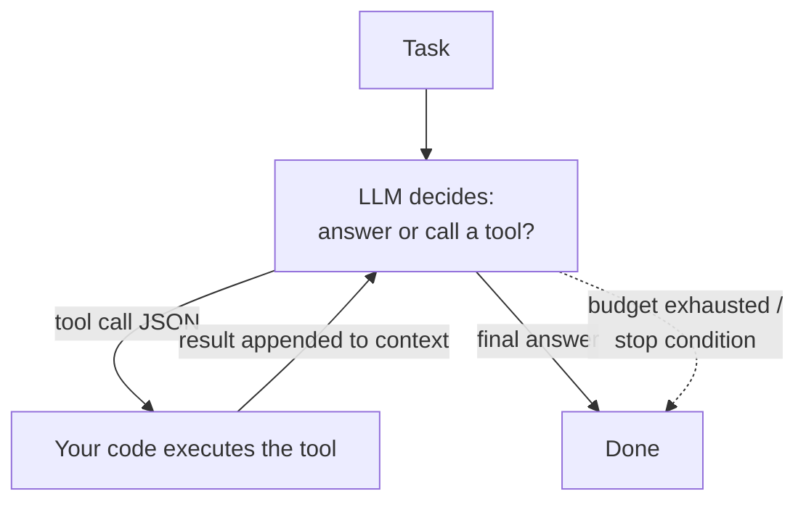

P08 gave the model instructions; P09 gave it knowledge. An **agent** is what you get when you give it *hands*: the ability to call tools, observe results, and decide what to do next. Strip the buzzword and the architecture is small enough to draw from memory — which you should be able to do, because everything that goes wrong in production traces back to one of the boxes.

## What you'll learn

- Draw the agent loop from memory, and name the two facts that make it safe or unsafe.
- Design a tool the way you'd design an API, error messages included.
- Set an autonomy budget: loop caps, approval gates, and an audit trail.
- Say when multi-agent is genuinely warranted — and it's later than the demos suggest.

**Prerequisites:** Part 8 (structured output and validation) and Part 9 (retrieval), since agents are built from both.

## 1. The loop you must be able to draw



That's it: a while-loop where the model emits either an answer or a **tool call** (structured JSON — P08's structured-output contract, load-bearing again), your code executes it, and the result goes back into the context for the next decision. Two facts fall out immediately. First, **the model never executes anything — your code does**: the model *proposes*, your runtime *disposes*, and that separation is where every safety property lives. Second, **the loop shares the context window** (P07): a 20-step run with big tool outputs quietly evicts its own early reasoning — long-horizon agents fail as *context management* problems before they fail as intelligence problems. Summarize old steps, truncate tool outputs, and treat context as the loop's memory budget.

## 2. Tools are the contract

A tool is a function signature shown to the model: name, description, typed parameters. Writing them is API design (CS-P10's interfaces-at-boundaries), and the same taste applies:

- **Descriptions are prompts.** The model chooses tools by reading them; a vague description produces vague calls. Say what it does, when to use it, and when *not* to.
- **Few, sharp tools beat many overlapping ones** — ten well-named tools with crisp parameters outperform forty near-duplicates that blur the decision (the model's version of a cluttered API surface).
- **Validate every call like user input** — because it is (CS-P11's model: the arguments arrive from a text generator that read untrusted content). Schema-check, then authorize: the agent's identity gets least-privilege scopes (CS-P11, S04-P02) — read-only where read-only suffices.
- **Errors are information.** Return "date must be YYYY-MM-DD, got 'tomorrow'" and the loop self-corrects next iteration; return a bare stack trace and it flails. Tool error messages are prompts too.

## 3. Autonomy is a budget, not a philosophy

The knob that matters isn't "agent or not" — it's *how much rope*. Spend autonomy where verification is cheap and mistakes are reversible; hold it where they aren't:

- **Cap the loop**: max iterations, max cost per task, timeouts. A stuck agent without budgets is P08's "infinite retry" with a credit card attached.
- **Gate irreversible actions.** Read-search-summarize can run free; send-money-delete-records goes through human approval (draft, don't send). This mirrors messaging's DLQ instinct (S04-P09): decide the failure path *before* the incident.
- **Design for the audit trail**: log every tool call and result. When the agent does something weird — it will — the transcript is your EXPLAIN plan.
- **Prompt injection is the standing threat** (CS-P11's fourth costume): any text the agent reads — a web page, a retrieved document (P09), a tool result — can contain instructions. Defenses are layered, not absolute: least-privilege tools, treating retrieved content as data in the prompt structure, and approval gates on anything with side effects.

## 4. Multi-agent: later than you think

The single-agent loop with good tools covers more than the ecosystem's noise suggests. Multi-agent earns its complexity in two honest cases: **parallel fan-out** (research N topics simultaneously — a worker pool, S02-P07's pattern with prompts) and **separation of concerns with different privileges** (a planner that can't execute; an executor with narrow scopes; a reviewer that only reads — CS-P11's least privilege as *architecture*). What doesn't survive contact: elaborate role-played "societies" where five agents burn tokens talking to each other about work one agent could do. Apply S01-P10's rule — add the second agent at the second *proven need*, not the first imagined one.

The evaluation carry-over from P09 stands: define done-criteria per task type, build a golden set of tasks, measure completion rate and cost — agents whose quality is judged by demo vibes are demos.

## Practice (25 minutes — build the loop yourself, with the budget attached)

Frameworks hide the loop, which is why so many agent systems are unpredictable. Write it once by hand and it stops being magic — including the parts that stop it running forever:

```python
import json
# from your_sdk import client

# --- Tools: real functions, plus schemas that ARE their documentation ---
def get_order(order_id: str):
    db = {"A-1": {"status": "shipped", "total": 120.0}}
    if order_id not in db:
        return {"error": f"no order {order_id}; ask the user to confirm the ID"}   # errors teach
    return db[order_id]

def issue_refund(order_id: str, amount: float):
    return {"ok": True, "refunded": amount, "order": order_id}

TOOLS = {"get_order": get_order, "issue_refund": issue_refund}
IRREVERSIBLE = {"issue_refund"}                       # the approval gate list
SCHEMAS = [
 {"name": "get_order", "description": "Look up an order's status and total by ID.",
  "input_schema": {"type": "object", "properties": {"order_id": {"type": "string"}},
                   "required": ["order_id"]}},
 {"name": "issue_refund", "description": "Refund money for an order. Irreversible.",
  "input_schema": {"type": "object",
                   "properties": {"order_id": {"type": "string"}, "amount": {"type": "number"}},
                   "required": ["order_id", "amount"]}},
]

def run_agent(user_msg, max_steps=5, auto_approve=False):
    messages = [{"role": "user", "content": user_msg}]
    audit = []                                        # the audit trail, not optional
    for step in range(max_steps):                     # THE CAP: the loop cannot run forever
        resp = client.messages.create(model="<your-model>", max_tokens=800,
                                      tools=SCHEMAS, messages=messages)
        calls = [b for b in resp.content if getattr(b, "type", "") == "tool_use"]
        if not calls:
            return "".join(b.text for b in resp.content if b.type == "text"), audit

        messages.append({"role": "assistant", "content": resp.content})
        results = []
        for c in calls:
            if c.name in IRREVERSIBLE and not auto_approve:
                decision = input(f"  APPROVE {c.name}({c.input})? [y/N] ")   # the gate
                if decision.lower() != "y":
                    results.append({"type": "tool_result", "tool_use_id": c.id,
                                    "content": "denied by human reviewer"})
                    audit.append(("denied", c.name, c.input)); continue
            out = TOOLS[c.name](**c.input)            # code decides; the model only proposed
            audit.append((step, c.name, c.input, out))
            results.append({"type": "tool_result", "tool_use_id": c.id,
                            "content": json.dumps(out)})
        messages.append({"role": "user", "content": results})
    return "STOPPED: step budget exhausted", audit    # a cap that reports, not one that hides

answer, trail = run_agent("What's the status of order A-1, and refund it if it shipped?")
print(answer); [print("  ", t) for t in trail]

# Now the cases that separate a demo from a system:
run_agent("Refund order A-999")                        # tool error → does it recover or loop?
run_agent("Refund every order in the database")        # does the cap stop it? does the gate hold?
```

Expected results: the first run does two steps — look up, then propose the refund — and stops at your approval prompt, which is the whole point of the gate: the model *proposed* an irreversible action and your code decided. The bad-ID case shows why error messages are prompts too: a message saying "ask the user to confirm the ID" produces recovery, while a bare `KeyError` produces a confused retry loop. The last case is the one worth watching closely — with the cap in place it stops and says so; delete `max_steps` and the same request can spin indefinitely, spending money the whole time.

## Check yourself

1. Your agent works in testing and occasionally does something wild in production. Which of the two facts about the loop did the design ignore?
2. A tool returns `{"error": "invalid input"}`. Why is that a worse tool than one returning a longer message?
3. Your team proposes five specialized agents that talk to each other. What do you ask before agreeing?

<details><summary>See answers</summary>

1. That the model *proposes* and your code *decides*. If the code executes whatever the model asks with no gate on irreversible actions and no loop cap, then the system's safety is entirely the model's judgment — which varies with the input, including inputs written by users. Autonomy has to be a budget enforced in code.
2. Because a tool's error message is a prompt: it's the only information the model has for its next attempt. "Invalid input" gives it nothing to correct, so it retries the same call or gives up. "No order A-999 exists; ask the user to confirm the ID" tells it exactly what recovery looks like, and turns a dead end into a working turn.
3. What each agent can do that one agent with the same tools cannot, and where the boundaries actually reduce risk. Legitimate reasons exist — genuine parallelism over independent subtasks, or privilege separation so the agent that reads the internet cannot also spend money. "It's more modular" is not one: every hop between agents adds context loss, latency and cost, and multi-agent debugging is much harder than single-loop debugging.

</details>

## Key takeaways

- An agent is a while-loop: model proposes tool calls, your code executes, results feed back — and context is the loop's memory budget; manage it or long tasks eat themselves.
- Tools are API design: sharp descriptions (they're prompts), schema validation, least-privilege scopes, and error messages written for the model to self-correct on.
- Spend autonomy where mistakes are cheap; budget iterations and cost, gate irreversible actions on approval, log everything, and treat prompt injection as a standing threat.
- Go multi-agent for parallel fan-out or privilege separation — not for theater; the second agent arrives at the second proven need.

*Next up — Part 11: Fine-tuning & LoRA: When Prompting Isn't Enough.*
