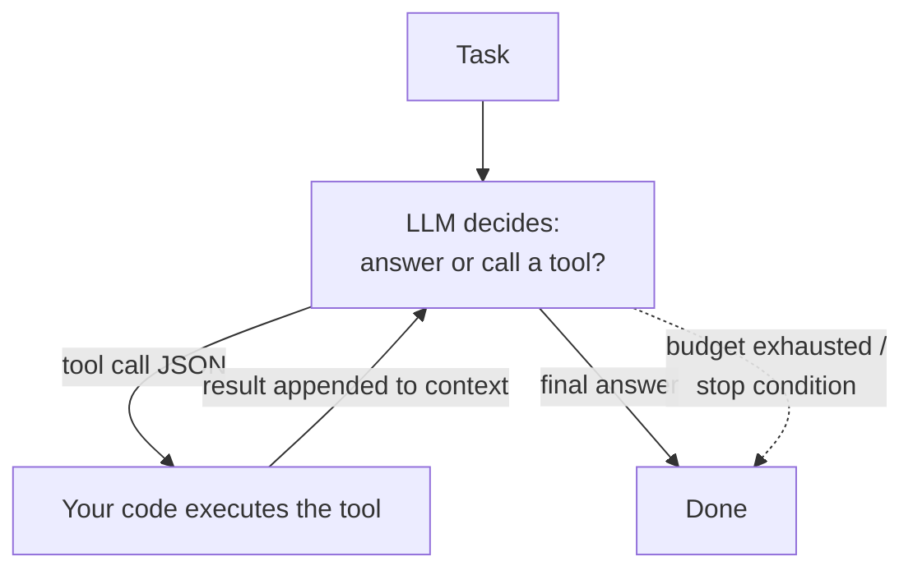

P08 gave the model instructions; P09 gave it knowledge. An **agent** is what you get when you give it *hands*: the ability to call tools, observe results, and decide what to do next. Strip the buzzword and the architecture is small enough to draw from memory — which you should be able to do, because everything that goes wrong in production traces back to one of the boxes.

## The loop you must be able to draw

That's it: a while-loop where the model emits either an answer or a **tool call** (structured JSON — P08's structured-output contract, load-bearing again), your code executes it, and the result goes back into the context for the next decision. Two facts fall out immediately. First, **the model never executes anything — your code does**: the model *proposes*, your runtime *disposes*, and that separation is where every safety property lives. Second, **the loop shares the context window** (P07): a 20-step run with big tool outputs quietly evicts its own early reasoning — long-horizon agents fail as *context management* problems before they fail as intelligence problems. Summarize old steps, truncate tool outputs, and treat context as the loop's memory budget.

## Tools are the contract

A tool is a function signature shown to the model: name, description, typed parameters. Writing them is API design (CS-P10's interfaces-at-boundaries), and the same taste applies:

- **Descriptions are prompts.** The model chooses tools by reading them; a vague description produces vague calls. Say what it does, when to use it, and when *not* to.
- **Few, sharp tools beat many overlapping ones** — ten well-named tools with crisp parameters outperform forty near-duplicates that blur the decision (the model's version of a cluttered API surface).
- **Validate every call like user input** — because it is (CS-P11's model: the arguments arrive from a text generator that read untrusted content). Schema-check, then authorize: the agent's identity gets least-privilege scopes (CS-P11, S04-P02) — read-only where read-only suffices.
- **Errors are information.** Return "date must be YYYY-MM-DD, got 'tomorrow'" and the loop self-corrects next iteration; return a bare stack trace and it flails. Tool error messages are prompts too.

## Autonomy is a budget, not a philosophy

The knob that matters isn't "agent or not" — it's *how much rope*. Spend autonomy where verification is cheap and mistakes are reversible; hold it where they aren't:

- **Cap the loop**: max iterations, max cost per task, timeouts. A stuck agent without budgets is P08's "infinite retry" with a credit card attached.
- **Gate irreversible actions.** Read-search-summarize can run free; send-money-delete-records goes through human approval (draft, don't send). This mirrors messaging's DLQ instinct (S04-P09): decide the failure path *before* the incident.
- **Design for the audit trail**: log every tool call and result. When the agent does something weird — it will — the transcript is your EXPLAIN plan.
- **Prompt injection is the standing threat** (CS-P11's fourth costume): any text the agent reads — a web page, a retrieved document (P09), a tool result — can contain instructions. Defenses are layered, not absolute: least-privilege tools, treating retrieved content as data in the prompt structure, and approval gates on anything with side effects.

## Multi-agent: later than you think

The single-agent loop with good tools covers more than the ecosystem's noise suggests. Multi-agent earns its complexity in two honest cases: **parallel fan-out** (research N topics simultaneously — a worker pool, S02-P07's pattern with prompts) and **separation of concerns with different privileges** (a planner that can't execute; an executor with narrow scopes; a reviewer that only reads — CS-P11's least privilege as *architecture*). What doesn't survive contact: elaborate role-played "societies" where five agents burn tokens talking to each other about work one agent could do. Apply S01-P10's rule — add the second agent at the second *proven need*, not the first imagined one.

The evaluation carry-over from P09 stands: define done-criteria per task type, build a golden set of tasks, measure completion rate and cost — agents whose quality is judged by demo vibes are demos.

## Key takeaways

- An agent is a while-loop: model proposes tool calls, your code executes, results feed back — and context is the loop's memory budget; manage it or long tasks eat themselves.
- Tools are API design: sharp descriptions (they're prompts), schema validation, least-privilege scopes, and error messages written for the model to self-correct on.
- Spend autonomy where mistakes are cheap; budget iterations and cost, gate irreversible actions on approval, log everything, and treat prompt injection as a standing threat.
- Go multi-agent for parallel fan-out or privilege separation — not for theater; the second agent arrives at the second proven need.

*Next up — Part 11: Fine-tuning & LoRA: When Prompting Isn't Enough.*
