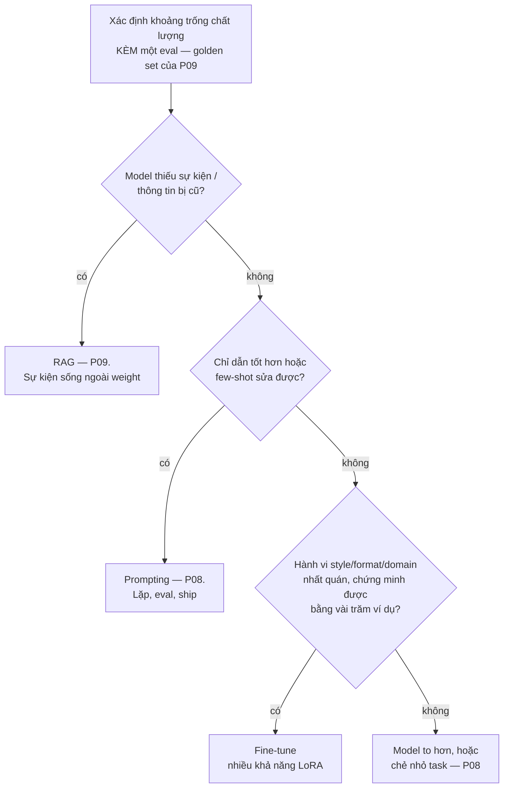

Chiếc thang tới giờ: prompt nó (P08), tiếp đất nó (P09), đưa nó tool (P10). **Fine-tuning** — thật sự cập nhật weight của model trên ví dụ của bạn — là nấc cuối, và là nấc hay bị trèo vì lý do sai nhất. Lý do sai gần như luôn giống nhau: *dạy model các sự kiện*. Đó là việc của RAG. Lý do đúng gói trong một câu: **fine-tune để đổi cách model hành xử; retrieve để đổi thứ model biết.** Phần này là cây quyết định, cơ chế khiến tuning rẻ đi (LoRA), và sự thật kém hào nhoáng rằng dataset chính là sản phẩm.

## Cây quyết định

Đọc kỹ node đầu vào: *kèm một eval*. Không có golden set (P09), "prompting không đủ" là một cảm giác, không phải một phát hiện — và kỷ luật của P04 áp nguyên văn: bạn không thể tuyên bố model đã tune tốt hơn nếu chẳng có gì để đo. Các ca thật thà nơi fine-tuning thắng: **hình dạng output nhất quán** (luôn đúng phương ngữ JSON này, đúng format báo cáo cộc lốc này — vượt quá thứ một schema ép được), **giọng điệu/persona ở quy mô lớn** (trả lời support đúng giọng của bạn, không cần style guide 2.000 token mỗi request — tuning như *nén prompt*, thường tự trả tiền cho mình bằng chi phí token, P07), **hành vi domain hẹp** (convention của codebase bạn, bộ nhãn phân loại tài liệu của bạn), và **kinh tế học model nhỏ** — tune một model mở nhỏ làm đúng một việc mà hiện đang cần model API lớn; ở volume cao, đây là business case mạnh nhất của cả danh sách.

## LoRA: vì sao tuning trở nên rẻ

Full fine-tuning cập nhật hàng tỷ weight — kinh tế học GPU của P05 nói bạn sẽ cần phần cứng nghiêm túc và chỗ chứa cho mỗi biến thể. **LoRA** (Low-Rank Adaptation) là cú mẹo đổi cả bài toán: đóng băng hoàn toàn weight pretrained, và tiêm các ma trận nhỏ trainable chạy kèm. Bản năng transfer learning từ P05 — "thích nghi gã khổng lồ, đừng xây lại nó" — đẩy tới cực điểm logic: bạn train **dưới hẳn 1% số tham số** và nhận phần lớn chất lượng của full tuning cho các task nắn hành vi.

Ba hệ quả thực dụng, không cần toán: **rẻ đủ để thử nghiệm** (một GPU tử tế tune được model nhỏ — các biến thể QLoRA đẩy xa hơn bằng cách quantize phần base đóng băng); **adapter là file nhỏ** (megabyte, không phải gigabyte của cả model — version chúng như code, ship biến thể theo từng khách/từng task trên một base chung); và **các API fine-tuning hosted bên dưới thường có hình LoRA** — cùng một mental model dù bạn tự chạy hay đi thuê.

## Dataset chính là sản phẩm

Đây là nơi các dự án fine-tuning thật sự thành hay bại. Model sẽ học *chính xác* thứ ví dụ của bạn dạy — gồm cả mọi thói hư trong đó:

- **Format**: các cặp prompt→completion, mỗi cặp trông y hệt traffic production. Vài trăm ví dụ tốt thắng vài chục nghìn ví dụ cào về cho task hành vi; chất lượng đè bẹp số lượng ở quy mô này.
- **Ví dụ CHÍNH LÀ spec.** Gắn nhãn không nhất quán (hai người chấm cãi nhau về tone) trở thành một model tự tin một cách không nhất quán. Curate như pipeline hoang-tưởng-leakage của P03: dedupe, review tay một mẫu ngẫu nhiên, và giữ một test set mà training không bao giờ thấy — luật "tiêu một lần" của P04, giờ canh bằng ví tiền, vì eval set bị rò khiến tuning trông tuyệt vời cho tới đúng lúc production.
- **Đào log của bạn**: dữ liệu train tốt nhất là traffic thật nơi model lớn (hoặc con người) đã cho câu trả lời đúng — pattern distillation: model lớn làm mẫu, model nhỏ đã tune bắt chước, unit economics cải thiện (hoá đơn của P07, đánh thẳng vào weight).
- **Overfitting quay lại** (P04, luôn luôn): model đã tune có thể đạt điểm tuyệt đối ở format của bạn và *tệ đi* ở mọi thứ khác — catastrophic forgetting. Eval của bạn phải gồm cả prompt tổng quát, không chỉ prompt của task, và bản năng đọc loss curve của P05 áp dụng nguyên vẹn.

Và màn đóng sổ vận hành, đúng tinh thần mọi mục "chạy thật" của series này: một model đã tune là một *deployment* — version base + adapter + dataset cùng nhau (bản năng lineage của S02), chạy lại golden set ở mỗi lần nâng cấp base model (adapter của bạn không tự động chuyển giao), và chuẩn bị tinh thần re-tune khi traffic trôi dạt. Fine-tuning không phải kỳ thi một lần; nó là một pipeline bạn sở hữu (S02-P08 muốn nói chuyện về việc lập lịch cho nó).

## Điều cần nhớ

- Một câu gánh cả quyết định: fine-tune hành vi, retrieve kiến thức — và chỉ bước vào cây khi có eval, không thì "prompting không đủ" chỉ là một cảm giác.
- Các ca thắng là hình dạng output, giọng điệu ở quy mô (nén prompt), hành vi domain hẹp, và kinh tế học model nhỏ — không phải dạy sự kiện.
- LoRA đóng băng base và train adapter tí hon: thử nghiệm rẻ, artifact cỡ megabyte version như code, cùng model dù tự host hay đi thuê.
- Dataset là sản phẩm: vài trăm ví dụ được curate, test set canh bằng ví tiền, distillation đào từ log — và model đã tune là một deployment có re-tune trong tương lai, không phải một lễ tốt nghiệp.

*Tiếp theo — Phần 12: Evals: test hệ thống AI như một kỹ sư.*
