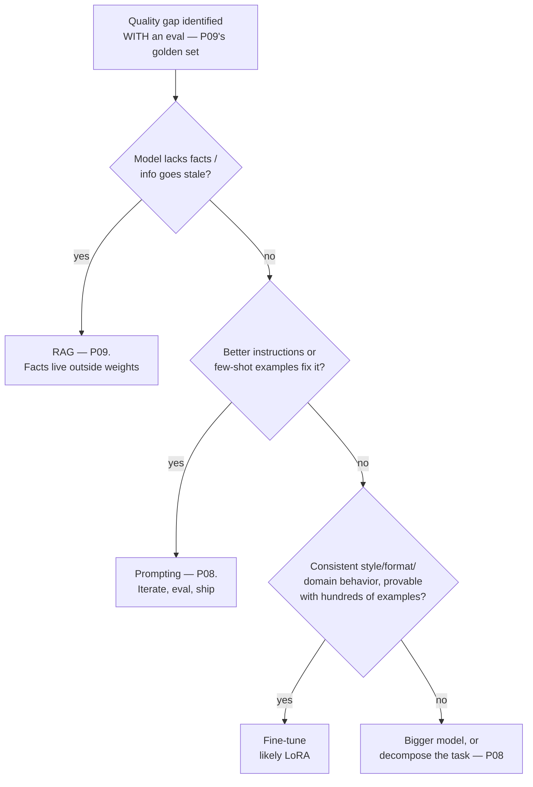

The ladder so far: prompt it (P08), ground it (P09), give it tools (P10). **Fine-tuning** — actually updating the model's weights on your examples — is the last rung, and the one most often climbed for the wrong reason. The wrong reason is almost always the same: *teaching the model facts*. That's what RAG is for. The right reasons fit in one sentence: **fine-tune to change how the model behaves; retrieve to change what it knows.** This part is the decision tree, the mechanism that makes tuning affordable (LoRA), and the unglamorous truth that the dataset is the product.

## What you'll learn

- Walk the decision tree: prompt, retrieve, or fine-tune — and why the order matters.
- Explain LoRA well enough to know what it changes and what it costs.
- Treat the dataset as the product, because that's where the quality actually lives.
- Version a tuned model the way you version a deployment.

**Prerequisites:** Part 5 (transfer learning — this is the same move at LLM scale), Part 9 (retrieval) and Part 4 (evaluation).

## 1. The decision tree



Read the entry node carefully: *with an eval*. Without a golden set (P09), "prompting wasn't enough" is a feeling, not a finding — and P04's discipline applies verbatim: you can't claim the tuned model is better if you have nothing to measure it on. The honest cases where fine-tuning wins: **consistent output shape** (always this JSON dialect, this terse report format — beyond what a schema can force), **tone/persona at scale** (support replies in your voice, without a 2,000-token style guide per request — tuning as *prompt compression*, often paying for itself in token costs, P07), **narrow-domain behavior** (your codebase's conventions, your document classification labels), and **small-model economics** — tuning a small open model to do one job that currently needs a large API model; at volume, this is the strongest business case on the list.

## 2. LoRA: why tuning became affordable

Full fine-tuning updates billions of weights — P05's GPU economics say you'll need serious hardware and storage for every variant. **LoRA** (Low-Rank Adaptation) is the trick that changed the calculus: freeze the pretrained weights entirely, and inject small trainable matrices alongside them. The transfer-learning instinct from P05 — "adapt the giant, don't rebuild it" — taken to its logical extreme: you train **well under 1% of the parameters** and get most of the quality of full tuning for behavior-shaping tasks.

Three practical consequences, no math required: **cheap enough to experiment** (a single decent GPU tunes a small model — QLoRA variants push this further by quantizing the frozen base); **adapters are small files** (megabytes, not the gigabytes of a full model — version them like code, ship per-customer or per-task variants of one base); and **hosted fine-tuning APIs are usually LoRA-shaped underneath** — same mental model whether you run it yourself or rent it.

## 3. The dataset is the product

Here is where fine-tuning projects actually succeed or die. The model will learn *exactly* what your examples teach — including every bad habit in them:

- **Format**: prompt→completion pairs, each one looking exactly like production traffic. Hundreds of good examples beat tens of thousands of scraped ones for behavior tasks; quality dominates quantity at this scale.
- **The examples ARE the spec.** Inconsistent labeling (two annotators disagreeing on tone) becomes a model that's confidently inconsistent. Curate like P03's leakage-paranoid pipelines: dedupe, review a random sample by hand, and hold out a test set the training never sees — P04's "spend it once" rule, wallet-guarded now, because a leaked eval set makes tuning look great right up until production.
- **Mine your logs**: the best training data is real traffic where the big model (or a human) produced the right answer — the distillation pattern: large model demonstrates, small tuned model imitates, unit economics improve (P07's bill, attacked at the weights).
- **Overfitting returns** (P04, always): a tuned model can ace your format and get *worse* at everything else — catastrophic forgetting. Your eval must include general prompts, not just task prompts, and the P05 loss-curve instincts apply unchanged.

And the operational close-out, in the spirit of every "run it for real" section in this series: a tuned model is a *deployment* — version base + adapter + dataset together (reproducibility is S02's lineage instinct), re-run the golden set on every base-model upgrade (your adapter does not automatically transfer), and expect to re-tune as traffic drifts. Fine-tuning is not a one-time exam; it's a pipeline you own (S02-P08 would like a word about scheduling it).

## Practice (25 minutes — build the dataset and the eval, before spending on a GPU)

The expensive mistake is fine-tuning first and measuring after. This exercise does it in the right order, and most of it costs nothing.

**Step 1 — write the eval set first (10 min).** Pick a behavior you actually want (a fixed output shape, a house tone, a narrow classification). Create 20 examples in a file, each with the input and the *ideal* output. Split them 15 for training and 5 held out, and never look at the held-out five while iterating.

```python
import json, random
examples = [
  {"input": "customer says the app crashes on login",
   "output": {"category": "bug", "severity": "high", "team": "platform"}},
  # …19 more, covering the edge cases you actually see, not the ones that are easy to write
]
random.seed(0); random.shuffle(examples)
train, holdout = examples[:15], examples[15:]
json.dump(train, open("train.json","w")); json.dump(holdout, open("holdout.json","w"))

def score(predict):                       # the same scorer for every approach
    ok = sum(predict(e["input"]) == e["output"] for e in holdout)
    return f"{ok}/{len(holdout)}"
```

**Step 2 — exhaust the cheap options (10 min).** Score three approaches with that one function: a zero-shot prompt, a prompt with three examples included (few-shot), and a prompt with the full instruction plus a schema. Write the numbers down.

**Step 3 — only now decide (5 min).** Answer in writing: does the best prompt already meet the bar? If not, is it failing on *shape* (fine-tuning helps) or on *knowledge* (retrieval helps)? What does the tuned version have to beat, and on which held-out examples?

Expected results: few-shot prompting usually closes most of the gap on its own, which is exactly why the decision tree puts fine-tuning last — teams that skip steps 1 and 2 often spend a week training a model that a three-example prompt would have matched. When fine-tuning *is* warranted, you now have the two artifacts that make it safe: a held-out set you never tuned against, and a documented number the tuned model must beat. Without those, "it feels better" is the only evaluation you'll have, and it isn't one.

## Check yourself

1. Your assistant doesn't know your company's internal product names. Fine-tune or retrieve?
2. You fine-tuned a model on 8,000 scraped support tickets and quality got worse. What's the likely cause?
3. The provider deprecates the base model your adapter was trained on. What's your position, and what should you have recorded?

<details><summary>See answers</summary>

1. Retrieve. Missing facts are a knowledge problem, and knowledge changes — a new product next quarter means retraining if you fine-tuned, versus one document added if you retrieved. Fine-tuning teaches *behavior* (shape, tone, format); retrieval supplies *knowledge*.
2. Data quality. Scraped tickets contain the mistakes, inconsistencies and off-brand answers of everyone who ever wrote one, and the model learned all of it faithfully — the examples *are* the specification. A few hundred carefully curated examples usually beat thousands of scraped ones.
3. Adapters are trained against a specific base model, so the weights aren't portable to a new base: you retrain and re-run the eval. What you should have recorded, versioned together, is the base model identifier, the adapter, and the exact dataset — plus the eval scores — so re-running is a mechanical step rather than an archaeology project.

</details>

## Key takeaways

- One sentence carries the decision: fine-tune behavior, retrieve knowledge — and enter the tree only with an eval, or "prompting wasn't enough" is just a feeling.
- The winning cases are output shape, tone at scale (prompt compression), narrow-domain behavior, and small-model economics — not teaching facts.
- LoRA freezes the base and trains tiny adapters: cheap experiments, megabyte artifacts you version like code, the same model whether self-hosted or rented.
- The dataset is the product: hundreds of curated examples, a wallet-guarded test set, log-mined distillation — and a tuned model is a deployment with re-tuning in its future, not a graduation.

*Next up — Part 12: Evals: Testing AI Systems Like an Engineer.*
