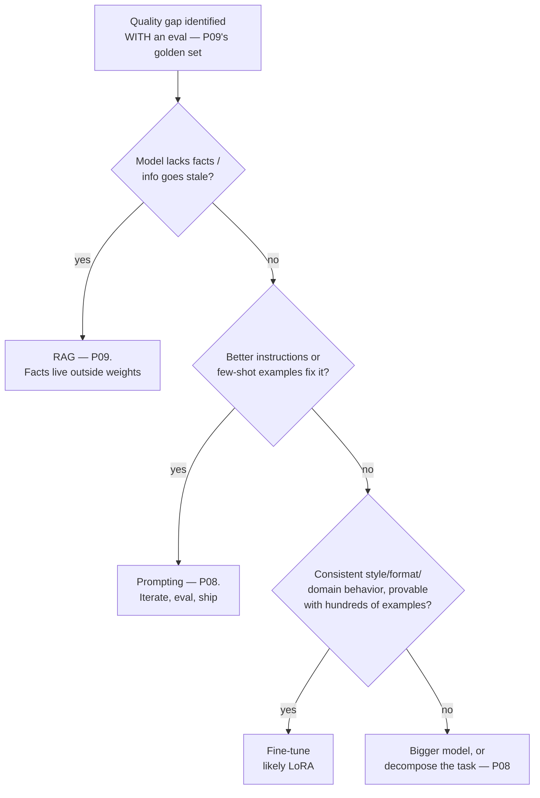

The ladder so far: prompt it (P08), ground it (P09), give it tools (P10). **Fine-tuning** — actually updating the model's weights on your examples — is the last rung, and the one most often climbed for the wrong reason. The wrong reason is almost always the same: *teaching the model facts*. That's what RAG is for. The right reasons fit in one sentence: **fine-tune to change how the model behaves; retrieve to change what it knows.** This part is the decision tree, the mechanism that makes tuning affordable (LoRA), and the unglamorous truth that the dataset is the product.

## The decision tree

Read the entry node carefully: *with an eval*. Without a golden set (P09), "prompting wasn't enough" is a feeling, not a finding — and P04's discipline applies verbatim: you can't claim the tuned model is better if you have nothing to measure it on. The honest cases where fine-tuning wins: **consistent output shape** (always this JSON dialect, this terse report format — beyond what a schema can force), **tone/persona at scale** (support replies in your voice, without a 2,000-token style guide per request — tuning as *prompt compression*, often paying for itself in token costs, P07), **narrow-domain behavior** (your codebase's conventions, your document classification labels), and **small-model economics** — tuning a small open model to do one job that currently needs a large API model; at volume, this is the strongest business case on the list.

## LoRA: why tuning became affordable

Full fine-tuning updates billions of weights — P05's GPU economics say you'll need serious hardware and storage for every variant. **LoRA** (Low-Rank Adaptation) is the trick that changed the calculus: freeze the pretrained weights entirely, and inject small trainable matrices alongside them. The transfer-learning instinct from P05 — "adapt the giant, don't rebuild it" — taken to its logical extreme: you train **well under 1% of the parameters** and get most of the quality of full tuning for behavior-shaping tasks.

Three practical consequences, no math required: **cheap enough to experiment** (a single decent GPU tunes a small model — QLoRA variants push this further by quantizing the frozen base); **adapters are small files** (megabytes, not the gigabytes of a full model — version them like code, ship per-customer or per-task variants of one base); and **hosted fine-tuning APIs are usually LoRA-shaped underneath** — same mental model whether you run it yourself or rent it.

## The dataset is the product

Here is where fine-tuning projects actually succeed or die. The model will learn *exactly* what your examples teach — including every bad habit in them:

- **Format**: prompt→completion pairs, each one looking exactly like production traffic. Hundreds of good examples beat tens of thousands of scraped ones for behavior tasks; quality dominates quantity at this scale.
- **The examples ARE the spec.** Inconsistent labeling (two annotators disagreeing on tone) becomes a model that's confidently inconsistent. Curate like P03's leakage-paranoid pipelines: dedupe, review a random sample by hand, and hold out a test set the training never sees — P04's "spend it once" rule, wallet-guarded now, because a leaked eval set makes tuning look great right up until production.
- **Mine your logs**: the best training data is real traffic where the big model (or a human) produced the right answer — the distillation pattern: large model demonstrates, small tuned model imitates, unit economics improve (P07's bill, attacked at the weights).
- **Overfitting returns** (P04, always): a tuned model can ace your format and get *worse* at everything else — catastrophic forgetting. Your eval must include general prompts, not just task prompts, and the P05 loss-curve instincts apply unchanged.

And the operational close-out, in the spirit of every "run it for real" section in this series: a tuned model is a *deployment* — version base + adapter + dataset together (reproducibility is S02's lineage instinct), re-run the golden set on every base-model upgrade (your adapter does not automatically transfer), and expect to re-tune as traffic drifts. Fine-tuning is not a one-time exam; it's a pipeline you own (S02-P08 would like a word about scheduling it).

## Key takeaways

- One sentence carries the decision: fine-tune behavior, retrieve knowledge — and enter the tree only with an eval, or "prompting wasn't enough" is just a feeling.
- The winning cases are output shape, tone at scale (prompt compression), narrow-domain behavior, and small-model economics — not teaching facts.
- LoRA freezes the base and trains tiny adapters: cheap experiments, megabyte artifacts you version like code, the same model whether self-hosted or rented.
- The dataset is the product: hundreds of curated examples, a wallet-guarded test set, log-mined distillation — and a tuned model is a deployment with re-tuning in its future, not a graduation.

*Next up — Part 12: Evals: Testing AI Systems Like an Engineer.*
