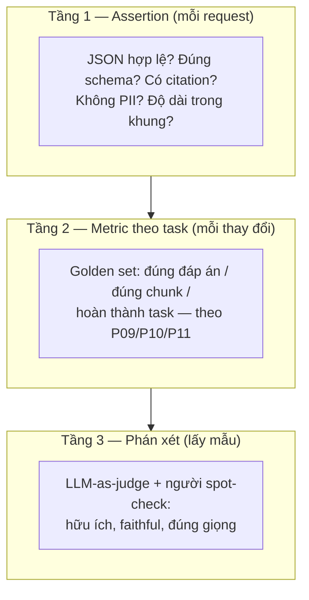

Mỗi phần của series này đều kết bằng cùng một nhịp trống — golden set (P09), tiêu chí xong (P10), test set canh ví tiền (P11) — và phần này là nơi nhịp trống trở thành kỷ luật. Lý do nó quan trọng nằm ở một sự bất đối xứng: **demo cho thấy hệ thống chạy trên các input bạn chọn; production là các input bạn không chọn, mãi mãi.** Phần mềm truyền thống đóng khoảng cách đó bằng test tất định (S01-P09): cùng input, cùng output, assert equals. LLM trả về *các phân phối hợp lý*, nên `assertEqual` chết — và đa số team phản ứng bằng cách ship theo cảm giác. Câu trả lời kỹ thuật là một kim tự tháp test khác.

## Bạn sẽ học được gì

- Dựng ba tầng của kim tự tháp eval, và biết mỗi tầng bắt được kiểu hỏng nào.
- Dùng LLM làm giám khảo mà không âm thầm tự chấm bài của chính mình.
- Tracing một app LLM với những trường khiến một câu trả lời tệ chẩn đoán được.
- Đặt cổng cho thay đổi prompt theo cách bạn đặt cổng cho deploy.

**Cần biết trước:** Phần 8 (prompt là code) và Phần 9 (retrieval, thứ thường hỏng nhất).

## 1. Kim tự tháp eval



**Tầng 1 — assertion, rẻ và tất định.** Mặc kệ phần văn xuôi của model, khối thứ vẫn là nhị phân: output parse được theo schema (bản hợp đồng structured-output của P08), citation bắt buộc có mặt (P09), nội dung cấm vắng mặt, độ dài trong khung. Chúng chạy trên *mọi* request production như guardrail, không chỉ trong CI — nước đi validate-tại-biên-giới của S02-P12, áp vào output của model. Một tỷ lệ bất ngờ các sự cố "chất lượng LLM" là lỗi Tầng-1 mặc áo Tầng-3.

**Tầng 2 — metric theo task trên golden set.** Các bộ 30–50 ca bạn đã xây suốt series, chạy ở *mọi thay đổi*: recall@k của retrieval (P09), completion rate của task (P10), độ trung thành format (P11). Chấm điểm tất định ở mọi nơi có thể — exact match, chứa-đúng-ý-chính, qua-được-checker — vì metric tất định không bao giờ cãi lại.

**Tầng 3 — phán xét, nơi rubric sống.** "Câu trả lời có hữu ích không? Có bám nguồn không? Có đúng brand không?" — không regex nào chấm được. Ở đây bạn lấy mẫu (không ai đủ tiền phán xét mọi thứ), và mời quan toà vào.

## 2. LLM-as-judge, mà không tự lừa mình

Dùng một model chấm một model là cách cả ngành scale được evaluation — nhưng chỉ dưới các luật giữ nó trung thực. **Chấm bằng rubric, không bằng cảm giác**: "chấm 1–5 cho faithfulness, 5 = mọi mệnh đề truy được về chunk cung cấp, 1 = mâu thuẫn với chúng" ăn đứt "hãy đánh giá câu trả lời" — bạn đang áp kỷ luật prompt của P08 *lên chính quan toà*. **Ưu tiên pairwise hơn tuyệt đối** khi có thể ("A hay B faithful hơn?") — model kém tin cậy ở thang tuyệt đối và giỏi hơn hẳn ở so sánh; pairwise cũng trả lời thẳng câu hỏi thật của bạn, "prompt mới có thắng prompt cũ không?". **Hiệu chuẩn với con người một lần mỗi rubric**: tự chấm tay 50 ca, đo độ đồng thuận; một quan toà đồng ý với bạn 90% là công cụ scale — một quan toà chưa từng được kiểm là máy sinh số ngẫu nhiên có phong thái tự tin. Và **đừng bao giờ để một họ model tự chấm mình vào production** — self-preference bias là thật; dùng họ model khác hoặc cổng người thật cho quyết định ship.

## 3. Tracing: observability với các trường mới

S04-P10 đưa bạn ba tín hiệu; app LLM thêm các trường đặc thù vào cùng kỷ luật đó. Một **trace** ở đây là cây request đầy đủ: query retrieval → chunk trả về (kèm điểm) → prompt cuối → model/version/params → response → tool call (audit trail của P10) → token và latency từng bước. Khi ai đó báo "nó nói gì đó kỳ kỳ," trace trả lời câu hỏi debug của P09 — *retrieval, prompt, hay model?* — bằng một cái nhìn thay vì một lần tái hiện. Các thói quen kèm theo: **log prompt và completion** (với sự nâng niu PII của CS-P11 — dữ liệu này nhạy cảm từ trong cấu tạo), **gắn tag mọi trace bằng version prompt và version model** (bên dưới), và **canh các metric đặc thù LLM**: chi phí token mỗi request (hoá đơn P07, theo từng feature), p99 latency gồm cả retrieval, tỷ lệ guardrail nổ, và tỷ lệ "tôi không biết" — tỷ lệ từ chối *tăng dần* thường nghĩa là retrieval hỏng ở thượng nguồn, không phải model bỗng khiêm tốn.

## 4. Regression: prompt là code, nên thay đổi được đối xử như deploy

Vòng lặp đầy đủ, lắp từ các mảnh bạn đã sở hữu: prompt và rubric sống trong git có version (P08); mọi thay đổi — chỉnh prompt, đổi cỡ chunk, nâng model — chạy Tầng 1–2 trong CI cộng một mẫu Tầng 3, so *với đương kim* (pairwise, lần nữa); ship theo **staged rollout** (S01-P12: vài phần trăm traffic trước, mắt dán vào metric trace) vì eval offline là cần nhưng chưa đủ; và đổ các thất bại production ngược về golden set — vòng lặp viện-bảo-tàng-sự-cố của S02-P12, nguyên văn: mỗi ca kỳ quặc người dùng báo là một test case tương lai đã có người trả tiền. Nâng cấp model xứng đáng độ hoang tưởng riêng: một model "tốt hơn" mà đảo thứ tự field JSON hay độn dài câu trả lời là một regression *đối với bạn*, mặc kệ leaderboard nói gì. Không eval, không upgrade.

## Thực hành (25 phút — dựng tầng tất định trước, vì đó là tầng sinh lời)

Đa số team nhảy thẳng tới LLM-as-judge và bỏ qua đúng cái tầng bắt được nhiều bug nhất với ít tiền nhất. Hãy dựng tầng đó:

```python
import json

# Golden set: các input có tính chất kiểm được, KHÔNG phải một chuỗi output được ban phước
GOLDEN = [
 {"q": "Chính sách hoàn tiền trong bao lâu?", "must_contain": ["14"], "must_not": ["30", "60"]},
 {"q": "Gói Pro giá bao nhiêu?",              "must_contain": ["49"], "must_not": []},
 {"q": "Ai vô địch World Cup 2019?",          "must_contain": ["không biết", "không có"],  # ngoài phạm vi
                                              "must_not": ["Anh", "New Zealand"], "any_of": True},
]

def assertions(answer, case):
    # Tầng 1: các phép kiểm tất định. Rẻ, nhanh, và không bao giờ cãi lại.
    fails = []
    if not isinstance(answer, str) or not answer.strip():
        fails.append("câu trả lời rỗng")
    hits = [p for p in case["must_contain"] if p.lower() in answer.lower()]
    if case.get("any_of"):
        if not hits: fails.append(f"không có cái nào trong {case['must_contain']}")
    elif len(hits) != len(case["must_contain"]):
        fails.append(f"thiếu {set(case['must_contain']) - set(hits)}")
    for p in case["must_not"]:
        if p.lower() in answer.lower(): fails.append(f"chứa từ cấm {p!r}")
    if len(answer) > 1200: fails.append("câu trả lời quá dài")
    return fails

def evaluate(answer_fn, label):
    rows, failed = [], 0
    for case in GOLDEN:
        f = assertions(answer_fn(case["q"]), case)
        failed += bool(f)
        rows.append({"q": case["q"][:40], "fails": f or "ok"})
    print(f"=== {label}: {len(GOLDEN)-failed}/{len(GOLDEN)} pass")
    for r in rows: print("   ", json.dumps(r, ensure_ascii=False))
    return len(GOLDEN) - failed

# Chạy nó trên prompt hiện tại, rồi trên thay đổi đang đề xuất:
# baseline  = evaluate(lambda q: call_model(PROMPT_V1, q), "prompt v1")
# candidate = evaluate(lambda q: call_model(PROMPT_V2, q), "prompt v2")
# assert candidate >= baseline, "REGRESSION: v2 điểm thấp hơn - không ship"
```

Kết quả mong đợi: ca thứ ba mới là ca đáng ngồi nhìn — một câu hỏi ngoài phạm vi mà hành vi đúng là *từ chối*, và một hệ thống trả lời nó đầy tự tin thì trượt một phép kiểm chứ không gây ấn tượng với ai. Để ý rằng không assertion nào cần một model đi chấm, không tốn đồng nào, và không sinh ra điểm số gây tranh cãi: chúng chạy trong một giây trên mọi thay đổi prompt, và đó chính xác là thứ khiến chúng thành một cái cổng. Hãy thêm tầng giám khảo sau, cho những phẩm chất assertion thật sự không diễn đạt nổi (giọng văn, mức hữu ích) — và khi thêm, hãy hiệu chuẩn nó với khoảng 50 ca có nhãn người trước, nếu không bạn đang tin một người chấm chưa được kiểm định.

## Tự kiểm tra

1. Team bạn đánh giá thay đổi prompt bằng cách thử vài câu hỏi trong playground rồi nhìn bằng mắt. Nêu hai kiểu hỏng của quy trình này.
2. Vì sao model sinh ra câu trả lời không nên đồng thời là giám khảo chấm điểm chúng?
3. Điểm eval của bạn đứng ở 95% suốt ba tháng trong khi than phiền từ người dùng cứ tăng. Giải thích khả dĩ là gì?

<details><summary>Xem đáp án</summary>

1. Thứ nhất, mẫu thử do chính người viết thay đổi chọn ra, nên nó thiên về thứ họ đang nghĩ tới và bỏ sót đúng những input làm vỡ nó. Thứ hai, không có ghi chép: không gì phát hiện được một regression trên ca vốn từng chạy đúng, vì "từng chạy đúng" chưa bao giờ được viết ra. Một golden set kèm chấm tự động sửa được cả hai.
2. Vì nó chấm chính khuynh hướng của mình là đúng — cùng những thiên lệch sinh ra câu trả lời cũng đang đánh giá câu trả lời đó, nên các lỗi hệ thống trở nên vô hình. Hãy dùng một model khác làm giám khảo, hoặc một rubric đã hiệu chuẩn với người, và kiểm mức đồng thuận của giám khảo với nhãn người trước khi tin vào con số của nó.
3. Bộ eval đã cũ: nó không còn đại diện cho thứ người dùng thật sự hỏi. Traffic thật trôi dần, và một golden set tĩnh từ từ biến thành bài kiểm tra các vấn đề của quý trước. Hãy liên tục đưa các cú fail trên production trở lại bộ eval, để nó luôn là viện bảo tàng các kiểu hỏng *hiện tại* chứ không phải kiểu hỏng lịch sử.

</details>

## Điều cần nhớ

- Demo là input được chọn; production thì không — thay assertEqual bằng kim tự tháp: assertion mỗi request, metric task trên golden set, phán xét lấy mẫu.
- LLM-as-judge chỉ scale được evaluation khi có rubric, so sánh pairwise, hiệu chuẩn với người, và không bao giờ để cùng họ model tự chấm cho quyết định ship.
- Trace mang các trường mới — chunk, version prompt/model, token, tool call — để "nó nói gì đó kỳ kỳ" thành một cú tra cứu; canh cost, tỷ lệ từ chối, guardrail như metric hạng nhất.
- Mọi thay đổi eval với đương kim và rollout theo tầng; thất bại production thành ca golden set. Không eval, không upgrade.

*Tiếp theo — Phần 13: LLMOps: serving, cost & latency.*
