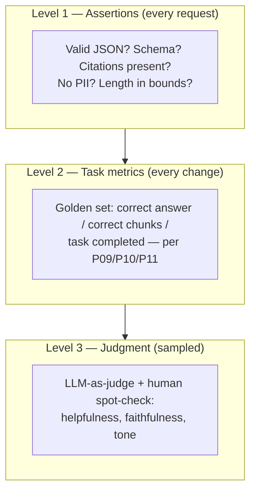

Every part of this series has ended with the same drumbeat — golden set (P09), done-criteria (P10), wallet-guarded test set (P11) — and this part is where the drumbeat becomes the discipline. The reason it matters is one asymmetry: **a demo shows the system working on inputs you chose; production is inputs you didn't choose, forever.** Traditional software closes that gap with deterministic tests (S01-P09): same input, same output, assert equals. LLMs return *plausible distributions*, so `assertEqual` dies — and most teams respond by shipping on vibes. The engineering answer is a different test pyramid.

## What you'll learn

- Build the three tiers of the eval pyramid, and know which failure each catches.
- Use an LLM as a judge without quietly grading your own homework.
- Trace an LLM app with the fields that make a bad answer diagnosable.
- Gate prompt changes the way you gate deploys.

**Prerequisites:** Part 8 (prompts as code) and Part 9 (retrieval, which is what usually fails).

## 1. The eval pyramid



**Level 1 — assertions, cheap and deterministic.** Whatever the model's prose does, plenty is still binary: output parses against the schema (P08's structured-output contract), required citations exist (P09), banned content absent, length within bounds. These run on *every* production request as guardrails, not just in CI — the S02-P12 move of validating at the border, applied to model output. A surprising share of "LLM quality" incidents are Level-1 failures wearing Level-3 clothes.

**Level 2 — task metrics on the golden set.** The 30–50-case sets you've been building all series, run on *every change*: retrieval recall@k (P09), task completion rate (P10), format fidelity (P11). Deterministic scoring where possible — exact match, contains-the-key-fact, passes-the-checker — because deterministic metrics never argue back.

**Level 3 — judgment, where rubrics live.** "Is this answer helpful? Faithful to the sources? On-brand?" — no regex scores that. Here you sample (you can't afford judgment on everything), and you bring in the judge.

## 2. LLM-as-judge, without fooling yourself

Using a model to grade a model works — it's how the field scales evaluation — but only under rules that keep it honest. **Judge with a rubric, not a feeling**: "score 1–5 for faithfulness, where 5 = every claim traceable to a provided chunk, 1 = contradicts them" beats "rate this answer" by a mile — you're applying P08's prompt discipline *to the judge itself*. **Prefer pairwise over absolute** where possible ("which of A/B is more faithful?") — models are unreliable at absolute scales and much better at comparisons; pairwise also directly answers your actual question, "did the new prompt beat the old one?". **Calibrate against humans once per rubric**: grade 50 cases by hand, check agreement; a judge that agrees with you 90% of the time is a scaling tool — one you haven't checked is a random-number generator with confidence. And **never let a model family grade itself into production** — self-preference bias is real; use a different family or a human gate for ship decisions.

## 3. Tracing: observability with new fields

S04-P10 gave you the three signals; LLM apps add domain-specific fields to the same discipline. A **trace** here is the full request tree: retrieval query → chunks returned (with scores) → final prompt → model/version/params → response → tool calls (P10's audit trail) → tokens and latency per step. When someone reports "it said something weird," the trace answers the P09 debugging question — *was it retrieval, the prompt, or the model?* — in one look instead of one reproduction attempt. The additional habits: **log prompts and completions** (with CS-P11 PII care — this data is sensitive by construction), **tag every trace with prompt version and model version** (below), and **watch the LLM-specific metrics**: token cost per request (P07's bill, per-feature), p99 latency including retrieval, guardrail-trigger rate, and "I don't know" rate — a *rising* refusal rate often means retrieval broke upstream, not that the model got humble.

## 4. Regression: prompts are code, so treat changes like deploys

The full loop, assembled from parts you own: prompts and rubrics live in git with versions (P08); every change — prompt tweak, new chunk size, model upgrade — runs Levels 1–2 in CI plus a Level-3 sample, compared *against the incumbent* (pairwise, again); ship as a **staged rollout** (S01-P12: a few percent of traffic first, watching the trace metrics) because offline evals are necessary but not sufficient; and feed production failures back into the golden set — S02-P12's museum-of-incidents loop, verbatim: every weird case a user reports is a future test case someone already paid for. Model upgrades deserve special paranoia: a "better" model that reorders your JSON fields or pads answers is a regression *for you*, whatever the leaderboard says. No eval, no upgrade.

## Practice (25 minutes — build the deterministic tier first, because it's the one that pays)

Most teams jump to LLM-as-judge and skip the tier that catches the most bugs for the least money. Build that one:

```python
import json

# A golden set: inputs with checkable properties, NOT with one blessed output string
GOLDEN = [
 {"q": "What is our refund window?",  "must_contain": ["14"],  "must_not": ["30", "60"]},
 {"q": "What is the Pro plan price?", "must_contain": ["49"],  "must_not": []},
 {"q": "Who won the 2019 World Cup?", "must_contain": ["don't know", "not in"],  # out of scope
                                      "must_not": ["England", "New Zealand"], "any_of": True},
]

def assertions(answer, case):
    # Tier 1: deterministic checks. Cheap, fast, and they never argue.
    fails = []
    if not isinstance(answer, str) or not answer.strip():
        fails.append("empty answer")
    hits = [p for p in case["must_contain"] if p.lower() in answer.lower()]
    if case.get("any_of"):
        if not hits: fails.append(f"none of {case['must_contain']} present")
    elif len(hits) != len(case["must_contain"]):
        fails.append(f"missing {set(case['must_contain']) - set(hits)}")
    for p in case["must_not"]:
        if p.lower() in answer.lower(): fails.append(f"contains forbidden {p!r}")
    if len(answer) > 1200: fails.append("answer too long")
    return fails

def evaluate(answer_fn, label):
    rows, failed = [], 0
    for case in GOLDEN:
        f = assertions(answer_fn(case["q"]), case)
        failed += bool(f)
        rows.append({"q": case["q"][:40], "fails": f or "ok"})
    print(f"=== {label}: {len(GOLDEN)-failed}/{len(GOLDEN)} passed")
    for r in rows: print("   ", json.dumps(r, ensure_ascii=False))
    return len(GOLDEN) - failed

# Run it against your current prompt, then against a proposed change:
# baseline  = evaluate(lambda q: call_model(PROMPT_V1, q), "prompt v1")
# candidate = evaluate(lambda q: call_model(PROMPT_V2, q), "prompt v2")
# assert candidate >= baseline, "REGRESSION: v2 scores lower - do not ship"
```

Expected results: the third case is the one worth staring at — an out-of-scope question where the correct behavior is *refusing*, and a system that answers it confidently fails a check rather than impressing anyone. Notice that none of these assertions needed a model to grade them, cost anything, or produced a debatable score: they run in a second on every prompt change, which is exactly what makes them a gate. Add the judge tier later for the qualities assertions genuinely can't express (tone, helpfulness) — and when you do, calibrate it against about 50 human-labeled cases first, or you're trusting an unvalidated grader.

## Check yourself

1. Your team evaluates prompt changes by trying a few questions in a playground and eyeballing the answers. Name two failure modes of this process.
2. Why shouldn't the model that generates answers also be the judge that scores them?
3. Your eval scores have been at 95% for three months while user complaints keep rising. What's the likely explanation?

<details><summary>See answers</summary>

1. First, the sample is chosen by the person who wrote the change, so it favors what they were thinking about and misses the inputs that break it. Second, there's no record: nothing detects a regression on a case that used to work, because "used to work" was never written down. A golden set with automatic scoring fixes both.
2. Because it grades its own tendencies as correct — the same biases that produced the answer also evaluate it, so systematic errors become invisible. Use a different model as judge, or a human-calibrated rubric, and check the judge's agreement with human labels before trusting its numbers.
3. The eval set has gone stale: it no longer represents what users actually ask. Real traffic drifts, and a static golden set slowly turns into a test of last quarter's problems. Feed production failures back into the set continuously, so it stays a museum of *current* failure modes rather than historical ones.

</details>

## Key takeaways

- Demos are chosen inputs; production isn't — replace assertEqual with the pyramid: per-request assertions, golden-set task metrics, sampled judgment.
- LLM-as-judge scales evaluation only with rubrics, pairwise comparisons, human calibration, and never grading its own family for ship decisions.
- Traces carry the new fields — chunks, prompt/model versions, tokens, tool calls — so "it said something weird" becomes a lookup, not a reproduction hunt; watch cost, refusal rate, and guardrail triggers as first-class metrics.
- Every change (prompt, pipeline, or model) evals against the incumbent and rolls out staged; production failures become golden-set cases. No eval, no upgrade.

*Next up — Part 13: LLMOps: Serving, Cost & Latency.*
