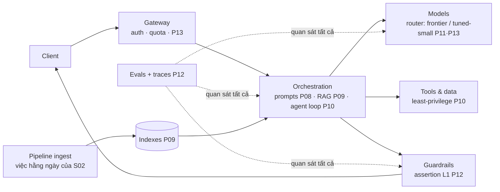

Mười ba phần cơ khí; hồi kết nói về *sự phán đoán*. Cú đổi mà S02-P14 gọi tên cho data engineer áp nguyên văn ở đây: **đơn vị công việc của một senior AI engineer không phải cú gọi model — mà là cái hệ thống business tin được.** Năm 2026 điều đó nghĩa là ba thứ mà các bản demo không bao giờ cho thấy: một kiến trúc nơi model là một *thành phần* (và thường là thành phần ít quan trọng nhất để debug), một threat model bạn mang vào mọi thiết kế, và sự phán đoán nghề nghiệp để quyết cái gì nên được ship.

## Kiến trúc tham chiếu

Đọc nó như một senior: **model là chiếc hộp tráo được sau một router** — việc của kiến trúc là khiến đổi model thành một đợt chạy eval, không phải một cuộc viết lại ("không eval, không upgrade" của P12, cấu trúc hoá). **Tầng orchestration là nơi kỹ thuật của bạn sống** — prompt-là-code, retrieval, agent loop — và nó là phần mềm thuần: các kỷ luật test, review, deploy của S01 áp không ngoại lệ. **Bộ eval là hạ tầng gánh lực**, không phải side project — nó là thứ khiến mọi chiếc hộp khác đổi được. Và chiếc hộp các team hay quên: **pipeline ingest nuôi index của bạn là một data pipeline** với đầy đủ yêu cầu của S02 — SLA độ tươi, cổng quality, lineage. Một nửa các sự cố "AI dạo này tệ đi" là sự cố S02-P12 mặc áo AI.

## Threat model: ba bề mặt

Security cho hệ AI là CS-P11 cộng đúng một bài toán mới thật sự, và một senior phát biểu được nó gọn gàng: **model không phân biệt được một cách đáng tin giữa chỉ thị và dữ liệu.** Mọi thứ khác suy ra từ đó.

- **Input — prompt injection** (bộ áo thứ tư của CS-P11, giờ lên tít): mọi văn bản hệ thống đọc — tin nhắn người dùng, tài liệu retrieve (P09), trang web, tool result (P10) — đều có thể chứa chỉ thị đối nghịch. Năm 2026 chưa có cách chữa triệt để; có *khoanh vùng nhiều lớp*: tách cấu trúc chỉ thị khỏi nội dung trong prompt (P08), tool least-privilege với cổng phê duyệt trên side effect (P10), assertion guardrail trên output (P12), và — tuyến cuối thật thà — *thiết kế bán kính vụ nổ*: giả định thỉnh thoảng bị chiếm quyền và hỏi hệ thống bị chiếm *làm được* gì. Câu hỏi đó quyết định nhiều an ninh hơn mọi bộ lọc.
- **Output — rò rỉ và tác hại**: model có thể vọng lại thứ nó thấy (tài liệu mật retrieve về → trả lời cho người dùng không có quyền) và sinh ra thứ không nên sinh. Cách chữa nhàm chán mà hiệu quả: **authorization ngay lúc retrieval** (lọc chunk theo quyền của *người đang hỏi* — metadata của P09, giờ là một security control; cái index là một database và bài học IDOR của CS-P11 áp lên nó), lọc PII trong pipeline và log (caveat tracing của P12), và guardrail output như assertion mỗi request.
- **Chuỗi cung ứng**: model, weights, dataset, và prompt template là các dependency — version chúng, biết xuất xứ, và đối xử "thư viện prompt hữu ích trên mạng" với cùng độ nghi ngờ như một package chưa audit (kỷ luật dependency của S01-P11, mở rộng).

## Trách nhiệm như một kỷ luật kỹ thuật

Bóc lớp buzzword; thứ còn lại là thực hành cụ thể mà một senior sở hữu. **Khớp autonomy với hệ quả** (ngân sách của P10, nâng thành chính sách): soạn nháp email và duyệt hồ sơ vay không nhận cùng một vòng lặp — với quyết định hệ trọng, hệ thống *đề xuất kèm lý do* và con người quyết, và đó là một yêu cầu kiến trúc (cổng phê duyệt đặt ở đâu), không phải một triết lý. **Đo xem nó hỏng với ai**: kim tự tháp eval của P12, cắt theo phân khúc — một bot support xuất sắc tiếng Anh và vô dụng tiếng Việt là một sản phẩm hỏng với điểm trung bình đẹp; golden set của bạn phải chứa những người dùng mà bản demo đã quên. **Trung thực về độ tự tin**: hiện sự bất định, dẫn nguồn (P09), và biến "tôi không biết" thành câu trả lời hạng nhất — một hệ sai 5% *và nói ra điều đó* hữu ích hơn một hệ sai 3% với sự tự tin hoàn hảo, vì người dùng hiệu chuẩn được với cái thứ nhất. Và **viết ra thứ hệ thống không được làm** — bản spec âm (không gian âm của P08, thăng cấp thành yêu cầu sản phẩm) — vì "bọn mình chưa từng quyết" là cách các cú launch tệ ra đời.

## Học khi mọi thứ đổi

Câu hỏi khó chịu mọi AI engineer nhận được — "một năm nữa mấy thứ này lỗi thời hết thì sao?" — có câu trả lời senior: **sắp xếp thứ đã học theo chu kỳ bán rã.** Bán rã ngắn: tên model, bề mặt API, thứ hạng leaderboard — *thuê* loại kiến thức này, đừng học thuộc. Bán rã dài: mọi thứ series này thật sự dạy — trực giác toán (P02), kỷ luật evaluation (P04, P12), kiến trúc retrieval (P09), pattern vòng-lặp-và-tool (P10), trade-off cost/latency (P13), và threat model ở trên. Chúng sống qua mọi thế hệ model tới giờ, và mỗi năng lực mới được *hấp thụ vào* chúng (một model tốt hơn đổi config router và kết quả eval của bạn — không đổi kiến trúc của bạn). Thói quen thực dụng: khi có thứ mới ra, hỏi "nó đổi chiếc hộp nào trong sơ đồ tham chiếu?" — thường là một hộp, và các chiếc hộp là lý do bạn hấp thụ được nó một cách bình tĩnh. Đi tiếp: nền dữ liệu sâu hơn → S02 (index của bạn xứng đáng có pipeline thật); đám mây hệ thống chạy trên → S04 (Bedrock/SageMaker ở P14 bên đó); phán đoán kiến trúc toàn hệ → S07.

Series hoàn tất. Các model trong mười bốn phần này sẽ thành hiện vật bảo tàng trong ba năm; các câu hỏi — nó có grounded không, có được đo không, bị chiếm quyền thì làm được gì, nó hỏng với ai, ai là người quyết — sẽ sống lâu hơn tất cả.

## Điều cần nhớ

- Model là chiếc hộp tráo được; kỹ thuật của bạn sống ở orchestration, eval, và pipeline ingest — một nửa "AI tệ đi" là sự cố chất lượng dữ liệu mặc áo AI.
- Một câu sinh ra cả threat model: model không tách được chỉ thị khỏi dữ liệu — nên khoanh vùng nhiều lớp và thiết kế theo bán kính vụ nổ, với authorization-lúc-retrieval là cú vá rò rỉ không ai bỏ qua lần hai.
- Trách nhiệm là cụ thể: autonomy khớp hệ quả, eval cắt theo phân khúc, bất định trung thực kèm nguồn, và bản spec âm viết ra giấy.
- Sắp kiến thức theo chu kỳ bán rã: thuê tên model, sở hữu kiến trúc + eval + threat model — năng lực mới đổi một chiếc hộp, không đổi sơ đồ. Series hoàn tất — S02 cho chiều sâu data, S04 cho cloud, S07 cho kiến trúc.
