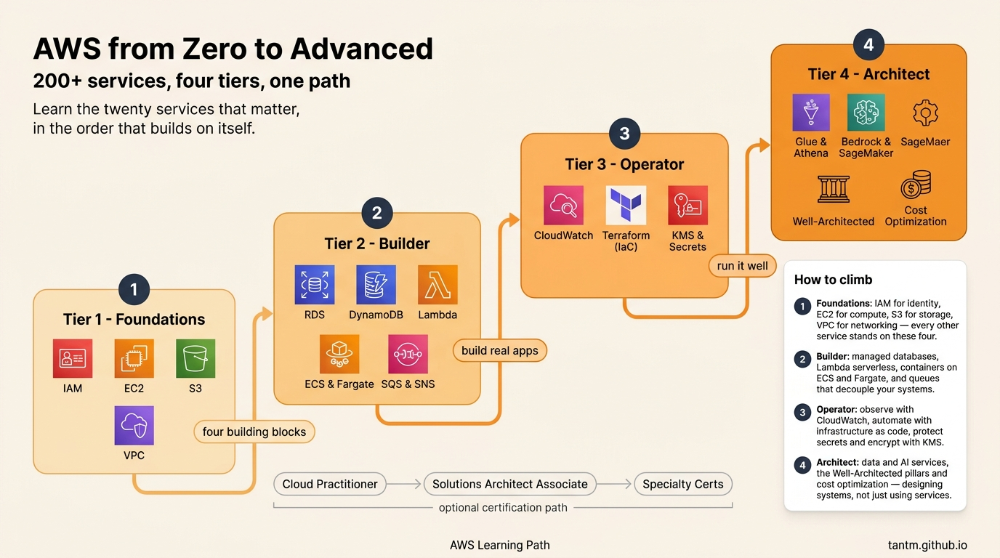
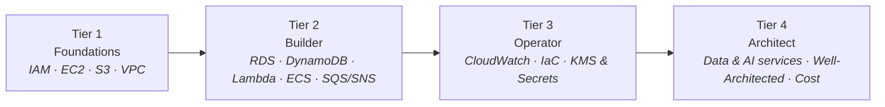

Mở AWS console lần đầu, bạn được chào đón bởi hơn hai trăm services với những cái tên như Fargate, Glue, Snowball. Cảm giác như phải mất nhiều năm chỉ để biết chúng là gì.

Tin tốt: không cần. Các hệ thống thật — kể cả hệ thống rất lớn — được xây từ một phần lõi nhỏ đến bất ngờ. Series này đi qua phần lõi đó theo bốn tier, mười sáu phần, từ "chưa từng đụng cloud" đến "thiết kế và bảo vệ được một kiến trúc".

## Trước hết, mental model

Ba ý tưởng sắp xếp mọi thứ còn lại:

- **Region và Availability Zone.** AWS là vật lý: các data center gom thành AZ, các AZ gom thành Region. High availability nghĩa là "sống sót khi một AZ hỏng"; disaster recovery nghĩa là "sống sót khi cả Region hỏng". Giá và latency khác nhau theo Region.
- **Mọi thứ là API.** Console chỉ là UI bọc trên API. Đây là lý do hạ tầng viết được thành code (Tier 3) — và cũng là lý do credentials gọi các API đó là báu vật cần giữ (cũng Tier 3).
- **Shared responsibility.** AWS bảo mật *cái cloud*; bạn bảo mật *thứ bạn đặt vào* cloud. Đa số sự cố cloud lên báo nằm ở phía khách hàng của ranh giới đó — thường là một misconfiguration.

## Bốn tier

### Tier 1 — Foundations (Phần 2–5)

Bốn khối lego mà mọi thứ khác đứng lên trên:

- **IAM** — ai được làm gì. Service đầu tiên phải học, vì sai ở đây thì mọi thứ khác sụp theo.
- **EC2** — một server thuê theo giây. Kể cả trong thế giới serverless, hiểu instance mới hiểu các abstraction đang giấu gì.
- **S3** — object storage âm thầm gánh nửa Internet: backup, data lake, static website.
- **VPC** — mạng riêng của bạn: subnet, routing, security group. Chủ đề người mới hay né, rồi hối hận vì đã né.

### Tier 2 — Builder (Phần 6–9)

Bộ đồ nghề xây ứng dụng: **managed database** (RDS/Aurora cho relational, DynamoDB cho key-value quy mô lớn), **Lambda** và API Gateway để chạy code không cần server, **container** trên ECS/Fargate cho mọi thứ ở giữa, và **SQS/SNS/EventBridge** — sự tách rời giúp hệ thống sống sót khi một phần hỏng.

Sau Tier 2 bạn đã build và ship được sản phẩm thật trên AWS.

### Tier 3 — Operator (Phần 10–12)

Khác biệt giữa "chạy được" và "chạy tốt": **CloudWatch** với metrics, logs, alarm; **infrastructure as code** bằng Terraform để environment tái tạo được thay vì nặn tay; **KMS và Secrets Manager** để encryption và credentials trở nên nhàm chán — đúng như chúng nên thế.

### Tier 4 — Architect (Phần 13–16)

Zoom out: **data services** (Glue, Athena, Kinesis, Redshift — cây cầu sang data engineering), **AI services** (Bedrock, SageMaker), **Well-Architected Framework** để chấm một bản thiết kế, và **cost optimization** — vì trên AWS, hoá đơn *chính là* một bài review kiến trúc. Tier này kết bằng lộ trình certification, nếu bạn muốn tấm giấy.

## 20 services đáng học

| Tier | Services |
|---|---|
| Foundations | IAM · EC2 · S3 · VPC |
| Builder | RDS · Aurora · DynamoDB · Lambda · API Gateway · ECS · ECR · SQS · SNS · EventBridge |
| Operator | CloudWatch · KMS · Secrets Manager |
| Architect | Glue · Athena · Bedrock |

Mọi thứ còn lại học on-demand được, một khi phần này đã vững.

## Học mà không sợ hoá đơn

- Tạo **account cá nhân mới** với free tier — tuyệt đối không thực hành trên account công ty.
- Đặt **billing alarm ngay ngày đầu** (Phần 2 sẽ làm cùng nhau).
- **Xoá những gì mình tạo** sau mỗi buổi học; một NAT Gateway để quên là bài học $35 kinh điển của người mới.
- Mọi ví dụ trong series dùng tài nguyên demo dùng-xong-xoá với tên generic.

## Điều cần nhớ

- AWS có 200+ services, nhưng hệ thống thật xây từ phần lõi khoảng hai mươi cái — học theo đúng thứ tự phụ thuộc.
- Mental model đi trước: Region/AZ, mọi-thứ-là-API, shared responsibility.
- Bốn tier: foundations, builder, operator, architect. Certification là sản phẩm phụ tuỳ chọn, không phải mục tiêu.

**Lộ trình liên quan:** [CS Foundations](/vi/series/cs-foundations) nếu networking và OS ở đây còn mới; [Lộ trình Data Engineer](/vi/series/de-roadmap) và [Lộ trình AI Engineer](/vi/series/ai-roadmap) đều chạm tới AWS services ở các giai đoạn sau.

*Tiếp theo — Phần 2: IAM: identity là vành đai bảo mật mới.*
