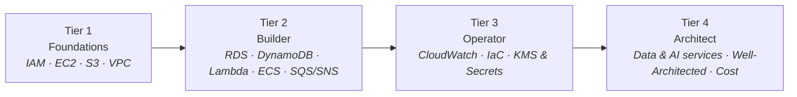
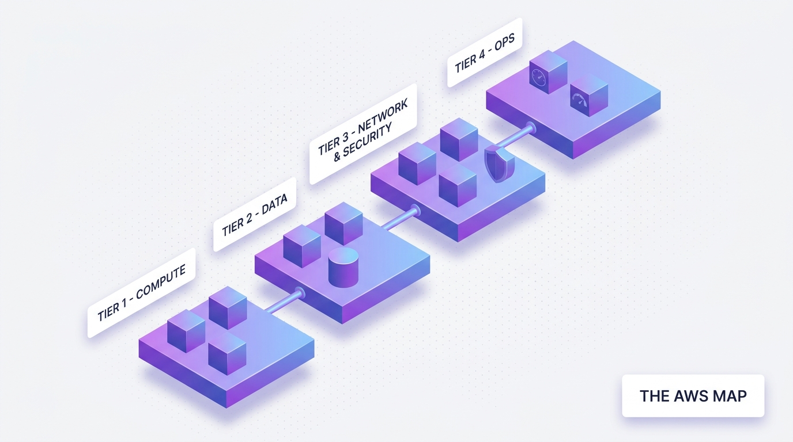

Open the AWS console for the first time and you are greeted by more than two hundred services with names like Fargate, Glue, and Snowball. It looks like you need years just to know what exists.

Good news: you don't. Real systems — including very large ones — are built from a surprisingly small core. This series walks that core in four tiers, sixteen parts, from "I have never touched cloud" to "I can design and defend an architecture".

## What you'll learn

- Hold the three-sentence mental model that explains all of AWS.
- Navigate the four tiers of services and the 20 that actually matter.
- Set up a free-tier account you can learn on without bill anxiety.
- Know the 16-part route and where your role should focus.

**Prerequisites:** none. CS Foundations helps but is not required.

## 1. First, the mental model

Three ideas organize everything else:

- **Regions and Availability Zones.** AWS is physical: data centers grouped into AZs, AZs grouped into Regions. High availability means "survives an AZ failure"; disaster recovery means "survives a Region failure". Price and latency differ by Region.
- **Everything is an API.** The console is just a UI over APIs. This is why infrastructure can be code (Tier 3) — and why credentials that call those APIs are the crown jewels (also Tier 3).
- **Shared responsibility.** AWS secures the cloud; you secure what you put *in* it. Most cloud incidents in the news are on the customer side of that line — usually a misconfiguration.

## 2. The four tiers

### Tier 1 — Foundations (Parts 2–5)

Four building blocks that everything else stands on:

- **IAM** — who can do what. The first service to learn, because a mistake here undermines everything else.
- **EC2** — a server you rent by the second. Even in a serverless world, understanding instances explains what the abstractions are hiding.
- **S3** — object storage that quietly powers half the internet: backups, data lakes, static websites.
- **VPC** — your private network: subnets, routing, security groups. The topic beginners avoid and then regret avoiding.

### Tier 2 — Builder (Parts 6–9)

The application-building kit: **managed databases** (RDS/Aurora for relational, DynamoDB for key-value at scale), **Lambda** and API Gateway for code without servers, **containers** on ECS/Fargate for everything in between, and **SQS/SNS/EventBridge** for the decoupling that keeps systems alive when one part fails.

After Tier 2 you can build and ship a real product on AWS.

### Tier 3 — Operator (Parts 10–12)

The difference between "it runs" and "it runs well": **CloudWatch** metrics, logs, and alarms; **infrastructure as code** with Terraform so environments are reproducible instead of hand-crafted; **KMS and Secrets Manager** so encryption and credentials are boring — which is exactly what they should be.

### Tier 4 — Architect (Parts 13–16)

Zoom out: **data services** (Glue, Athena, Kinesis, Redshift — the bridge to data engineering), **AI services** (Bedrock, SageMaker), the **Well-Architected Framework** for judging designs, and **cost optimization** — because on AWS, the bill *is* an architecture review. This tier ends with the certification path, if you want the paper.

## 3. The 20 services that matter

| Tier | Services |
|---|---|
| Foundations | IAM · EC2 · S3 · VPC |
| Builder | RDS · Aurora · DynamoDB · Lambda · API Gateway · ECS · ECR · SQS · SNS · EventBridge |
| Operator | CloudWatch · KMS · Secrets Manager |
| Architect | Glue · Athena · Bedrock |

Everything else you can learn on demand, once these are solid.

## 4. Learning without a scary bill

- Create a **fresh personal account** with the free tier — never practice in a company account.
- Set a **billing alarm on day one** (we do it together in Part 2).
- **Delete what you create** at the end of each session; a NAT Gateway left running is the classic beginner's $35 lesson.
- All examples in this series use throwaway demo resources with generic names.

## Practice (15 minutes)

Do the two setup steps this whole series assumes:

1. Create a free-tier AWS account. Immediately enable MFA on the root user, then create an IAM user for daily work (Part 2 explains why root stays locked away).
2. Create a billing alarm at $5. This is the single highest-value click in AWS: you will never be surprised by a bill again. Console → Billing → Budgets → create a $5 monthly budget with an email alert.
3. Bookmark the pricing calculator (calculator.aws). Before every hands-on in this series, you can check the expected cost — almost always $0 on free tier.

## Check yourself

1. What are the three sentences of the AWS mental model?
2. You want to run a Python API with zero traffic at night. Which tier-1 service shape fits best, and why?
3. Why does this series insist on a billing alarm before any other hands-on?

See answers

1. Everything is an API call; you rent by the unit (hour, GB, request); the shared responsibility model splits security between AWS (of the cloud) and you (in the cloud).
2. Serverless (Lambda-class): it scales to zero, so zero traffic costs zero — a server would bill hourly all night.
3. Because the biggest barrier to learning AWS is bill fear. A $5 alarm converts "what if I forget something expensive" into an email — making every later experiment psychologically free.

## Key takeaways

- AWS is 200+ services, but real systems are built from a core of about twenty — learn those in dependency order.
- The mental model comes first: Regions/AZs, everything-is-an-API, shared responsibility.
- Four tiers: foundations, builder, operator, architect. Certifications are an optional by-product, not the goal.

**Related paths:** [CS Foundations](/series/cs-foundations) if networking and OS concepts here feel new; the [Data Engineer Roadmap](/series/de-roadmap) and [AI Engineer Roadmap](/series/ai-roadmap) both land on AWS services in their later stages.

*Next up — Part 2: IAM: Identity Is the New Perimeter.*
