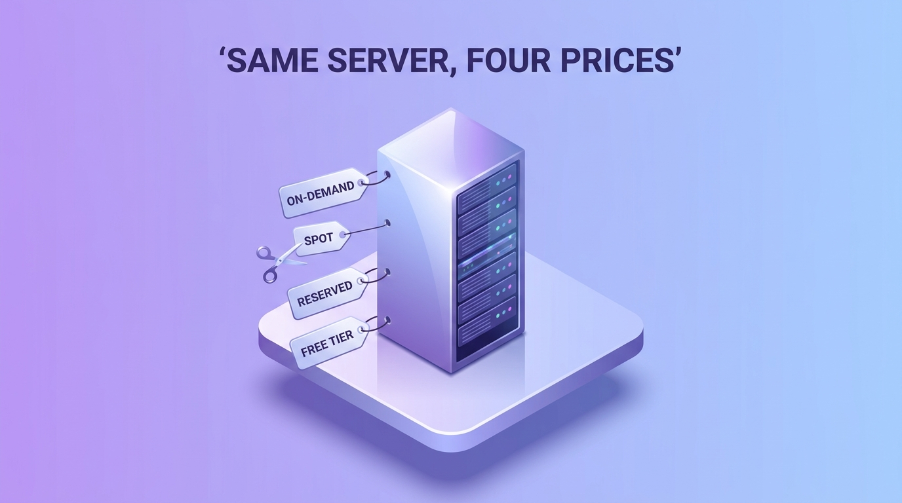

Serverless đang là mốt, vậy sao lại bắt đầu bằng server? Vì mọi abstraction cao hơn trên bản đồ AWS — Lambda, Fargate, database managed — đều là **EC2 đã được mài bớt cạnh sắc**, và khi abstraction rò rỉ (chắc chắn có lúc), vết rò mang hình một cái instance. Một giờ thông thạo EC2 mua được trực giác cho nửa catalog AWS. Phần này chính là một giờ đó.

## Bạn sẽ học được gì

- Nói được instance thực chất là gì — và ba sự thật vòng đời mà người mới học bằng nước mắt.
- Giải mã mọi instance type như một câu văn và chọn được bằng hai câu hỏi.
- Launch bò đàn thay vì thú cưng: AMI + user data + tham số, kết nối kiểu không-cần-key hiện đại.
- Cấu hình security group mặc định-đóng và chọn có chủ đích trên thực đơn bốn mức giá.

**Cần biết trước:** Phần 1 (region và AZ), Phần 2 (IAM role — SSM đứng trên nó). Account AWS cá nhân; mọi thứ ở đây nằm gọn trong free tier.

## 1. Instance thực chất là gì

Một EC2 instance là một lát cắt thuê của một máy vật lý trong một Availability Zone của Phần 1: vCPU, memory, network interface, và một root disk. Ba hệ quả mà người mới thường học bằng nước mắt:

- **Nó sống trong MỘT AZ.** AZ gặp ngày xấu → instance của bạn gặp ngày xấu. High availability nghĩa là *nhiều instance ở nhiều AZ* (các pattern của Phần 15), không bao giờ là một instance được chăm kỹ.
- **Root EBS volume là một thứ riêng** — storage gắn qua mạng với vòng đời riêng. Terminate bất cẩn thì disk có thể biến mất cùng instance; ngược lại, một volume có thể sống lâu hơn instance và được gắn lại chỗ khác.
- **Stop ≠ terminate.** Instance đã stop không tính tiền compute (EBS volume vẫn tính); đã terminate là mất hẳn. Cặp động từ đứng sau nhiều cơn đau tim của người mới.

## 2. Đọc instance type như đọc một câu văn

`m7g.xlarge` giải mã thành: **family** (`m` = general purpose) + **thế hệ** (`7`, mới hơn = giá/hiệu năng tốt hơn, cứ lấy mới nhất) + **thuộc tính** (`g` = chip Graviton/ARM — rẻ hơn, và ổn cho đa số workload Linux) + **size** (`xlarge` ≈ 4 vCPU / 16 GB; mỗi nấc size là nhân đôi).

Các family bạn sẽ gặp thật:

| Family | Tính cách | Dùng cho |
|---|---|---|
| `t` | Burstable — nhỏ, tích luỹ CPU credit | Máy dev, app ít traffic — **và cái bẫy credit**: tải bền vững rút cạn credit, rồi nó bò |
| `m` | Cân bằng CPU:RAM (1:4) | Mặc định khi chưa chắc |
| `c` | Nặng compute (1:2) | Encode, batch cày số |
| `r` | Nặng memory (1:8) | Database, cache, DataFrame to (phép tính pandas của S02-P03) |

Quyết định là hai câu hỏi — đói CPU hay đói RAM, và đói cỡ nào? — rồi lấy thế hệ mới nhất của family khớp. Đừng dằn vặt: resize chỉ là stop-đổi-start, đúng thứ đàn hồi mà bạn đang trả tiền để có.

## 3. AMI, user data, và tư tưởng pets-vs-cattle

**AMI** (Amazon Machine Image) là ảnh disk đông lạnh mà instance boot lên từ đó (OS + những gì đã nướng sẵn). **User data** là script chạy ở lần boot đầu. Gộp lại, chúng chở ý tưởng văn hoá quan trọng nhất của cloud — và là phép ví von của cả bài này: **cattle, not pets** — nuôi bò đàn, đừng nuôi thú cưng. Server thú-cưng được cấu hình tay, đặt tên trìu mến, không thể thay thế — và không thể tái tạo. Instance bò-đàn là *AMI + user data + tham số*: xoá đi, dựng con giống hệt trong hai phút.

```bash
#!/bin/bash
# user data: từ Amazon Linux trắng tinh thành web server đang chạy, không bàn tay người
dnf install -y nginx
systemctl enable --now nginx
```

Tập kỷ luật này ngay bây giờ, và Phần 11 (Terraform) sẽ là kết luận tự nhiên thay vì một tôn giáo mới.

## 4. Kết nối: SSH, kiểu 2026

Đường cổ điển — tải key pair `.pem`, `ssh -i my-key.pem ec2-user@<public-ip>` — vẫn chạy và vẫn đáng học. Nhưng để ý nó đòi gì: một file key phải canh giữ (cảnh báo credential-sống-lâu của IAM Phần 2, phiên bản dạng file) và một cổng 22 mở. Mặc định hiện đại trên AWS là **SSM Session Manager**: IAM role của instance (lại nó — danh từ quan trọng nhất của Phần 2) cho bạn mở shell từ console hoặc CLI với **không file key và không một cổng inbound nào**. Học SSH một lần cho thông thạo; với tới SSM trong mọi thứ nghiêm túc.

## 5. Security group đầu tiên của bạn

**Security group** là firewall stateful gắn vào network interface của instance: mặc định = không gì vào, mọi thứ ra; bạn chỉ mở đúng thứ cần. Hai rule cho một web server demo:

| Chiều | Cổng | Nguồn | Vì sao |
|---|---|---|---|
| Inbound | 443/80 | `0.0.0.0/0` | Website công khai mà |
| Inbound | 22 | *chỉ IP của bạn* — hoặc khỏi mở, dùng SSM | Quyền admin không phải dịch vụ công cộng |

Sai lầm người mới kinh điển là mở `22` cho `0.0.0.0/0` — trong vài giờ, auth log đầy các cú thử đăng nhập của bot (chúng quét liên tục; đây là phiên bản nhìn-thấy-từ-vũ-trụ của bài học lộ-key Phần 2). Security group đào sâu hơn ở Phần 5 (VPC), nơi nó gặp subnet và NACL.

## 6. Thực đơn giá

Cùng một instance, bốn mức giá — và chính cái thực đơn là bài học kiến trúc (S07-P12 dành nguyên một phần cho nó):

- **On-demand** — trả theo giây, không cam kết. Mặc định khi học và khi chưa rõ.
- **Spot** — công suất dư giảm ~60–90%, AWS có thể đòi lại với cảnh báo 2 phút. Hoàn hảo cho batch chịu được ngắt (các job idempotent của S02-P03 *sinh ra đúng cho việc này*); sai chỗ cho bất cứ thứ gì không được chết giữa request.
- **Savings Plans / Reserved** — cam kết 1–3 năm dùng đều để giảm ~30–60%. Nửa "committed ở lõi" trong pattern của S07-P12.
- **Free tier** — đủ giờ của một instance nhỏ để làm mọi thứ trong phần này với $0.

Thói quen quan trọng hơn mọi khoản giảm giá: **instance không dùng thì stop.** Một con `xlarge` bị quên là cú sốc hoá đơn đầu đời kinh điển — billing alarm của Phần 2 tồn tại chính xác cho việc này.

## Thực hành (30 phút — free tier)

1. Launch instance nhỏ nhất thế hệ mới với Amazon Linux, script user-data nginx ở mục 3, và security group mở cổng 80 cho mọi nơi (không mở cổng 22 chút nào).
2. Mở public IP trong browser.
3. Kết nối qua SSM Session Manager: gắn role SSM mặc định cho instance (IAM → role có `AmazonSSMManagedInstanceCore`), rồi Connect → Session Manager trong console.
4. Stop instance và xem trang Volumes. Rồi terminate và xem lại.

Kết quả mong đợi: bước 2 hiện trang chào của nginx — một server từ con số không, không bàn tay người chạm vào (bò đàn, không thú cưng). Bước 3 cho bạn shell mà không file key, không cổng 22 mở. Bước 4: sau stop, EBS volume vẫn còn (và vẫn tính tiền); sau terminate, instance lẫn volume biến mất — khác biệt stop-vs-terminate, cảm bằng xương tuỷ.

## Tự kiểm tra

1. Máy dev `t3.micro` của bạn chạy load test kéo dài và đột nhiên chậm không dùng nổi, dù CPU báo 100% "đang dùng." Chuyện gì xảy ra?
2. Đồng đội đề xuất chạy pipeline batch hằng đêm trên spot instance. Job phải có tính chất gì, và bài học nào trước đó cung cấp nó?
3. Vì sao SSM Session Manager được ưu tiên hơn SSH key cho mọi thứ nghiêm túc — nối với thói quen lõi của Phần 2.

<details><summary>Xem đáp án</summary>

1. Bẫy credit của family burstable: instance `t` tích luỹ CPU credit và tiêu chúng khi có tải. Tải kéo dài rút cạn credit nên instance bị bóp về baseline thấp. Sửa: family `m`/`c` cho việc chạy bền, hoặc canh số dư credit.
2. Idempotency (S02-P03): spot có thể bị đòi lại với 2 phút cảnh báo, nên job phải chạy lại an toàn — mỗi lượt sở hữu lát cắt của nó và retry cho cùng kết quả. Batch idempotent + giá spot là cặp sinh ra cho nhau.
3. SSM xác thực qua IAM role của instance — credentials tạm thời, không file key để lộ, không cổng 22 cho bot gõ cửa. Đó là "danh tính cố định, credentials thì không nên" của Phần 2 áp vào quyền truy cập shell.

</details>

## Điều cần nhớ

- Mọi thứ cấp cao trên AWS là EC2 đã mài cạnh — thông thạo instance là bảo hiểm rò rỉ cho mọi abstraction bên trên.
- Đọc type như câu văn (family-thế hệ-thuộc tính-size); chọn theo cơn đói CPU-hay-RAM và lấy thế hệ mới nhất.
- Cattle, not pets: AMI + user data + tham số nghĩa là instance nào cũng xoá được và tái tạo được — tư duy mà Terraform sẽ chính thức hoá.
- Security group mặc định đóng (không bao giờ mở 22 cho cả thế giới; ưu tiên SSM hơn key); trên thực đơn giá, spot dành cho batch idempotent và stop là mức giá tốt nhất trong tất cả.

*Tiếp theo — Phần 4: S3 chuyên sâu: hơn cả chỗ chứa file.*
