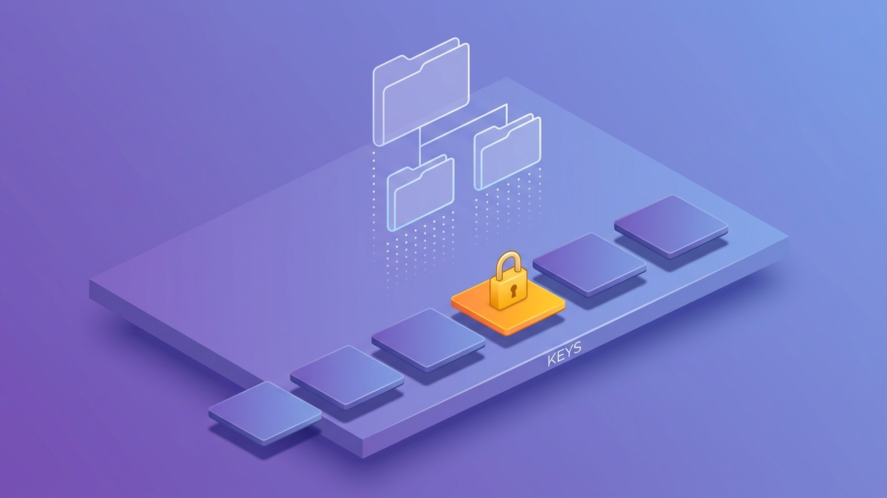

S3 looks like a file share and that resemblance is a trap. It is an **object store** (storage addressed by key over HTTP, not by disk block) — a different animal with different physics. It quietly underpins half of AWS: data lakes, EBS snapshots, log archives, static websites, ML datasets.

## What you'll learn

- Explain why S3 has no folders and no file edits — and what that changes in your code.
- Pick a storage class from the access pattern, and spot the two fine-print traps.
- Write a lifecycle rule that tiers and expires data automatically, forever.
- Share objects safely with presigned URLs, and never need a public bucket.

**Prerequisites:** Part 2 (IAM roles — presigned URLs use them). Part 1 helps for the everything-is-an-API model.

## 1. Objects, not files

An S3 **bucket** (globally unique name) holds **objects**: a key (the full "path" string), the bytes, and metadata. The mental model corrections that matter:

- **There are no folders.** `raw/2026/07/orders.parquet` is one flat key; the console just *renders* slashes as a hierarchy. Consequence: "renaming a folder" means copying every object under a prefix — there is no cheap `mv`.
- **Objects are immutable.** You never edit an object; you overwrite the whole thing under the same key. "Append to a file in S3" is not an operation. That is exactly why big-data files come in immutable formats like Parquet, and why table formats exist to fake mutability on top.
- **It's an HTTP API, not a disk.** Roughly milliseconds per request, effectively infinite parallel throughput. Optimized code makes *fewer, larger* requests — a thousand 1 KB objects cost more time and money than one 1 MB object.
- **Durability and availability are different promises.** Eleven 9s of durability (your bytes survive), but occasional request errors are normal — clients retry. Objects live in one **region**, replicated across AZs; where your data legally resides is decided by that one region choice.



## 2. Storage classes: the same bytes at five prices

The bytes don't change; the access-pattern promise does. The menu, simplified to what you'll use:

| Class | The deal | Use when |
|---|---|---|
| Standard | Full price, instant, no strings | Hot data, default |
| Intelligent-Tiering | Small monitoring fee, auto-moves tiers | You honestly don't know the access pattern |
| Standard-IA | ~45% cheaper storage, per-GB retrieval fee, 30-day minimum | Backups, older partitions still queried sometimes |
| Glacier Instant | ~68% cheaper, still millisecond access | Archives you rarely touch but can't wait for |
| Glacier Deep Archive | ~95% cheaper, hours to restore, 180-day minimum | Compliance archives kept for years |

Two traps hide in the fine print. **Minimum storage durations**: delete an IA object after a week and you pay for 30 days anyway. **Retrieval fees**: move a hot dataset to IA and the "savings" invert. That is why the honest default for mixed workloads is Intelligent-Tiering — and why the real tool is the next section.

## 3. Lifecycle rules: tiering, made real

The FinOps "tier automatically" pattern is literally an S3 JSON rule:

```json
{
  "Rules": [{
    "ID": "archive-raw-data",
    "Filter": { "Prefix": "raw/" },
    "Transitions": [
      { "Days": 90,  "StorageClass": "STANDARD_IA" },
      { "Days": 365, "StorageClass": "DEEP_ARCHIVE" }
    ],
    "Expiration": { "Days": 2555 }
  }]
}
```

Raw data cools with age: Standard for the working quarter, IA for the year, Deep Archive until the 7-year retention expires, then gone. Written once at design time, it compounds savings forever.

Also cover the unglamorous leak: a rule to **abort incomplete multipart uploads** after 7 days. Failed uploads leave orphaned parts that bill silently until something deletes them.

## 4. Versioning: the undo button with a bill

Turn on versioning and overwrites/deletes stop destroying data: old versions stack up; a delete just adds a *delete marker*. Two edges:

- **The good**: fat-finger protection, and the substrate for replication and audit trails. For buckets holding anything irreplaceable, it's non-negotiable.
- **The bill**: every overwritten version keeps billing at full class price. Versioning **without** a lifecycle rule expiring old versions (`NoncurrentVersionExpiration`) is a slow-motion cost incident — the pair travels together, always.

## 5. Presigned URLs: sharing without opening the door

The bucket stays private. Your backend, using its IAM role from Part 2, mints a time-limited URL that grants exactly one operation on exactly one object:

```python
url = s3.generate_presigned_url("get_object",
        Params={"Bucket": "my-app-uploads", "Key": "reports/july.pdf"},
        ExpiresIn=900)   # 15 minutes, this object only
```

This one primitive powers most "download your invoice" and "upload your avatar" features on the internet. User uploads go *directly* to S3 via a presigned PUT, never through your servers — so you never size servers for file traffic. It keeps buckets private while the product stays convenient.

Which brings up the famous failure mode: the **public bucket**. A decade of breach headlines came from "just make it public so the app works." Modern S3 ships with **Block Public Access** on by default — leave it on. The legitimate exception is *deliberate* static website hosting, and even then prefer CloudFront with Origin Access Control so the bucket itself still isn't public. If you're about to uncheck that box for any other reason, the answer is a presigned URL.

## Practice (25 minutes — free tier, feel each mechanism)

Do these in order; each step produces something you can see:

```bash
B=my-s3-lab-$RANDOM                                  # bucket names are globally unique
aws s3 mb s3://$B                                    # Block Public Access is on by default — leave it

# 1. Keys are flat: the "folder" is a rendering
echo "hello" > a.txt
aws s3 cp a.txt s3://$B/raw/2026/07/a.txt
aws s3api list-objects-v2 --bucket $B --query 'Contents[].Key'   # one key, slashes and all

# 2. Versioning: the undo button
aws s3api put-bucket-versioning --bucket $B --versioning-configuration Status=Enabled
echo "goodbye" > a.txt && aws s3 cp a.txt s3://$B/raw/2026/07/a.txt
aws s3api list-object-versions --bucket $B --query 'Versions[].[Key,VersionId,IsLatest]'
aws s3 rm s3://$B/raw/2026/07/a.txt                  # a delete marker, not a deletion
aws s3api list-object-versions --bucket $B --query 'DeleteMarkers[].VersionId'
# restore: delete the marker (paste the VersionId above)
aws s3api delete-object --bucket $B --key raw/2026/07/a.txt --version-id <MARKER_ID>
aws s3 cp s3://$B/raw/2026/07/a.txt -                # "goodbye" is back

# 3. Lifecycle: tiering + the multipart leak, in one rule set
cat > lc.json <<'EOF'
{"Rules":[
 {"ID":"archive-raw","Status":"Enabled","Filter":{"Prefix":"raw/"},
  "Transitions":[{"Days":30,"StorageClass":"STANDARD_IA"}],
  "NoncurrentVersionExpiration":{"NoncurrentDays":7}},
 {"ID":"abort-multipart","Status":"Enabled","Filter":{"Prefix":""},
  "AbortIncompleteMultipartUpload":{"DaysAfterInitiation":7}}]}
EOF
aws s3api put-bucket-lifecycle-configuration --bucket $B --lifecycle-configuration file://lc.json
aws s3api get-bucket-lifecycle-configuration --bucket $B   # both rules registered

# 4. Presigned URL: sharing without going public
aws s3 presign s3://$B/raw/2026/07/a.txt --expires-in 60
curl -s "https://$B.s3.amazonaws.com/raw/2026/07/a.txt"     # AccessDenied — bucket is private
curl -s "<paste presigned url>"                             # "goodbye" — one object, one minute

aws s3 rb s3://$B --force                                   # clean up
```

Expected results: step 1 shows a single flat key — there is no folder object anywhere. In step 2 the delete does not remove data; the object comes back when you delete the marker, which is the moment "undo button" stops being a metaphor. Step 3's second rule is the one nobody remembers and every bill notices. In step 4 the plain URL is denied while the presigned one works for exactly 60 seconds — that contrast is the whole argument against public buckets.

## Check yourself

1. Your teammate wants to "rename the `raw/2026/` folder to `raw/archive/`." What actually has to happen, and what does it cost?
2. You move 5 TB of frequently-queried data to Standard-IA to save money. What are the two ways this can end up costing *more*?
3. You enable versioning on a bucket holding daily 10 GB overwrites, and the bill triples over a month. What did you forget, and what's the fix?

<details><summary>See answers</summary>

1. Every object under the prefix must be copied to the new key and the old one deleted — there is no rename operation, because there is no folder. Cost is one request pair per object plus data-copy time; for millions of small objects that's slow and not free.
2. Retrieval fees (frequently-queried means constant per-GB retrieval charges), and the 30-day minimum storage duration if any of that data gets deleted or re-tiered early. Both make IA a bad fit for hot data.
3. A `NoncurrentVersionExpiration` lifecycle rule. Every overwrite keeps the old version billing at full price forever; versioning and noncurrent-version expiration always travel together.

</details>

## Key takeaways

- S3 is an object store: flat keys not folders, immutable objects not editable files, an HTTP API not a disk — fewer, larger requests win.
- Storage classes are prices on access-pattern promises; minimum durations and retrieval fees are the fine print; lifecycle rules automate the tiering forever.
- Versioning is the undo button and it bills — pair it with noncurrent-version expiration, always.
- Buckets stay private: presigned URLs for sharing, Block Public Access untouched, CloudFront for the deliberate website case.

*Next up — Part 5: VPC Networking Without the Headache.*
