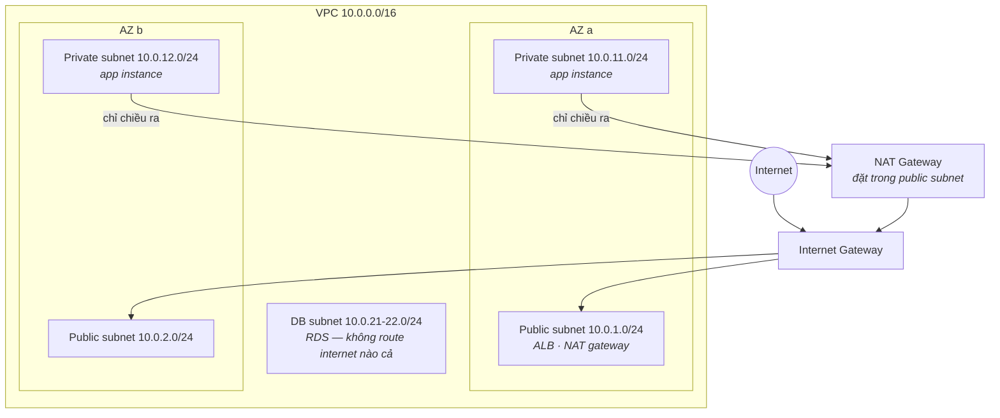

VPC là phần AWS mà người mới trì hoãn lâu nhất — nó mang cảm giác network engineering cộng thêm acronym. Đây là cú lật khung làm tan nỗi sợ: chỉ có bốn khái niệm (subnet, route table, gateway, firewall), một layout chuẩn, và một checklist hai phút giải được mọi bí ẩn "sao instance của em không ra được internet".

## Bạn sẽ học được gì

- Giải thích được thứ gì thật sự khiến một subnet thành public hay private — và thôi đi tìm cái ô tick.
- Vẽ được layout ba tầng chuẩn phủ 90% các triển khai thật.
- Chọn giữa security group và NACL, và viết rule SG sống sót qua autoscaling.
- Debug mọi lỗi kết nối bằng checklist năm bước, đúng thứ tự.

**Cần biết trước:** Phần 3 (instance, security group, availability zone). Quen sơ với địa chỉ IP là có lợi.

## 1. Các viên gạch, trong một hơi thở

Một **VPC** là lát cắt mạng riêng của bạn trong một region — một dải **CIDR** (một khối địa chỉ IP viết dạng `10.0.0.0/16`, ở đây khoảng 65.000 địa chỉ private). Bạn xẻ nó thành các **subnet**, mỗi cái sống trong đúng một availability zone, và cố ý trải chúng qua nhiều AZ.

Traffic rời bất kỳ subnet nào đều tra **route table**. Đây là câu giải ảo tất cả:

> **Subnet "public" hay "private" là do route table của nó. Không gì khác.**

Không tồn tại ô tick "public". Một *public subnet* là subnet có route table gửi `0.0.0.0/0` (mọi thứ ngoài nội bộ) tới một **Internet Gateway**; *private subnet* thì không có route đó. Toàn bộ khác biệt chỉ có thế — và đó là nơi nhìn đầu tiên khi bí ẩn kết nối ập đến.

## 2. Layout chuẩn

Chín mươi phần trăm các triển khai thật là đúng sơ đồ này:



Ba tầng, mỗi tầng một kiểu quan hệ với internet:

- **Public subnet** chứa số ít thứ phải *được với tới từ* internet — load balancer, NAT gateway. App server của bạn không thuộc về đây.
- **Private subnet** chứa app. Instance không có public IP; traffic vào chỉ đến qua load balancer. Nhưng chúng vẫn *vươn ra ngoài* được (kéo package, gọi API) qua **NAT Gateway** — và đây là khác biệt IGW/NAT trong một dòng: **IGW = cửa mở hai chiều (cho ai có public IP); NAT = kính một chiều** (ra thì được, vào không mời thì không bao giờ).
- **DB subnet** thường không có route internet ở *cả hai* chiều — database nói chuyện với tầng app và không ai khác. Xoá một route là bức firewall mạnh nhất trần đời.

Hai chú thích tiết kiệm tiền thật và đau thật. NAT Gateway tính tiền theo giờ *và* theo GB — NAT bị bỏ quên là dòng kinh điển trên một hoá đơn gây bất ngờ (prod chạy một cái mỗi AZ, dev có khi một cái tổng). Và cho instance private nói chuyện với S3 hay DynamoDB, **VPC endpoint** dẫn traffic đó chạy bên trong AWS, né hẳn trạm thu phí NAT.

## 3. Hai firewall, một thói quen

Traffic được routing cho phép vẫn phải qua firewall — và AWS có hai cái, tức nhiều hơn mong muốn của mọi người một cái:

| | Security Group | NACL |
|---|---|---|
| Gắn vào | Network interface của instance | Subnet |
| Trạng thái | **Stateful** — chiều trả lời tự được phép | Stateless — chiều trả lời cần rule tường minh |
| Rule | Chỉ allow | Allow *và* deny, đánh số |
| Siêu năng lực | Tham chiếu SG khác | Chặn một dải IP ngay biên subnet |

Thói quen giữ mọi thứ đơn giản: **bảo mật thật làm ở security group; để NACL nguyên mặc định**, trừ khi bạn cần cụ thể một cú deny mức subnet như chặn dải IP thù địch.

Siêu năng lực của security group đáng học sớm: rule có thể tham chiếu *security group khác*. "SG của DB cho phép 5432 **từ SG của app**" diễn đạt đúng kiến trúc — app nói chuyện với DB — thay vì một danh sách IP mong manh, và nó tiếp tục đúng khi instance được tạo rồi bị huỷ.

## 4. Checklist kết nối

"Instance của em không với tới X" — đi theo thứ tự, hai phút tròn:

1. **Route** — route table của subnet có đường tới X không (IGW? NAT? peering? endpoint?). Không route, không trò chuyện.
2. **Security group, chiều ra** của bên gọi (mặc định cho ra tất — thường ổn).
3. **Security group, chiều vào** của đích — SG/IP của bên gọi có được phép trên port đó không? (Thủ phạm số 1.)
4. **NACL** — chỉ khi có ai đã đổi khỏi mặc định (làm thủ phạm số 4 là có lý do).
5. **Chính cái đích** — có gì đang nghe không? `connection refused` nghĩa là mạng ổn và process vắng mặt; timeout nghĩa là bạn chưa từng tới nơi.

Chín trên mười bí ẩn chết ở bước 1 hoặc 3.

## Thực hành (30 phút — dựng nó, phá nó, cảm nhận tấm kính một chiều)

Dựng sơ đồ ở mục 2, rồi dùng chính nó để chứng minh từng tuyên bố. Mỗi bước có kết quả quan sát được:

```bash
# 1. VPC và mỗi tầng một subnet (lab thì một AZ là đủ)
VPC=$(aws ec2 create-vpc --cidr-block 10.0.0.0/16 --query Vpc.VpcId --output text)
PUB=$(aws ec2 create-subnet --vpc-id $VPC --cidr-block 10.0.1.0/24  --query Subnet.SubnetId --output text)
PRIV=$(aws ec2 create-subnet --vpc-id $VPC --cidr-block 10.0.11.0/24 --query Subnet.SubnetId --output text)

# 2. Internet Gateway + MỘT route duy nhất khiến subnet thành "public"
IGW=$(aws ec2 create-internet-gateway --query InternetGateway.InternetGatewayId --output text)
aws ec2 attach-internet-gateway --vpc-id $VPC --internet-gateway-id $IGW
RT=$(aws ec2 create-route-table --vpc-id $VPC --query RouteTable.RouteTableId --output text)
aws ec2 create-route --route-table-id $RT --destination-cidr-block 0.0.0.0/0 --gateway-id $IGW
aws ec2 associate-route-table --route-table-id $RT --subnet-id $PUB

# 3. Đọc hai route table cạnh nhau — ĐÂY CHÍNH LÀ khác biệt public/private
aws ec2 describe-route-tables --filters Name=vpc-id,Values=$VPC   --query 'RouteTables[].{RT:RouteTableId,Subnets:Associations[].SubnetId,Routes:Routes[].DestinationCidrBlock}'

# 4. Launch mỗi subnet một instance (vào bằng SSM, không cần SSH key) rồi so:
#    instance public   → curl https://example.com chạy
#    instance private  → curl timeout. Không có route. Không có gì khác sai cả.
#    Rồi thêm NAT Gateway ở subnet public + route 0.0.0.0/0 trong route table private
#    → chiều ra chạy, chiều vào vẫn bất khả. Đó là tấm kính một chiều.

# 5. DỌN DẸP — NAT Gateway tính tiền theo giờ và là món đồ lab bỏ quên kinh điển
aws ec2 describe-nat-gateways --filter Name=vpc-id,Values=$VPC   --query 'NatGateways[].NatGatewayId'        # xoá mấy cái này TRƯỚC, rồi mới xoá VPC
```

Kết quả mong đợi: bước 3 là trọn bài học trong một output — hai route table giống hệt nhau, chỉ khác một cái có dòng `0.0.0.0/0` trỏ tới IGW. Không chỗ nào ghi chữ "public" cả. Ở bước 4, cú fail của instance private là *timeout*, không phải bị từ chối: gói tin không có chỗ nào để đi, và đó chính là ý nghĩa thực hành của câu "route bị xoá là firewall mạnh nhất". Sau khi có NAT gateway, chiều ra thành công trong khi không thứ gì trên internet mở được cuộc trò chuyện với instance đó.

## Tự kiểm tra

1. Một instance nằm trong subnet bạn tin là public lại không ra được internet. Bạn kiểm gì trước, và chính xác là tìm cái gì?
2. Security group của DB cần cho phép tầng app, nhưng instance app autoscale và IP đổi liên tục. Bạn viết rule nào?
3. Hoá đơn tháng hiện phí NAT Gateway ở một account dev chạy ba instance kéo package hằng đêm. Nêu hai cách cắt giảm.

<details><summary>Xem đáp án</summary>

1. Route table gắn với subnet đó — cụ thể là xem có route `0.0.0.0/0` trỏ tới Internet Gateway không. "Public" không phải thuộc tính của subnet; nó chính là cái route đó. (Rồi kiểm instance có public IP thật không, và rule chiều vào của security group.)
2. Cho phép port 5432 *từ security group của app*, không phải từ một dải IP. SG tham chiếu SG diễn đạt đúng kiến trúc và tiếp tục đúng khi instance được tạo rồi huỷ — autoscaling chạy mà không phải sửa rule nào.
3. Thêm VPC endpoint cho S3 và DynamoDB để traffic không bao giờ băng qua NAT, và chỉ chạy một NAT Gateway cho cả VPC dev (hoặc không chạy cái nào, nếu instance kéo được từ endpoint hay một mirror có cache). Production thì muốn mỗi AZ một cái; dev thì thường không.

</details>

## Điều cần nhớ

- Public vs private là sự thật của route table, không phải ô tick: `0.0.0.0/0 → IGW` là trọn định nghĩa.
- Layout ba tầng chuẩn (public: LB+NAT / private: app / cô lập: DB) trên hai AZ phủ 90% hệ thống thật.
- IGW là cửa hai chiều, NAT là kính một chiều, route bị xoá là firewall mạnh nhất; VPC endpoint né trạm thu phí NAT cho các service AWS.
- Bảo mật thật nằm ở security group tham chiếu security group; debug kết nối bằng checklist năm bước, đúng thứ tự.

*Tiếp theo — Phần 6: RDS, Aurora & DynamoDB: chọn database.*
