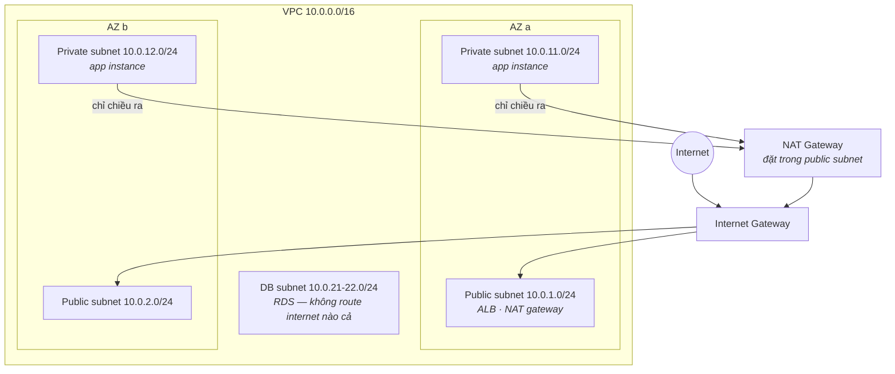

VPC là phần AWS mà người mới trì hoãn lâu nhất — nó mang cảm giác network engineering cộng thêm acronym. Đây là cú lật khung làm tan nỗi sợ: VPC chỉ là **CS Foundations Phần 6, nhưng bạn tự đi dây**. Bốn khái niệm (subnet, route table, gateway, firewall), một layout chuẩn, và mọi bí ẩn "sao instance của em không ra được internet" trở thành một checklist hai phút.

## Các viên gạch, trong một hơi thở

Một **VPC** là lát cắt mạng riêng của bạn trong một region — một dải CIDR như `10.0.0.0/16` (~65k địa chỉ private) được bạn xẻ thành các **subnet**, mỗi cái sống trong đúng một AZ (bài học bán-kính-nổ của S04-P03 áp vào: cố ý trải qua nhiều AZ). Traffic rời bất kỳ subnet nào đều tra **route table** — và đây là câu giải ảo tất cả:

> **Subnet "public" hay "private" là do route table của nó. Không gì khác.**

Không tồn tại ô tick "public". Một *public subnet* là subnet có route table gửi `0.0.0.0/0` (mọi thứ ngoài nội bộ) tới một **Internet Gateway**; *private subnet* thì không có route đó. Toàn bộ khác biệt chỉ có thế — và đó là nơi nhìn đầu tiên khi bí ẩn kết nối ập đến.

## Layout chuẩn

Chín mươi phần trăm các triển khai thật là đúng sơ đồ này:

Ba tầng, mỗi tầng một kiểu quan hệ với internet:

- **Public subnet** chứa số ít thứ phải *được với tới từ* internet — load balancer, NAT gateway. App server của bạn không thuộc về đây.
- **Private subnet** chứa app. Instance không có public IP; traffic vào chỉ đến qua load balancer. Nhưng chúng vẫn *vươn ra ngoài* được (kéo package, gọi API) qua **NAT Gateway** — và đây là khác biệt IGW/NAT trong một dòng: **IGW = cửa mở hai chiều (cho ai có public IP); NAT = kính một chiều** (ra thì được, vào không mời thì không bao giờ).
- **DB subnet** thường không có route internet ở *cả hai* chiều — database nói chuyện với tầng app và không ai khác. Xoá một route là bức firewall mạnh nhất trần đời.

Hai chú thích tiết kiệm tiền thật và đau thật: NAT Gateway là một tờ *hoá đơn* theo giờ + theo GB (catalog zombie của S07-P12 thường xuyên có mặt các NAT bị quên — prod thì một cái mỗi AZ, dev có khi một cái tổng), và cho instance private nói chuyện với S3/DynamoDB, **VPC endpoint** dẫn traffic chạy bên trong AWS — né hẳn trạm thu phí NAT.

## Hai firewall, một thói quen

Traffic được routing cho phép vẫn phải qua firewall — và AWS có hai cái, tức nhiều hơn mong muốn của mọi người một cái:

| | Security Group (S04-P03) | NACL |
|---|---|---|
| Gắn vào | Network interface của instance | Subnet |
| Trạng thái | **Stateful** — chiều trả lời tự được phép | Stateless — chiều trả lời cần rule tường minh |
| Rule | Chỉ allow | Allow *và* deny, đánh số |
| Siêu năng lực | Tham chiếu SG khác | Chặn một dải IP ngay biên subnet |

Thói quen giữ mọi thứ đơn giản: **bảo mật thật làm ở security group; để NACL nguyên mặc định** trừ khi bạn cần cụ thể một cú deny mức subnet (chặn dải IP thù địch). Siêu năng lực SG đáng học sớm: rule có thể tham chiếu *security group khác* — "SG của DB cho phép 5432 **từ SG của app**" — cách diễn đạt kiến trúc ("app nói chuyện với DB") thay vì danh sách IP mong manh, và nó tiếp tục đúng khi instance đến rồi đi (cattle, not pets).

## Checklist kết nối

"Instance của em không với tới X" — đi theo thứ tự, hai phút tròn:

1. **Route** — route table của subnet có đường tới X không (IGW? NAT? peering? endpoint?). Không route, không trò chuyện.
2. **Security group, chiều ra** của bên gọi (mặc định cho ra tất — thường ổn).
3. **Security group, chiều vào** của đích — SG/IP của bên gọi có được phép trên port đó không? (Thủ phạm số 1.)
4. **NACL** — chỉ khi có ai đã đổi khỏi mặc định (làm thủ phạm số 4 là có lý do).
5. **Chính cái đích** — có gì đang nghe không? (`connection refused` = mạng ổn, process vắng — bài học CS-P6.)

Chín trên mười bí ẩn chết ở bước 1 hoặc 3.

## Thực hành (30 phút, gần như miễn phí)

1. Dựng đúng sơ đồ: một VPC, một public + một private subnet, IGW, route table đi dây như trên.
2. Launch một instance tí hon ở subnet *public* (có public IP) — vào bằng SSM; xác nhận `curl` ra internet chạy.
3. Launch một con ở subnet *private* — xác nhận internet fail; thêm NAT Gateway; xác nhận chiều ra chạy trong khi chiều vào vẫn không chạm được nó. Cảm nhận tấm kính một chiều.
4. **Xoá NAT Gateway khi xong** — nó tính tiền theo giờ và là món đồ lab bỏ quên kinh điển.

## Điều cần nhớ

- Public vs private là sự thật của route table, không phải ô tick: `0.0.0.0/0 → IGW` là trọn định nghĩa.
- Layout ba tầng chuẩn (public: LB+NAT / private: app / cô lập: DB) trên hai AZ phủ 90% hệ thống thật.
- IGW là cửa hai chiều, NAT là kính một chiều, route bị xoá là firewall mạnh nhất; VPC endpoint né trạm thu phí NAT cho các service AWS.
- Bảo mật thật nằm ở security group tham chiếu security group; debug kết nối bằng checklist năm bước, đúng thứ tự.

*Tiếp theo — Phần 6: RDS, Aurora & DynamoDB: chọn database.*
