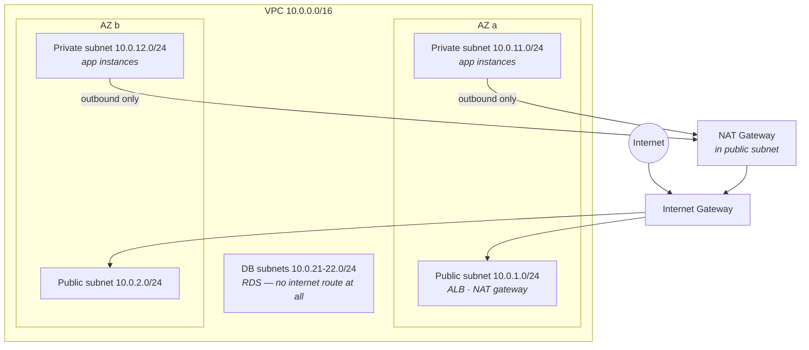

VPC is the part of AWS beginners postpone hardest — it feels like network engineering with extra acronyms. Here's the reframe that dissolves the fear: a VPC is just **CS-Foundations Part 6, but you own the wiring**. Four concepts (subnet, route table, gateway, firewall), one standard layout, and every "why can't my instance reach the internet" mystery becomes a two-minute checklist.

## The building blocks, in one breath

A **VPC** is your private slice of a region's network — a CIDR range like `10.0.0.0/16` (~65k private addresses) that you carve into **subnets**, each living in exactly one AZ (S04-P03's blast-radius lesson applies: spread across AZs on purpose). Traffic leaving any subnet consults a **route table** — and here is the sentence that demystifies everything:

> **A subnet is "public" or "private" because of its route table. Nothing else.**

There is no "public" checkbox. A *public subnet* is one whose route table sends `0.0.0.0/0` (everything non-local) to an **Internet Gateway**; a *private subnet* has no such route. That's the entire distinction — and the first place to look when connectivity mysteries strike.

## The standard layout

Ninety percent of real deployments are this exact diagram:

Three tiers, each with a different relationship to the internet:

- **Public subnets** hold the few things that must be *reachable from* the internet — the load balancer, the NAT gateway. Your app servers do not belong here.
- **Private subnets** hold the app. Instances have no public IP; inbound traffic arrives only via the load balancer. But they can still *reach out* (pull packages, call APIs) through the **NAT Gateway** — which is the IGW/NAT distinction in one line: **IGW = doors open both ways (for those with public IPs); NAT = one-way glass** (outbound yes, unsolicited inbound never).
- **DB subnets** often have no internet route in *either* direction — the database talks to the app tier and nobody else. Deleting a route is the strongest firewall there is.

Two footnotes that save real money and real pain: the NAT Gateway is a per-hour + per-GB *bill* (S07-P12's zombie catalog regularly features forgotten NATs — one per AZ in prod, maybe one total in dev), and for private instances talking to S3/DynamoDB, **VPC endpoints** route the traffic inside AWS — skipping the NAT toll entirely.

## Two firewalls, one habit

Traffic that routing allows must still pass the firewalls — and AWS has two, which is one more than people want:

| | Security Group (S04-P03) | NACL |
|---|---|---|
| Attaches to | Instance's network interface | Subnet |
| State | **Stateful** — replies auto-allowed | Stateless — replies need explicit rules |
| Rules | Allow only | Allow *and* deny, numbered |
| Superpower | Reference other SGs | Block a specific IP range at the border |

The habit that keeps this simple: **do your real security in security groups; leave NACLs at their defaults** unless you specifically need a subnet-level deny (blocking a hostile IP range). The SG superpower worth learning early: rules can reference *other security groups* — "the DB security group allows 5432 **from the app security group**" — which expresses architecture ("app talks to DB") instead of brittle IP lists, and keeps working as instances come and go (cattle, not pets).

## The connectivity checklist

"My instance can't reach X" — walk it in order, two minutes flat:

1. **Route** — does the subnet's route table have a path to X (IGW? NAT? peering? endpoint?). No route, no conversation.
2. **Security group, outbound** on the caller (default allows all out — usually fine).
3. **Security group, inbound** on the target — is the caller's SG/IP allowed on that port? (The #1 culprit.)
4. **NACLs** — only if someone changed them from default (the #4 culprit for a reason).
5. **The target itself** — is anything listening? (`connection refused` = network fine, process missing — CS-P6's lesson.)

Nine out of ten mysteries die at steps 1 or 3.

## Hands-on (30 minutes, mostly free)

1. Build the diagram: one VPC, one public + one private subnet, IGW, route tables wired as above.
2. Launch a tiny instance in the *public* subnet (with public IP) — reach it via SSM; confirm `curl` to the internet works.
3. Launch one in the *private* subnet — confirm internet fails; add a NAT Gateway; confirm outbound now works while inbound still can't reach it. Feel the one-way glass.
4. **Delete the NAT Gateway when done** — it bills hourly and is the classic lab leftover.

## Key takeaways

- Public vs private is a route-table fact, not a checkbox: `0.0.0.0/0 → IGW` is the whole definition.
- The standard three-tier layout (public: LB+NAT / private: apps / isolated: DB) across two AZs covers 90% of real systems.
- IGW is a two-way door, NAT is one-way glass, a missing route is the strongest firewall; VPC endpoints skip the NAT toll for AWS services.
- Real security lives in security groups referencing other security groups; debug connectivity with the five-step checklist, in order.

*Next up — Part 6: RDS, Aurora & DynamoDB: Picking a Database.*
