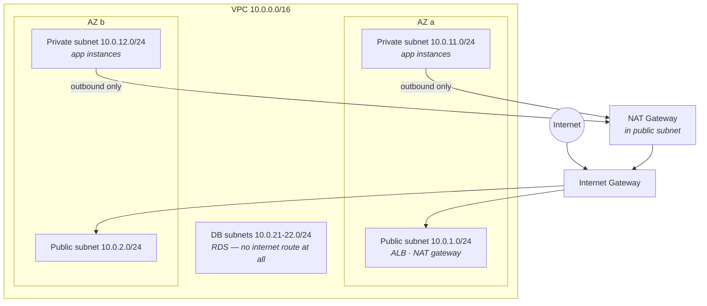

VPC is the part of AWS beginners postpone hardest — it feels like network engineering with extra acronyms. Here's the reframe that dissolves the fear: it's four concepts (subnet, route table, gateway, firewall), one standard layout, and a two-minute checklist that solves every "why can't my instance reach the internet" mystery.

## What you'll learn

- Explain what actually makes a subnet public or private — and stop looking for the checkbox.
- Draw the standard three-tier layout that covers 90% of real deployments.
- Choose between security groups and NACLs, and write SG rules that survive autoscaling.
- Debug any connectivity failure with a five-step checklist, in order.

**Prerequisites:** Part 3 (instances, security groups, availability zones). Basic familiarity with IP addresses helps.

## 1. The building blocks, in one breath

A **VPC** is your private slice of a region's network — a **CIDR range** (a block of IP addresses written like `10.0.0.0/16`, here about 65,000 private addresses). You carve it into **subnets**, each living in exactly one availability zone, and you spread them across AZs on purpose.

Traffic leaving any subnet consults a **route table**. Here is the sentence that demystifies everything:

> **A subnet is "public" or "private" because of its route table. Nothing else.**

There is no "public" checkbox. A *public subnet* is one whose route table sends `0.0.0.0/0` (everything non-local) to an **Internet Gateway**; a *private subnet* has no such route. That's the entire distinction — and the first place to look when connectivity mysteries strike.

## 2. The standard layout

Ninety percent of real deployments are this exact diagram:



Three tiers, each with a different relationship to the internet:

- **Public subnets** hold the few things that must be *reachable from* the internet — the load balancer, the NAT gateway. Your app servers do not belong here.
- **Private subnets** hold the app. Instances have no public IP; inbound traffic arrives only via the load balancer. But they can still *reach out* (pull packages, call APIs) through the **NAT Gateway** — which is the IGW/NAT distinction in one line: **IGW = doors open both ways (for those with public IPs); NAT = one-way glass** (outbound yes, unsolicited inbound never).
- **DB subnets** often have no internet route in *either* direction — the database talks to the app tier and nobody else. Deleting a route is the strongest firewall there is.

Two footnotes that save real money and real pain. The NAT Gateway bills per hour *and* per GB — forgotten NAT gateways are a classic line item on a surprising bill (run one per AZ in production, maybe one total in dev). And for private instances talking to S3 or DynamoDB, **VPC endpoints** route that traffic inside AWS, skipping the NAT toll entirely.

## 3. Two firewalls, one habit

Traffic that routing allows must still pass the firewalls — and AWS has two, which is one more than people want:

| | Security Group | NACL |
|---|---|---|
| Attaches to | Instance's network interface | Subnet |
| State | **Stateful** — replies auto-allowed | Stateless — replies need explicit rules |
| Rules | Allow only | Allow *and* deny, numbered |
| Superpower | Reference other SGs | Block a specific IP range at the border |

The habit that keeps this simple: **do your real security in security groups; leave NACLs at their defaults**, unless you specifically need a subnet-level deny such as blocking a hostile IP range.

The security-group superpower worth learning early: rules can reference *other security groups*. "The DB security group allows 5432 **from the app security group**" expresses the architecture — app talks to DB — instead of a brittle IP list, and it keeps working as instances come and go.

## 4. The connectivity checklist

"My instance can't reach X" — walk it in order, two minutes flat:

1. **Route** — does the subnet's route table have a path to X (IGW? NAT? peering? endpoint?). No route, no conversation.
2. **Security group, outbound** on the caller (default allows all out — usually fine).
3. **Security group, inbound** on the target — is the caller's SG/IP allowed on that port? (The #1 culprit.)
4. **NACLs** — only if someone changed them from default (the #4 culprit for a reason).
5. **The target itself** — is anything listening? A `connection refused` means the network is fine and the process is missing; a timeout means you never got there.

Nine out of ten mysteries die at steps 1 or 3.

## Practice (30 minutes — build it, break it, feel the one-way glass)

Build the diagram from section 2, then use it to prove each claim. Every step has an observable result:

```bash
# 1. The VPC and one subnet per tier (single AZ is enough for the lab)
VPC=$(aws ec2 create-vpc --cidr-block 10.0.0.0/16 --query Vpc.VpcId --output text)
PUB=$(aws ec2 create-subnet --vpc-id $VPC --cidr-block 10.0.1.0/24  --query Subnet.SubnetId --output text)
PRIV=$(aws ec2 create-subnet --vpc-id $VPC --cidr-block 10.0.11.0/24 --query Subnet.SubnetId --output text)

# 2. Internet Gateway + the ONE route that makes a subnet "public"
IGW=$(aws ec2 create-internet-gateway --query InternetGateway.InternetGatewayId --output text)
aws ec2 attach-internet-gateway --vpc-id $VPC --internet-gateway-id $IGW
RT=$(aws ec2 create-route-table --vpc-id $VPC --query RouteTable.RouteTableId --output text)
aws ec2 create-route --route-table-id $RT --destination-cidr-block 0.0.0.0/0 --gateway-id $IGW
aws ec2 associate-route-table --route-table-id $RT --subnet-id $PUB

# 3. Read the two route tables side by side — this IS the public/private distinction
aws ec2 describe-route-tables --filters Name=vpc-id,Values=$VPC   --query 'RouteTables[].{RT:RouteTableId,Subnets:Associations[].SubnetId,Routes:Routes[].DestinationCidrBlock}'

# 4. Launch one instance per subnet (SSM access, no SSH keys) and compare:
#    public instance   → curl https://example.com works
#    private instance  → curl times out. No route. Nothing else is wrong.
#    Then add a NAT Gateway in the public subnet + a 0.0.0.0/0 route in the private
#    route table → outbound works, inbound still impossible. That is one-way glass.

# 5. CLEAN UP — the NAT Gateway bills hourly and is the classic lab leftover
aws ec2 describe-nat-gateways --filter Name=vpc-id,Values=$VPC   --query 'NatGateways[].NatGatewayId'        # delete these FIRST, then the VPC
```

Expected results: step 3 is the whole lesson in one output — two route tables, identical except that one has a `0.0.0.0/0` entry pointing at the IGW. Nothing anywhere says "public". In step 4, the private instance's failure is a *timeout*, not a refusal: packets have nowhere to go, which is what "a missing route is the strongest firewall" means in practice. After the NAT gateway, outbound succeeds while nothing on the internet can start a conversation with that instance.

## Check yourself

1. An instance in a subnet you believe is public can't reach the internet. What do you check first, and what exactly are you looking for?
2. Your DB security group needs to allow the app tier, but app instances autoscale and their IPs change constantly. What rule do you write?
3. Your monthly bill shows a NAT Gateway charge in a dev account that runs three instances pulling packages nightly. Name two ways to cut it.

<details><summary>See answers</summary>

1. The route table associated with that subnet — specifically whether a `0.0.0.0/0` route points at an Internet Gateway. "Public" is not a property of the subnet; it's that one route. (Then check that the instance actually has a public IP, and the security group's inbound rules.)
2. Allow port 5432 *from the app's security group*, not from an IP range. SG-referencing-SG expresses the architecture and keeps working as instances are created and destroyed — no rule updates when autoscaling acts.
3. Add VPC endpoints for S3 and DynamoDB so that traffic never crosses the NAT, and run a single NAT Gateway for the whole dev VPC (or none at all, if instances can pull from an endpoint or a cached mirror). Production wants one per AZ; dev usually does not.

</details>

## Key takeaways

- Public vs private is a route-table fact, not a checkbox: `0.0.0.0/0 → IGW` is the whole definition.
- The standard three-tier layout (public: LB+NAT / private: apps / isolated: DB) across two AZs covers 90% of real systems.
- IGW is a two-way door, NAT is one-way glass, a missing route is the strongest firewall; VPC endpoints skip the NAT toll for AWS services.
- Real security lives in security groups referencing other security groups; debug connectivity with the five-step checklist, in order.

*Next up — Part 6: RDS, Aurora & DynamoDB: Picking a Database.*
