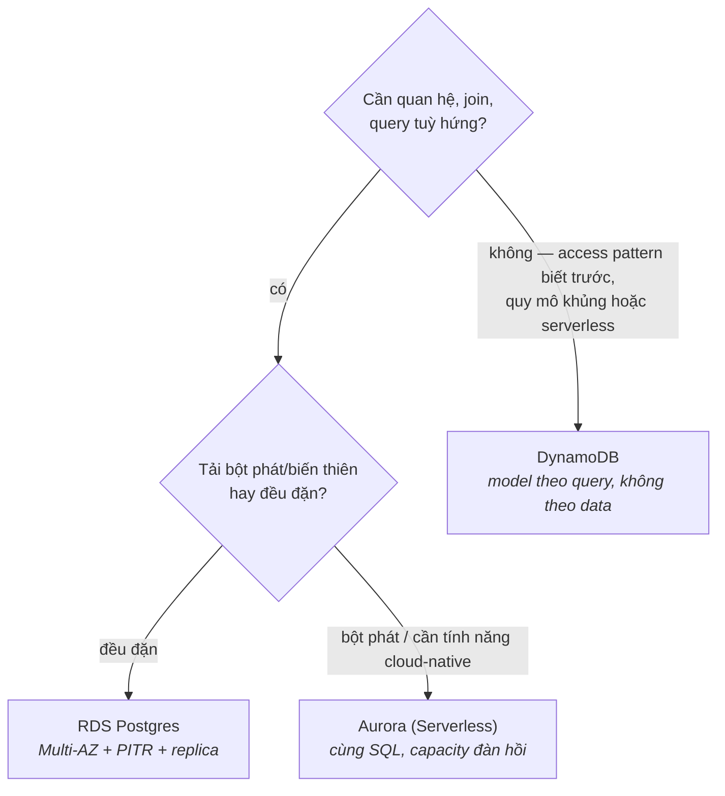

Bạn đã biết database là gì; phần này là về *thuê* nó cho khéo. Gian hàng database của AWS trông đông đúc, nhưng quyết định thật chỉ là một ngã ba — **relational (RDS hoặc Aurora) hay key-value quy mô lớn (DynamoDB)** — cộng với việc biết bật sẵn những tính năng managed nào trước khi cần đến. Mọi thứ còn lại trong gian hàng là các chuyên gia ngách bạn sẽ tự nhận ra khi use case xuất hiện.

## Bạn sẽ học được gì

- Nói chính xác "managed" phủ những gì và thứ gì vẫn là việc của bạn.
- Gạt ba công tắc ngày đầu, và giải thích mỗi cái cứu bạn khỏi thảm hoạ khác nhau ra sao.
- Chọn giữa RDS, Aurora và DynamoDB từ access pattern, không theo hype.
- Nhận ra replication lag là một sự thật thiết kế mà ứng dụng phải xử lý.

**Cần biết trước:** Phần 3 (instance, security group) và Phần 5 (subnet VPC — database sống ở tầng cô lập).

## 1. "Managed" thật sự mua được gì

RDS chạy các engine bạn vốn biết — PostgreSQL, MySQL và bè bạn — trên instance bạn tự size (family tối ưu memory là lựa chọn quen thuộc cho database).

Chữ *managed* phủ provisioning, vá lỗi, backup tự động, khôi phục point-in-time, và điều phối failover. Nó dứt khoát **không** phủ schema của bạn, index của bạn, query chậm của bạn, hay bài toán số học connection-pool. Các sự cố 2 giờ sáng dời lên một tầng; chúng không biến mất.

Ba công tắc nên gạt từ ngày đầu, vì trang bị lại về sau rất đau:

- **Multi-AZ** — một standby đồng bộ ở AZ khác; failover trong ~một phút không mất dữ liệu. Đây là *availability*, giá ~2× — prod thì bật, dev thì thôi.
- **Backup tự động + PITR** — khôi phục về bất kỳ giây nào trong cửa sổ lưu. Đây là *bảo hiểm lỡ tay* (cú `DELETE` thiếu `WHERE`) — và để ý khác biệt: Multi-AZ không cứu bạn khỏi một câu query tồi được replicate trung thành sang standby; PITR thì có.
- **Read replica** — bản sao bất đồng bộ cho scale đọc và reporting; các job extract phân tích thuộc về đây, không phải trên primary. Bất đồng bộ nghĩa là **replication lag**: đọc ngay sau ghi có thể nhận dữ liệu cũ từ replica. Đó là một sự thật thiết kế ứng dụng, không phải bug.

**Aurora** là bản cloud-native của cùng các engine. Storage tự lớn và tự replicate qua ba AZ, replica dùng chung tầng storage đó (nên failover nhanh hơn và lag ít hơn), và Aurora Serverless co giãn capacity theo tải — workload bột phát hoặc dev rất hợp, còn tải cao đều đặn thì provisioned rẻ hơn.

Mặc định thật thà: bắt đầu bằng RDS Postgres thường, và lên Aurora khi câu chuyện scaling hay failover của nó xứng với phần giá chênh.

## DynamoDB: một bản hợp đồng khác hẳn

DynamoDB không phải "Postgres phiên bản NoSQL" — nó là một thoả thuận khác với vật lý khác. Bạn từ bỏ join SQL, query tuỳ hứng, index linh hoạt; bạn nhận về **đọc/ghi vài mili-giây ở mọi quy mô với không một server nào phải quản**.

Mental model: một hash map khổng lồ (CS-P3!) shard theo **partition key**, kèm **sort key** tuỳ chọn để sắp thứ tự trong partition:

```text
Bảng: orders
  PK: customer_id        → dữ liệu của bạn nằm trên shard nào
  SK: order_date#id      → sắp xếp bên trong từng customer
Query: "đơn của khách X, mới nhất trước"      → nhanh, rẻ, index sẵn từ thiết kế
Query: "mọi đơn trên $100 tháng trước"        → full scan. Đau. Sai tool hoặc thiếu GSI.
```

Kỷ luật thiết kế đảo ngược so với relational: **phải biết access pattern trước khi model** — cái bảng được *nặn theo hình các query của bạn* (secondary index — GSI — mua thêm được vài pattern, trả giá bằng chi phí ghi). Vì thế DynamoDB toả sáng với workload có hình dạng biết trước (session, giỏ hàng, profile, event store, mọi thứ key theo user/device) và trừng phạt analytics khám phá (việc đó dành cho các pipeline S02 export sang warehouse). Hai ghi chú vận hành: **hot partition** (key của một khách-nổi-tiếng nung chảy một shard) là sự cố scale kinh điển, và on-demand vs provisioned capacity lại là bài chọn pricing-model của S07-P12, theo từng bảng.

## 3. Quyết định, nói thật



Và cú phân định: **phân vân thì chọn relational.** Bạn có thể rời Postgres sang DynamoDB khi một access pattern cụ thể đòi hỏi; di cư chiều ngược lại — "giờ mình cần join" — là một cú viết lại. Các chuyên gia ngách (ElastiCache cho cache, OpenSearch cho search, Redshift cho warehouse) vít thêm vào cái lõi này chứ không thay thế ngã ba.

## Thực hành (30 phút — cảm nhận hai hợp đồng đặt cạnh nhau)

Làm nửa DynamoDB trước: nó không cần VPC, không cần instance, và để không thì gần như 0 đồng, nên bạn cảm nhận được khác biệt trong năm phút.

```bash
# --- DynamoDB: bạn model theo CÂU QUERY, không theo dữ liệu ---
aws dynamodb create-table --table-name orders-lab \
  --attribute-definitions AttributeName=customer_id,AttributeType=S AttributeName=order_date,AttributeType=S \
  --key-schema AttributeName=customer_id,KeyType=HASH AttributeName=order_date,KeyType=RANGE \
  --billing-mode PAY_PER_REQUEST
aws dynamodb wait table-exists --table-name orders-lab

for d in 2026-03-01 2026-03-05 2026-03-09; do
  aws dynamodb put-item --table-name orders-lab --item \
    "{\"customer_id\":{\"S\":\"C1\"},\"order_date\":{\"S\":\"$d\"},\"amount\":{\"N\":\"42\"}}"
done

# 1. Access pattern mà key schema được THIẾT KẾ cho — nhanh, rẻ, scale mãi mãi
aws dynamodb query --table-name orders-lab \
  --key-condition-expression "customer_id = :c AND order_date > :d" \
  --expression-attribute-values '{":c":{"S":"C1"},":d":{"S":"2026-03-02"}}' \
  --query 'Items[].order_date.S'

# 2. Câu hỏi key schema KHÔNG lường trước: "mọi đơn trên 40, bất kể khách nào"
aws dynamodb scan --table-name orders-lab \
  --filter-expression "amount > :a" --expression-attribute-values '{":a":{"N":"40"}}' \
  --query 'Count'          # ra kết quả — nhưng đã QUÉT cả bảng để trả lời

aws dynamodb delete-table --table-name orders-lab
```

Với nửa RDS: launch một Postgres free-tier vào DB subnet cô lập của VPC, security group cho phép 5432 *chỉ từ security group của app*, không bao giờ từ một dải IP. Kết nối qua một instance, tạo bảng, insert vài dòng, chụp snapshot thủ công, rồi tìm cửa sổ point-in-time restore trong console. Xoá instance khi xong.

Kết quả mong đợi: query 1 trả về tức thì và sẽ tốn y hệt như vậy ở mười tỷ dòng, vì nó đọc đúng cái partition mà key schema được thiết kế cho. Query 2 ra đúng đáp án nhưng phải quét sạch — đó là hợp đồng DynamoDB nói thẳng: câu hỏi bạn đã thiết kế cho thì gần như miễn phí, câu hỏi bạn chưa thì đắt và càng lớn càng tệ. Trong khi đó Postgres trả lời *cả hai* dạng bằng một mệnh đề `WHERE` và một index, và tính tiền bạn theo giờ cho một instance nằm không. Đó là cái ngã ba, được cảm nhận thay vì đọc.

## Tự kiểm tra

1. Team bật Multi-AZ rồi gọi database là "đã có backup". Họ thật sự mua được gì, và vẫn còn phơi mình trước thảm hoạ nào?
2. Người dùng báo bản ghi họ vừa lưu thỉnh thoảng "không tồn tại" trong vài giây. App của bạn đọc từ read replica. Chuyện gì đang xảy ra, và nêu hai cách sửa.
3. Một service mới cần lưu event và sau đó trả lời "cho tôi event của một user trong một khoảng thời gian" ở quy mô rất lớn. Chọn database nào, và điều gì khiến bạn đổi ý?

<details><summary>Xem đáp án</summary>

1. Họ mua *availability*: một standby đồng bộ tiếp quản trong khoảng một phút nếu primary chết. Họ vẫn phơi mình hoàn toàn trước một câu query tồi — cú `DELETE` thiếu `WHERE` được replicate trung thành sang standby. Backup cộng point-in-time recovery mới là thứ phủ chuyện đó, và nó là một công tắc riêng.
2. Replication lag: replica là bất đồng bộ, nên một cú đọc ngay sau ghi có thể rơi vào replica chưa nhận được thay đổi. Cách sửa: định tuyến traffic đọc-sau-ghi về primary (pattern phổ biến), hoặc để client giữ và hiển thị chính giá trị vừa ghi thay vì fetch lại.
3. DynamoDB: access pattern đó đúng là một partition key (user) cộng một sort key (thời gian), và nó giữ nhanh và rẻ ở mọi quy mô. Điều khiến đổi ý: khi stakeholder bắt đầu hỏi các câu phân tích ngoài kế hoạch xuyên mọi user, hoặc cần join — đó là hướng quét-tốn-tiền, và một kho relational (hoặc một đường analytics riêng) hợp hơn.

</details>

## Điều cần nhớ

- Managed dời phần ops không-khác-biệt lên một tầng; schema, index và query chậm vẫn là việc của bạn — CS-P7 vẫn áp dụng.
- Công tắc ngày đầu: Multi-AZ cho availability, PITR cho bảo hiểm lỡ tay (hai thảm hoạ khác nhau), replica cho đọc — cẩn thận lag.
- DynamoDB đổi độ linh hoạt query lấy scale có latency đảm bảo: model access pattern trước, sợ hot partition, export sang warehouse để làm analytics.
- Phân vân chọn relational; Aurora khi độ đàn hồi xứng giá chênh; DynamoDB khi access pattern đã rõ và quy mô là thật.

*Tiếp theo — Phần 7: Lambda & API Gateway: serverless thực chiến.*
