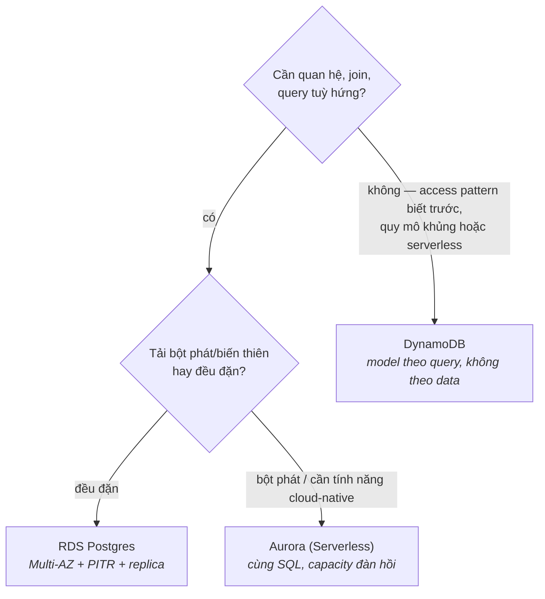

CS Foundations P7 dạy bạn database; phần này là về *thuê* chúng cho khéo. Gian hàng database của AWS trông đông đúc, nhưng quyết định thật chỉ là một ngã ba — **relational (RDS/Aurora) hay key-value quy mô lớn (DynamoDB)** — cộng với việc biết bật sẵn những tính năng managed nào trước khi cần đến. Mọi thứ còn lại trong gian hàng là các chuyên gia ngách bạn sẽ tự nhận ra khi use case xuất hiện.

## "Managed" thật sự mua được gì

RDS chạy các engine bạn vốn biết (PostgreSQL, MySQL và bè bạn) trên instance bạn tự size (các family của S04-P03 — `r` cho database, nhớ chứ). Chữ *managed* phủ: provisioning, vá lỗi, backup tự động, khôi phục point-in-time, điều phối failover. Nó dứt khoát **không** phủ: schema của bạn, index của bạn (CS-P7), query chậm của bạn, hay bài toán số học connection-pool. Các sự cố 2 giờ sáng dời lên một tầng; chúng không biến mất.

Ba công tắc nên gạt từ ngày đầu, vì trang bị lại về sau rất đau:

- **Multi-AZ** — một standby đồng bộ ở AZ khác; failover trong ~một phút không mất dữ liệu. Đây là *availability*, giá ~2× — prod thì bật, dev thì thôi.
- **Backup tự động + PITR** — khôi phục về bất kỳ giây nào trong cửa sổ lưu. Đây là *bảo hiểm lỡ tay* (cú `DELETE` thiếu `WHERE`) — và để ý khác biệt: Multi-AZ không cứu bạn khỏi một câu query tồi được replicate trung thành sang standby; PITR thì có.
- **Read replica** — bản sao bất đồng bộ cho scale đọc và reporting (các job extract của S02 thuộc về đây, không phải trên primary). Bất đồng bộ nghĩa là **replication lag**: đọc-ngay-sau-ghi trên replica có thể trả dữ liệu cũ — một sự thật thiết kế ứng dụng, không phải bug.

**Aurora** là bản cloud-native của cùng các engine: storage tự lớn và tự replicate qua 3 AZ, replica dùng chung tầng storage (failover nhanh hơn, lag ít hơn), và Aurora Serverless co giãn capacity theo tải (pattern serverless-ở-rìa của S07-P12 — workload bột phát hoặc dev rất hợp; tải cao đều đặn thì provisioned rẻ hơn). Mặc định thật thà: bắt đầu bằng RDS Postgres thường; lên Aurora khi câu chuyện scaling hay failover của nó xứng với phần giá chênh.

## DynamoDB: một bản hợp đồng khác hẳn

DynamoDB không phải "Postgres phiên bản NoSQL" — nó là một thoả thuận khác với vật lý khác. Bạn từ bỏ join SQL, query tuỳ hứng, index linh hoạt; bạn nhận về **đọc/ghi vài mili-giây ở mọi quy mô với không một server nào phải quản**.

Mental model: một hash map khổng lồ (CS-P3!) shard theo **partition key**, kèm **sort key** tuỳ chọn để sắp thứ tự trong partition:

```text
Bảng: orders
  PK: customer_id        → dữ liệu của bạn nằm trên shard nào
  SK: order_date#id      → sắp xếp bên trong từng customer
Query: "đơn của khách X, mới nhất trước"      → nhanh, rẻ, index sẵn từ thiết kế
Query: "mọi đơn trên $100 tháng trước"        → full scan. Đau. Sai tool hoặc thiếu GSI.
```

Kỷ luật thiết kế đảo ngược so với relational: **phải biết access pattern trước khi model** — cái bảng được *nặn theo hình các query của bạn* (secondary index — GSI — mua thêm được vài pattern, trả giá bằng chi phí ghi). Vì thế DynamoDB toả sáng với workload có hình dạng biết trước (session, giỏ hàng, profile, event store, mọi thứ key theo user/device) và trừng phạt analytics khám phá (việc đó dành cho các pipeline S02 export sang warehouse). Hai ghi chú vận hành: **hot partition** (key của một khách-nổi-tiếng nung chảy một shard) là sự cố scale kinh điển, và on-demand vs provisioned capacity lại là bài chọn pricing-model của S07-P12, theo từng bảng.

## Quyết định, nói thật



Và cú phân định mà CS-P7 đã trao sẵn: **phân vân thì chọn relational** — bạn có thể rời Postgres sang DynamoDB khi một access pattern cụ thể đòi hỏi; di cư chiều ngược lại (DynamoDB → "giờ mình cần join") là một cú viết lại. Các chuyên gia ngách (ElastiCache cho cache, OpenSearch cho search, Redshift cho warehouse — S04-P13) vít thêm vào cái lõi này; chúng không thay thế ngã ba.

## Thực hành (30 phút, free tier)

1. Launch RDS Postgres free-tier trong DB subnet của VPC (tầng cô lập của S04-P05 — không route internet), security group cho phép 5432 *chỉ từ SG của app*.
2. Kết nối từ một instance (hoặc SSM port-forward), tạo bảng, insert vài dòng. Chụp một snapshot thủ công; xem cửa sổ restore của PITR trong console.
3. Tạo bảng DynamoDB (`customer_id` PK, `order_date` SK), put và query item từ CLI — cảm nhận kiểu truy cập nặn-theo-query.
4. Xoá cả hai khi xong (RDS tính tiền theo giờ; DynamoDB on-demand để không thì ~0 đồng — tự thân nó là một bài học pricing).

## Điều cần nhớ

- Managed dời phần ops không-khác-biệt lên một tầng; schema, index và query chậm vẫn là việc của bạn — CS-P7 vẫn áp dụng.
- Công tắc ngày đầu: Multi-AZ cho availability, PITR cho bảo hiểm lỡ tay (hai thảm hoạ khác nhau), replica cho đọc — cẩn thận lag.
- DynamoDB đổi độ linh hoạt query lấy scale có latency đảm bảo: model access pattern trước, sợ hot partition, export sang warehouse để làm analytics.
- Phân vân chọn relational; Aurora khi độ đàn hồi xứng giá chênh; DynamoDB khi access pattern đã rõ và quy mô là thật.

*Tiếp theo — Phần 7: Lambda & API Gateway: serverless thực chiến.*
