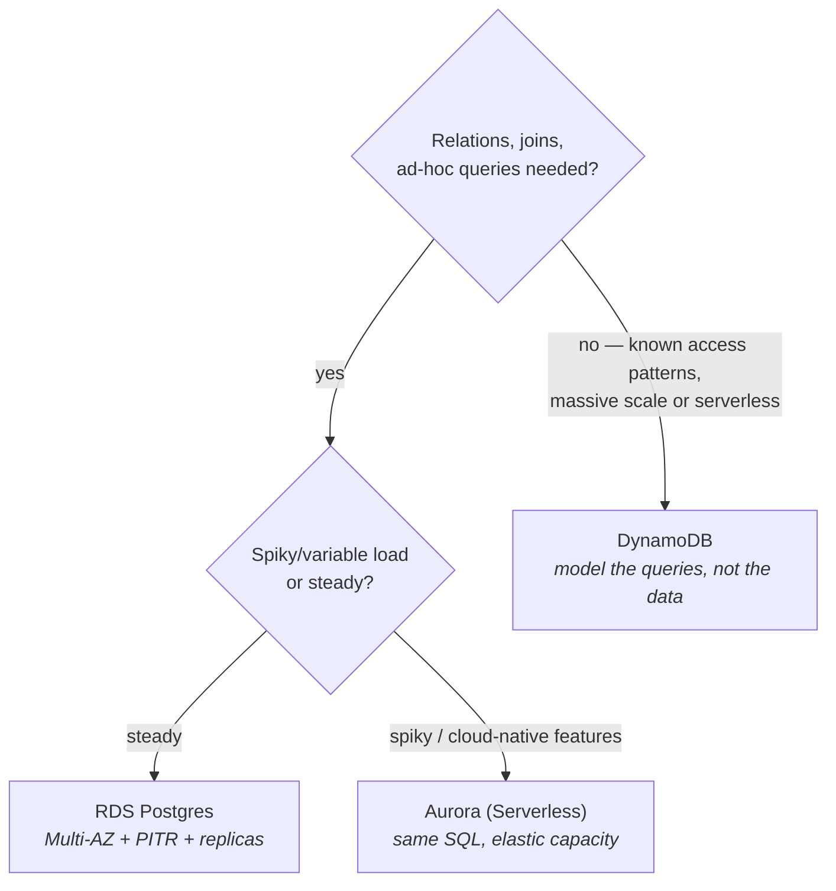

CS-Foundations P7 taught you databases; this part is about *renting* them well. AWS's database aisle looks crowded, but the real decision is one fork — **relational (RDS/Aurora) or key-value at scale (DynamoDB)** — plus knowing which managed features to switch on before you need them. Everything else in the aisle is a specialist you'll recognize when the use case arrives.

## What "managed" actually buys

RDS runs the engines you already know (PostgreSQL, MySQL, and friends) on instances you size (S04-P03's families — `r` for databases, remember). The word *managed* covers: provisioning, patching, automated backups, point-in-time recovery, failover orchestration. It explicitly does **not** cover: your schema, your indexes (CS-P7), your slow queries, or your connection-pool arithmetic. The 2 a.m. incidents move up a layer; they don't disappear.

The three switches to flip on day one, because retrofitting them hurts:

- **Multi-AZ** — a synchronous standby in another AZ; failover in ~a minute without data loss. This is *availability*, priced at ~2× — prod yes, dev no.
- **Automated backups + PITR** — restore to any second in the retention window. This is *oops insurance* (the `DELETE` without a `WHERE`) — and note the difference: Multi-AZ won't save you from a bad query faithfully replicated to the standby; PITR will.
- **Read replicas** — asynchronous copies for read scaling and reporting (S02's extract jobs belong here, not on the primary). Async means **replication lag**: read-after-write on a replica can serve stale data — an application design fact, not a bug.

**Aurora** is AWS's cloud-native take on the same engines: storage auto-grows and self-replicates across 3 AZs, replicas share the storage layer (faster failover, less lag), and Aurora Serverless scales capacity with load (S07-P12's serverless-at-the-edges pattern — spiky or dev workloads love it; steady high load prices better on provisioned). Honest default: start plain RDS Postgres; move to Aurora when its scaling or failover story earns the premium.

## DynamoDB: a different contract entirely

DynamoDB isn't "NoSQL Postgres" — it's a different deal with different physics. You give up SQL joins, ad-hoc queries, and flexible indexing; you receive **single-digit-millisecond reads/writes at any scale with zero servers to manage**.

The mental model: a giant hash map (CS-P3!) sharded by **partition key**, with optional **sort key** for ordering within a partition:

```text
Table: orders
  PK: customer_id        → which shard your data lives on
  SK: order_date#id      → sorted within that customer
Query: "orders for customer X, newest first"  → fast, cheap, indexed by design
Query: "all orders over $100 last month"      → full scan. Pain. Wrong tool or missing GSI.
```

The design discipline is inverted from relational: **you must know your access patterns before you model** — the table is *shaped like your queries* (secondary indexes — GSIs — buy you a few extra patterns, at write-cost). This is why DynamoDB shines for well-known-shape workloads (sessions, carts, profiles, event stores, anything keyed by user/device) and punishes exploratory analytics (that's what S02's pipelines exporting to the warehouse are for). Two operational notes: **hot partitions** (one celebrity customer's key melting a shard) are the classic scale incident, and on-demand vs provisioned capacity is S07-P12's pricing-model decision again, per table.

## The decision, honestly



And the tie-breaker that CS-P7 already gave you: **when in doubt, relational** — you can leave Postgres for DynamoDB when a specific access pattern demands it; migrating the other direction (DynamoDB → "we need joins now") is a rewrite. The specialists (ElastiCache for caching, OpenSearch for search, Redshift for warehousing — S04-P13) bolt onto this core; they don't replace the fork.

## Hands-on (30 minutes, free tier)

1. Launch a free-tier RDS Postgres in your VPC's DB subnets (S04-P05's isolated tier — no internet route), security group allowing 5432 *from the app SG only*.
2. Connect from an instance (or SSM port-forward), create a table, insert rows. Take a manual snapshot; note PITR's restore window in the console.
3. Create a DynamoDB table (`customer_id` PK, `order_date` SK), put and query items from the CLI — feel the query-shaped access.
4. Delete both when done (RDS bills hourly; DynamoDB on-demand idles at ~zero — a pricing lesson in itself).

## Key takeaways

- Managed moves the undifferentiated ops up a layer; schema, indexes, and slow queries remain your job — CS-P7 still applies.
- Day-one switches: Multi-AZ for availability, PITR for oops insurance (they solve different disasters), replicas for reads — mind the lag.
- DynamoDB trades query flexibility for guaranteed-latency scale: model your access patterns first, fear hot partitions, export to the warehouse for analytics.
- When in doubt, relational; Aurora when elasticity earns its premium; DynamoDB when the access pattern is known and the scale is real.

*Next up — Part 7: Lambda & API Gateway: Serverless in Practice.*
