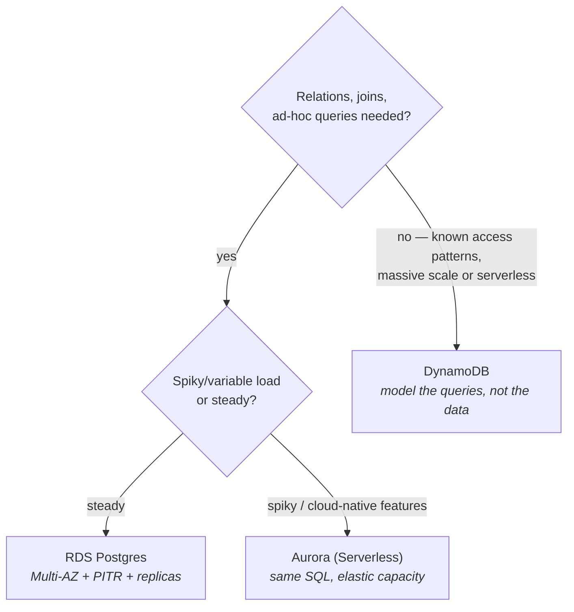

You already know what a database is; this part is about *renting* one well. AWS's database aisle looks crowded, but the real decision is one fork — **relational (RDS or Aurora) versus key-value at scale (DynamoDB)** — plus knowing which managed features to switch on before you need them. Everything else in the aisle is a specialist you'll recognize when the use case arrives.

## What you'll learn

- State precisely what "managed" covers and what stays your problem.
- Flip the three day-one switches, and explain why each one saves a different disaster.
- Choose between RDS, Aurora, and DynamoDB from the access pattern, not the hype.
- Recognize replication lag as a design fact your application must handle.

**Prerequisites:** Part 3 (instances, security groups) and Part 5 (VPC subnets — databases live in the isolated tier).

## 1. What "managed" actually buys

RDS runs the engines you already know — PostgreSQL, MySQL and friends — on instances you size yourself (memory-optimized families are the usual pick for databases).

The word *managed* covers provisioning, patching, automated backups, point-in-time recovery, and failover orchestration. It explicitly does **not** cover your schema, your indexes, your slow queries, or your connection-pool arithmetic. The 2 a.m. incidents move up a layer; they don't disappear.

The three switches to flip on day one, because retrofitting them hurts:

- **Multi-AZ** — a synchronous standby in another AZ; failover in ~a minute without data loss. This is *availability*, priced at ~2× — prod yes, dev no.
- **Automated backups + PITR** — restore to any second in the retention window. This is *oops insurance* (the `DELETE` without a `WHERE`) — and note the difference: Multi-AZ won't save you from a bad query faithfully replicated to the standby; PITR will.
- **Read replicas** — asynchronous copies for read scaling and reporting; analytics extracts belong here, not on the primary. Asynchronous means **replication lag**: a read right after a write can serve stale data from a replica. That is an application design fact, not a bug.

**Aurora** is AWS's cloud-native take on the same engines. Storage auto-grows and self-replicates across three AZs, replicas share that storage layer (so failover is faster and lag smaller), and Aurora Serverless scales capacity with load — spiky or dev workloads love it, while steady high load prices better on provisioned.

Honest default: start with plain RDS Postgres, and move to Aurora when its scaling or failover story earns the premium.

## 2. DynamoDB: a different contract entirely

DynamoDB isn't "NoSQL Postgres" — it's a different deal with different physics. You give up SQL joins, ad-hoc queries, and flexible indexing; you receive **single-digit-millisecond reads/writes at any scale with zero servers to manage**.

The mental model: a giant hash map (CS-P3!) sharded by **partition key**, with optional **sort key** for ordering within a partition:

```text
Table: orders
  PK: customer_id        → which shard your data lives on
  SK: order_date#id      → sorted within that customer
Query: "orders for customer X, newest first"  → fast, cheap, indexed by design
Query: "all orders over $100 last month"      → full scan. Pain. Wrong tool or missing GSI.
```

The design discipline is inverted from relational: **you must know your access patterns before you model** — the table is *shaped like your queries* (secondary indexes — GSIs — buy you a few extra patterns, at write-cost). This is why DynamoDB shines for well-known-shape workloads (sessions, carts, profiles, event stores, anything keyed by user/device) and punishes exploratory analytics (that's what S02's pipelines exporting to the warehouse are for). Two operational notes: **hot partitions** (one celebrity customer's key melting a shard) are the classic scale incident, and on-demand vs provisioned capacity is S07-P12's pricing-model decision again, per table.

## 3. The decision, honestly



And the tie-breaker: **when in doubt, relational.** You can leave Postgres for DynamoDB when a specific access pattern demands it; migrating the other direction — "we need joins now" — is a rewrite. The specialists (ElastiCache for caching, OpenSearch for search, Redshift for warehousing) bolt onto this core rather than replacing the fork.

## Practice (30 minutes — feel the two contracts side by side)

Do the DynamoDB half first: it needs no VPC, no instance, and idles at nearly zero cost, so you can feel the difference in five minutes.

```bash
# --- DynamoDB: you model the QUERIES, not the data ---
aws dynamodb create-table --table-name orders-lab \
  --attribute-definitions AttributeName=customer_id,AttributeType=S AttributeName=order_date,AttributeType=S \
  --key-schema AttributeName=customer_id,KeyType=HASH AttributeName=order_date,KeyType=RANGE \
  --billing-mode PAY_PER_REQUEST
aws dynamodb wait table-exists --table-name orders-lab

for d in 2026-03-01 2026-03-05 2026-03-09; do
  aws dynamodb put-item --table-name orders-lab --item \
    "{\"customer_id\":{\"S\":\"C1\"},\"order_date\":{\"S\":\"$d\"},\"amount\":{\"N\":\"42\"}}"
done

# 1. The access pattern the key schema was DESIGNED for — fast, cheap, scales forever
aws dynamodb query --table-name orders-lab \
  --key-condition-expression "customer_id = :c AND order_date > :d" \
  --expression-attribute-values '{":c":{"S":"C1"},":d":{"S":"2026-03-02"}}' \
  --query 'Items[].order_date.S'

# 2. A question the key schema did NOT anticipate: "all orders over 40, any customer"
aws dynamodb scan --table-name orders-lab \
  --filter-expression "amount > :a" --expression-attribute-values '{":a":{"N":"40"}}' \
  --query 'Count'          # works — but it SCANNED the whole table to answer

aws dynamodb delete-table --table-name orders-lab
```

For the RDS half: launch a free-tier Postgres into your VPC's isolated DB subnets, with a security group allowing 5432 *from the app security group only* — never from an IP range. Connect through an instance, create a table, insert rows, take a manual snapshot, then find the point-in-time restore window in the console. Delete the instance when you're done.

Expected results: query 1 returns instantly and would cost the same at ten billion rows, because it reads exactly the partition the key schema was designed for. Query 2 returns the right answer but had to scan everything — that's the DynamoDB contract stated plainly: questions you designed for are free, questions you didn't are expensive and get worse as you grow. Meanwhile Postgres answers *both* shapes with a `WHERE` clause and an index, and charges you an idle instance by the hour for the privilege. That's the fork, felt rather than read.

## Check yourself

1. Your team enables Multi-AZ and calls the database "backed up". What did they actually buy, and which disaster are they still exposed to?
2. Users report that a record they just saved sometimes "doesn't exist" for a few seconds. Your app reads from a read replica. What's happening, and name two fixes.
3. A new service needs to store events and later answer "give me one user's events in a time range" at very high scale. Which database, and what would make you change your mind?

<details><summary>See answers</summary>

1. They bought *availability*: a synchronous standby that takes over in about a minute if the primary fails. They are still fully exposed to a bad query — a `DELETE` without a `WHERE` replicates faithfully to the standby. Backups plus point-in-time recovery are what cover that, and they're a separate switch.
2. Replication lag: replicas are asynchronous, so a read right after a write can land on a replica that hasn't received it yet. Fixes: route read-after-write traffic to the primary (the common pattern), or have the client hold and display the value it just wrote rather than re-fetching it.
3. DynamoDB: that access pattern is exactly one partition key (user) plus a sort key (time), which stays fast and cheap at any scale. What would change your mind: the moment stakeholders start asking unplanned analytical questions across all users, or need joins — that's the expensive-scan direction, and a relational store (or a separate analytics path) fits better.

</details>

## Key takeaways

- Managed moves the undifferentiated ops up a layer; schema, indexes, and slow queries remain your job — CS-P7 still applies.
- Day-one switches: Multi-AZ for availability, PITR for oops insurance (they solve different disasters), replicas for reads — mind the lag.
- DynamoDB trades query flexibility for guaranteed-latency scale: model your access patterns first, fear hot partitions, export to the warehouse for analytics.
- When in doubt, relational; Aurora when elasticity earns its premium; DynamoDB when the access pattern is known and the scale is real.

*Next up — Part 7: Lambda & API Gateway: Serverless in Practice.*
