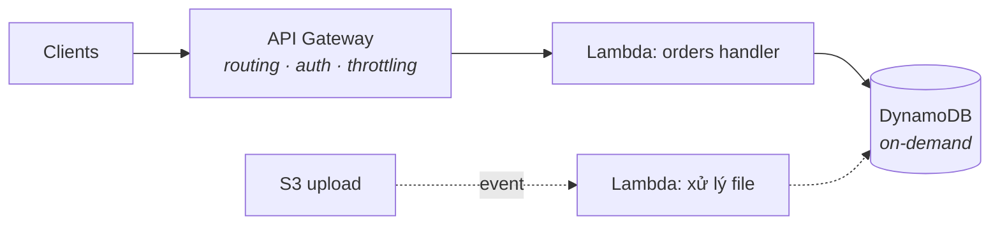

Lambda lật ngược thoả thuận EC2 của S04-P03: thay vì thuê một server và giữ nó no, bạn trao AWS một function và trả tiền **theo lần gọi, theo mili-giây** — bằng không khi không gì chạy. Cái giá là một mental model mới: code của bạn thôi là một *process đứng chờ* (CS-P5) và trở thành một *handler phản ứng*. Phần này phủ cái model, phần vật lý (cold start, giới hạn), pattern API, và quyết định thật thà khi nào serverless thắng.

## Cú lật event-driven

Một Lambda function là code với một điểm vào, được gọi *bởi sự kiện*:

```python
def handler(event, context):
    # event: AI gọi và VÌ SAO — một HTTP request, một cú upload S3,
    # một message từ queue, một tick lịch. Hình dạng khác nhau theo nguồn.
    order = json.loads(event["body"])          # hình dạng của API Gateway
    save(order)
    return {"statusCode": 201, "body": json.dumps({"id": order["id"]})}
```

Các nguồn mới là điểm chính: **API Gateway** (HTTP → function — pattern REST bên dưới), **S3 event** (file đáp vào bucket → function xử lý — pipeline thumbnail/parse kinh điển), **SQS/EventBridge** (message và lịch — lãnh thổ S04-P09), **DynamoDB stream** (phản ứng với thay đổi dữ liệu — bản năng CDC của S07-P06, phiên bản serverless). Bạn thôi viết "một server ngồi poll"; bạn đi dây "khi X xảy ra, chạy cái này."

Ba hệ quả kế thừa từ mọi thứ đã học: function phải **stateless** (instance hiện ra rồi biến mất — state sống ở DynamoDB/S3/RDS, S04-P06), phải **idempotent** (đa số nguồn sự kiện giao at-least-once — bài test chạy-lại của S02-P03 giờ là bắt buộc, không còn là best practice), và quyền của nó **chính là** một IAM role (S04-P02 đã hứa Lambda sẽ chứng minh điều này).

## Cold start, giải ảo

Lần gọi đầu (hoặc một cơn burst vượt công suất ấm): AWS dựng một môi trường micro, nạp runtime và code, chạy phần init của bạn — **cold start**, vài chục ms tới vài giây. Các cú gọi sau tái dùng môi trường ấm. Các sự thật engineering:

- **Code init chạy một lần mỗi môi trường, không phải mỗi cú gọi** — nên mở kết nối DB và nạp config *bên ngoài* handler; đây là caching miễn phí (và là chỗ bài toán connection-pool của CS-P7 gặp cú twist: hàng trăm Lambda đồng thời ≈ hàng trăm connection — RDS Proxy tồn tại chính xác để pool giùm).
- **Cân nặng có giá**: gói deploy to và import nặng kéo dài cold start; giữ function gọn là một cú tối ưu thật, không phải thẩm mỹ.
- **Ai quan tâm, nói thật**: một con xử lý queue chẳng bận tâm cold start 500 ms; một API hướng người dùng thì có thể — đo p99 (luật CS-P4) trước khi mua *provisioned concurrency* (instance hâm nóng sẵn — hiệu quả, và lặng lẽ tái du nhập trả-tiền-cho-sự-rảnh; S07-P12 gật đầu).

## Giới hạn là đầu vào thiết kế

Các ràng buộc của Lambda không phải chữ nhỏ — chúng *định hình* thiết kế đúng: **tối đa 15 phút chạy** (việc dài hơn thuộc về container/batch — hoặc cắt nhỏ qua queue), **memory 128 MB–10 GB với CPU tăng kèm** (cái núm duy nhất: nhiều memory = nhiều CPU = thường *rẻ hơn* vì chạy nhanh hơn — test 512 MB vs 1769 MB trước khi mặc định), **payload đồng bộ ~6 MB** (file to đi đường S3 presigned URL — pattern S04-P04, giờ gánh trọng lượng), và **quota concurrency theo region** (một cơn spike chạm trần → throttle — thứ một cái queue đứng trước hấp thụ duyên dáng; gọi sync trực tiếp thì chỉ có fail).

Chủ đề lặp lại: khi một giới hạn bó, đáp án thường là **tách rời bằng queue hoặc S3**, không phải vật lộn với giới hạn.

## REST API serverless

Stack kinh điển: **API Gateway → Lambda → DynamoDB** — không một instance nào, scale về không và lên hàng nghìn:



API Gateway kiếm cơm bằng routing, auth (IAM/JWT authorizer), throttling và usage plan — các việc HTTP nhàm chán. Hai quyết định thực chiến: chọn **HTTP API** thay vì REST API legacy trong API Gateway trừ khi cần các món phụ của nó (rẻ hơn, nhanh hơn, đủ cho đa số), và tổ chức function **theo resource, không theo dòng code** — một function "orders" ôm các route của nó thắng năm mươi nano-function (loạn deploy) và thắng một mega-function (bán kính nổ). Ghép stack với DynamoDB *on-demand*: hai tầng cùng scale về không — cả kiến trúc để không ở ~0 đồng, và đó mới là trò ảo thuật thật.

## Khi serverless thắng — và khi thua

**Thắng**: traffic bột phát hoặc khó đoán (serverless-ở-rìa của S07-P12), keo dán sự kiện (xử lý theo S3-trigger, job theo lịch, consumer của stream), API có quãng nghỉ, và bất cứ chỗ nào việc *không quản server* giải phóng một team nhỏ (trục team của S07-P08, bản cloud).

**Thua**: tải cao đều đặn (container luôn-bật rẻ hơn — làm phép tính ở RPS của bạn), việc chạy dài hay stateful (bức tường 15 phút), đường latency-nhạy không dung thứ cold start, và dependency cục bộ nặng (model ML khổng lồ muốn process bền — thế giới serving của S03-P13).

Câu trả lời trưởng thành là một hỗn hợp: serverless cho rìa và keo dán, container cho lõi đều đặn — đúng hình dạng S07-P12 kê đơn cho pricing, áp sang compute.

## Thực hành (30 phút, free tier)

1. Tạo một Lambda (Python), test bằng event trong console — đọc `event` và `context`, log vài thứ, tìm nó trong CloudWatch Logs (nếm thử S04-P10 lần đầu).
2. Đặt một HTTP API phía trước; `curl` endpoint của bạn — một API sống với không server nào.
3. Đi dây một S3 trigger: upload một file, xem function nổ với hình dạng event của S3.
4. Cố tình khiêu khích một cold start (chờ 15 phút, gọi, xem `Init Duration` trong dòng log) — giờ bạn đã *đo* được cái thứ mọi người hay cãi nhau.

## Điều cần nhớ

- Lambda là compute event-driven, stateless, tính theo mili-giây: state đưa ra ngoài, idempotency bắt buộc, quyền = IAM role.
- Init-ngoài-handler là caching miễn phí; cold start đo được, không phải huyền thoại — chỉ tối ưu khi p99 lên tiếng.
- Các giới hạn (15 phút, payload, concurrency) là đầu vào thiết kế: tách rời bằng queue và S3 thay vì vật lộn.
- API Gateway + Lambda + DynamoDB on-demand để không ở ~0 đồng và scale lên hàng nghìn; giữ serverless ở rìa, container ở lõi đều đặn.

*Tiếp theo — Phần 8: ECS, Fargate & ECR: chạy container trên AWS.*
