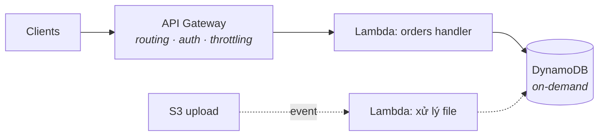

Lambda lật ngược thoả thuận ở Phần 3: thay vì thuê một server và giữ nó no, bạn trao AWS một function và trả tiền **theo lần gọi, theo mili-giây** — bằng không khi không gì chạy. Cái giá là một mental model mới: code của bạn thôi là một *process đứng chờ* và trở thành một *handler phản ứng*.

## Bạn sẽ học được gì

- Viết lại một request handler thành event handler, và nói được vì sao stateless hết là tuỳ chọn.
- Giải thích cold start bằng cơ học, và tự đo một cú thay vì đi cãi nhau về nó.
- Coi các giới hạn của Lambda là đầu vào thiết kế chứ không phải chướng ngại.
- Quyết định thật thà khi nào serverless thắng về chi phí và khi nào nó lặng lẽ thua.

**Cần biết trước:** Phần 3 (instance, để cảm được cú lật) và Phần 2 (execution role).

## 1. Cú lật event-driven

Một Lambda function là code với một điểm vào, được gọi *bởi sự kiện*:

```python
def handler(event, context):
    # event: AI gọi và VÌ SAO — một HTTP request, một cú upload S3,
    # một message từ queue, một tick lịch. Hình dạng khác nhau theo nguồn.
    order = json.loads(event["body"])          # hình dạng của API Gateway
    save(order)
    return {"statusCode": 201, "body": json.dumps({"id": order["id"]})}
```

Các nguồn mới là điểm chính: **API Gateway** (HTTP → function — pattern REST bên dưới), **S3 event** (file đáp vào bucket → function xử lý — pipeline thumbnail/parse kinh điển), **SQS/EventBridge** (message và lịch — lãnh thổ S04-P09), **DynamoDB stream** (phản ứng với thay đổi dữ liệu — bản năng CDC của S07-P06, phiên bản serverless). Bạn thôi viết "một server ngồi poll"; bạn đi dây "khi X xảy ra, chạy cái này."

Ba hệ quả kế thừa từ mọi thứ đã học: function phải **stateless** (instance hiện ra rồi biến mất — state sống ở DynamoDB/S3/RDS, S04-P06), phải **idempotent** (đa số nguồn sự kiện giao at-least-once — bài test chạy-lại của S02-P03 giờ là bắt buộc, không còn là best practice), và quyền của nó **chính là** một IAM role (S04-P02 đã hứa Lambda sẽ chứng minh điều này).

## 2. Cold start, giải ảo

Lần gọi đầu (hoặc một cơn burst vượt công suất ấm): AWS dựng một môi trường micro, nạp runtime và code, chạy phần init của bạn — **cold start**, vài chục ms tới vài giây. Các cú gọi sau tái dùng môi trường ấm. Các sự thật engineering:

- **Code init chạy một lần mỗi môi trường, không phải mỗi cú gọi** — nên mở kết nối DB và nạp config *bên ngoài* handler; đây là caching miễn phí (và là chỗ bài toán connection-pool của CS-P7 gặp cú twist: hàng trăm Lambda đồng thời ≈ hàng trăm connection — RDS Proxy tồn tại chính xác để pool giùm).
- **Cân nặng có giá**: gói deploy to và import nặng kéo dài cold start; giữ function gọn là một cú tối ưu thật, không phải thẩm mỹ.
- **Ai quan tâm, nói thật**: một con xử lý queue chẳng bận tâm cold start 500 ms; một API hướng người dùng thì có thể — đo p99 (luật CS-P4) trước khi mua *provisioned concurrency* (instance hâm nóng sẵn — hiệu quả, và lặng lẽ tái du nhập trả-tiền-cho-sự-rảnh; S07-P12 gật đầu).

## 3. Giới hạn là đầu vào thiết kế

Các ràng buộc của Lambda không phải chữ nhỏ — chúng *định hình* thiết kế đúng: **tối đa 15 phút chạy** (việc dài hơn thuộc về container/batch — hoặc cắt nhỏ qua queue), **memory 128 MB–10 GB với CPU tăng kèm** (cái núm duy nhất: nhiều memory = nhiều CPU = thường *rẻ hơn* vì chạy nhanh hơn — test 512 MB vs 1769 MB trước khi mặc định), **payload đồng bộ ~6 MB** (file to đi đường S3 presigned URL — pattern S04-P04, giờ gánh trọng lượng), và **quota concurrency theo region** (một cơn spike chạm trần → throttle — thứ một cái queue đứng trước hấp thụ duyên dáng; gọi sync trực tiếp thì chỉ có fail).

Chủ đề lặp lại: khi một giới hạn bó, đáp án thường là **tách rời bằng queue hoặc S3**, không phải vật lộn với giới hạn.

## 4. REST API serverless

Stack kinh điển: **API Gateway → Lambda → DynamoDB** — không một instance nào, scale về không và lên hàng nghìn:



API Gateway kiếm cơm bằng routing, auth (IAM/JWT authorizer), throttling và usage plan — các việc HTTP nhàm chán. Hai quyết định thực chiến: chọn **HTTP API** thay vì REST API legacy trong API Gateway trừ khi cần các món phụ của nó (rẻ hơn, nhanh hơn, đủ cho đa số), và tổ chức function **theo resource, không theo dòng code** — một function "orders" ôm các route của nó thắng năm mươi nano-function (loạn deploy) và thắng một mega-function (bán kính nổ). Ghép stack với DynamoDB *on-demand*: hai tầng cùng scale về không — cả kiến trúc để không ở ~0 đồng, và đó mới là trò ảo thuật thật.

## 5. Khi serverless thắng — và khi thua

**Thắng**: traffic bột phát hoặc khó đoán (serverless-ở-rìa của S07-P12), keo dán sự kiện (xử lý theo S3-trigger, job theo lịch, consumer của stream), API có quãng nghỉ, và bất cứ chỗ nào việc *không quản server* giải phóng một team nhỏ (trục team của S07-P08, bản cloud).

**Thua**: tải cao đều đặn (container luôn-bật rẻ hơn — làm phép tính ở RPS của bạn), việc chạy dài hay stateful (bức tường 15 phút), đường latency-nhạy không dung thứ cold start, và dependency cục bộ nặng (model ML khổng lồ muốn process bền — thế giới serving của S03-P13).

Câu trả lời trưởng thành là một hỗn hợp: serverless cho rìa và keo dán, container cho lõi đều đặn — đúng hình dạng S07-P12 kê đơn cho pricing, áp sang compute.

## Thực hành (30 phút — dựng nó, rồi đo cái cold start mọi người hay cãi nhau)

Free tier phủ trọn phần này. Điểm mấu chốt của bước 4 là từ nay bạn sẽ không lặp lại một câu truyền miệng nào về cold start mà mình chưa tự đo.

```bash
# 1. Một function mà bạn NHÌN THẤY được chi phí init (việc ở mức module chính là pha init)
mkdir lambda-lab && cd lambda-lab
cat > handler.py <<'EOF'
import time, os
BOOT = time.time()                     # mức module: chạy MỘT LẦN mỗi cold start
time.sleep(1.5)                        # giả vờ đây là import một SDK nặng

def handler(event, context):
    return {"statusCode": 200,
            "body": f"sống được {time.time()-BOOT:.1f}s, request {context.aws_request_id}"}
EOF
zip -q fn.zip handler.py

ROLE_ARN=<arn role execution lambda bạn đang có>   # role của Phần 2, dùng lại
aws lambda create-function --function-name cold-lab --runtime python3.12 \
  --handler handler.handler --zip-file fileb://fn.zip --role "$ROLE_ARN" --timeout 30

# 2. Gọi hai lần liên tiếp và so con số "sống được" nó báo về
for i in 1 2; do
  aws lambda invoke --function-name cold-lab out.json >/dev/null && cat out.json; echo
done

# 3. Các con số đáng giá nằm ở dòng REPORT, không nằm ở lời truyền miệng
aws logs tail /aws/lambda/cold-lab --since 5m --format short | grep REPORT
#   Init Duration: … ms   ← chỉ xuất hiện ở lần chạy LẠNH
#   Duration / Billed Duration / Max Memory Used  ← thứ bạn thật sự trả tiền

# 4. Cố tình khiêu khích cold start: chờ, rồi gọi và đọc lại Init Duration
sleep 900 && aws lambda invoke --function-name cold-lab out.json >/dev/null
aws logs tail /aws/lambda/cold-lab --since 2m --format short | grep -E "REPORT|Init"

aws lambda delete-function --function-name cold-lab
```

Kết quả mong đợi: lần gọi đầu báo "sống được" khoảng 0 giây và dòng log của nó chứa `Init Duration` — đó là cold start, và cú `sleep` 1,5 giây ở mức module đúng là thứ nó tính tiền bạn. Lần gọi thứ hai dùng lại chính môi trường thực thi đó: `Init Duration` biến mất và con số "sống được" đã lớn lên, chứng minh container sống sót giữa hai request. Riêng sự thật đó là toàn bộ câu chuyện tối ưu — phần khởi tạo đắt tiền thuộc về mức module *chính vì* nó được dùng lại, và nó cũng *chính là* cold start bạn trả ở request đầu tiên. Sau 15 phút nằm không, môi trường biến mất và `Init Duration` quay lại.

## Tự kiểm tra

1. Lambda của bạn mở connection database bên trong handler ở mỗi lần gọi, và database cạn connection khi tải cao. Chuyện gì đang xảy ra, và hai cách sửa là gì?
2. Đồng nghiệp đề xuất provisioned concurrency để chữa "API phản hồi chậm". Bạn hỏi xem cái gì trước?
3. Job batch của bạn chạy 22 phút trên một EC2 instance. Nó chuyển thẳng sang Lambda được không? Bạn có những lựa chọn nào?

<details><summary>Xem đáp án</summary>

1. Mỗi lần thực thi đồng thời là một môi trường riêng với connection riêng, nên 500 lần gọi đồng thời nghĩa là tới 500 connection — cách scale của Lambda nhân số connection của bạn lên theo kiểu mà một đội server cố định không bao giờ làm. Sửa: đưa phần tạo connection lên mức module để nó được dùng lại giữa các lần gọi trong cùng môi trường, và đặt một connection proxy trước database để pool hộ.
2. Bảng phân rã độ trễ p99, và liệu các request chậm có thật sự là cold start hay không. Provisioned concurrency tốn tiền liên tục để triệt tiêu một chi phí chỉ phát sinh ở một phần nhỏ số request — nếu các dòng `REPORT` cho thấy `Init Duration` xuất hiện ở 1% lần gọi trong khi p99 bị chi phối bởi một cú gọi hạ nguồn chậm, thì provisioned concurrency chẳng mua được gì.
3. Không chuyển thẳng được: trần thực thi của Lambda là 15 phút. Lựa chọn: chia việc thành các mảnh nhỏ mỗi mảnh dưới giới hạn rồi điều phối chúng (một state machine, hoặc một queue mà mỗi message là một mảnh), chuyển sang dịch vụ container sinh ra cho tác vụ chạy dài, hoặc giữ nguyên trên instance nếu nó thật sự là một công việc dài không chia được.

</details>

## Điều cần nhớ

- Lambda là compute event-driven, stateless, tính theo mili-giây: state đưa ra ngoài, idempotency bắt buộc, quyền = IAM role.
- Init-ngoài-handler là caching miễn phí; cold start đo được, không phải huyền thoại — chỉ tối ưu khi p99 lên tiếng.
- Các giới hạn (15 phút, payload, concurrency) là đầu vào thiết kế: tách rời bằng queue và S3 thay vì vật lộn.
- API Gateway + Lambda + DynamoDB on-demand để không ở ~0 đồng và scale lên hàng nghìn; giữ serverless ở rìa, container ở lõi đều đặn.

*Tiếp theo — Phần 8: ECS, Fargate & ECR: chạy container trên AWS.*
