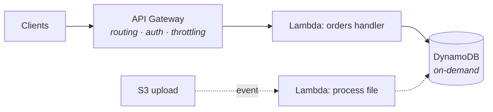

Lambda inverts the EC2 deal of S04-P03: instead of renting a server and keeping it fed, you hand AWS a function and pay **per invocation, per millisecond** — zero when nothing runs. The catch is a new mental model: your code stops being a *process that waits* (CS-P5) and becomes a *handler that reacts*. This part covers the model, the physics (cold starts, limits), the API pattern, and the honest decision of when serverless wins.

## The event-driven inversion

A Lambda function is code with one entry point, invoked *by events*:

```python
def handler(event, context):
    # event: WHO called and WHY — an HTTP request, an S3 upload,
    # a queue message, a schedule tick. Shape differs per source.
    order = json.loads(event["body"])          # API Gateway shape
    save(order)
    return {"statusCode": 201, "body": json.dumps({"id": order["id"]})}
```

The sources are the point: **API Gateway** (HTTP → function — the REST pattern below), **S3 events** (file lands in a bucket → function processes it — the classic thumbnail/parse pipeline), **SQS/EventBridge** (messages and schedules — S04-P09 territory), **DynamoDB streams** (react to data changes — S07-P06's CDC instinct, serverless edition). You stop writing "a server that polls"; you wire "when X happens, run this."

Three consequences carried over from everything you've learned: the function must be **stateless** (instances appear and vanish — state lives in DynamoDB/S3/RDS, S04-P06), it must be **idempotent** (most event sources deliver at-least-once — S02-P03's re-run test is now mandatory, not best practice), and its permissions **are** an IAM role (S04-P02 said Lambda would prove the point).

## Cold starts, demystified

First invocation (or a burst beyond warm capacity): AWS provisions a micro-environment, loads your runtime and code, runs your init — **cold start**, tens of ms to seconds. Subsequent calls reuse the warm environment. The engineering facts:

- **Init code runs once per environment, not per call** — so open DB connections and load config *outside* the handler; this is free caching (and why the connection-pool arithmetic of CS-P7 meets a twist: hundreds of concurrent Lambdas ≈ hundreds of connections — RDS Proxy exists precisely to pool them).
- **Weight matters**: big deployment packages and heavy imports stretch cold starts; keeping functions lean is a real optimization, not aesthetics.
- **Who cares, honestly**: a queue processor doesn't care about 500 ms cold starts; a user-facing API might — measure the p99 (CS-P4's rule) before buying *provisioned concurrency* (pre-warmed instances — effective, and quietly reintroduces paying-for-idle; S07-P12 nods).

## The limits are design inputs

Lambda's constraints aren't fine print — they *shape* correct designs: **15-minute max runtime** (longer work belongs on containers/batch — or split via queues), **memory 128 MB–10 GB with CPU scaling alongside it** (the one knob: more memory = more CPU = often *cheaper* because faster — test 512 MB vs 1769 MB before assuming), **~6 MB synchronous payloads** (big files go through S3 presigned URLs — S04-P04's pattern, now load-bearing), and **per-region concurrency quotas** (a traffic spike hits the ceiling → throttles — which a queue in front absorbs gracefully; direct sync calls just fail).

The recurring theme: when a limit pinches, the answer is usually **decouple with a queue or S3**, not fight the limit.

## The serverless REST API

The canonical stack: **API Gateway → Lambda → DynamoDB** — no instance anywhere, scales to zero and to thousands:



API Gateway earns its keep with routing, auth (IAM/JWT authorizers), throttling and usage plans — the boring HTTP chores. Two working decisions: choose **HTTP API** over legacy REST API in API Gateway unless you need its extras (cheaper, faster, sufficient for most), and structure functions **per resource, not per line of code** — one "orders" function handling its routes beats fifty nano-functions (deploy sprawl) and beats one mega-function (blast radius). And pair the stack with DynamoDB *on-demand*: both layers then scale to zero together — the whole architecture idles at ~$0, which is the actual magic trick.

## When serverless wins — and when it doesn't

**Wins**: spiky or unpredictable traffic (S07-P12's serverless-at-the-edges), event glue (S3-triggered processing, scheduled jobs, stream consumers), APIs with idle periods, and anything where *not managing servers* frees a small team (S07-P08's team axis, cloud edition).

**Loses**: steady high load (always-on containers price better — do the arithmetic at your RPS), long-running or stateful work (the 15-minute wall), latency-critical paths intolerant of cold starts, and heavy local dependencies (huge ML models want persistent processes — S03-P13's serving world).

The mature answer is a mix: serverless for the edges and glue, containers for the steady core — the same shape S07-P12 prescribed for pricing, applied to compute.

## Hands-on (30 minutes, free tier)

1. Create a Lambda (Python), test with a console event — read `event` and `context`, log something, find it in CloudWatch Logs (your first taste of S04-P10).
2. Put an HTTP API in front; `curl` your endpoint — a live API with zero servers.
3. Wire an S3 trigger: upload a file, watch the function fire with the S3 event shape.
4. Deliberately provoke a cold start (wait 15 minutes, invoke, check the `Init Duration` in the log line) — now you've *measured* the thing everyone argues about.

## Key takeaways

- Lambda is event-driven, stateless, per-millisecond compute: state externalized, idempotency mandatory, permissions = the IAM role.
- Init-outside-handler is free caching; cold starts are measurable, not mythical — optimize only when p99 says so.
- The limits (15 min, payload, concurrency) are design inputs: decouple with queues and S3 instead of fighting them.
- API Gateway + Lambda + DynamoDB on-demand idles at ~$0 and scales to thousands; keep serverless at the edges, containers at the steady core.

*Next up — Part 8: ECS, Fargate & ECR: Containers on AWS.*
