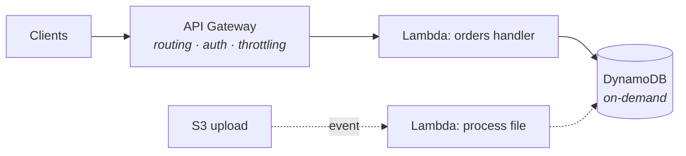

Lambda inverts the deal from Part 3: instead of renting a server and keeping it fed, you hand AWS a function and pay **per invocation, per millisecond** — zero when nothing runs. The catch is a new mental model: your code stops being a *process that waits* and becomes a *handler that reacts*.

## What you'll learn

- Rewrite a request handler as an event handler, and say why statelessness stops being optional.
- Explain cold starts mechanically, and measure one instead of arguing about it.
- Treat Lambda's limits as design inputs rather than obstacles.
- Decide honestly when serverless wins on cost and when it quietly loses.

**Prerequisites:** Part 3 (instances, so you can feel the inversion) and Part 2 (execution roles).

## 1. The event-driven inversion

A Lambda function is code with one entry point, invoked *by events*:

```python
def handler(event, context):
    # event: WHO called and WHY — an HTTP request, an S3 upload,
    # a queue message, a schedule tick. Shape differs per source.
    order = json.loads(event["body"])          # API Gateway shape
    save(order)
    return {"statusCode": 201, "body": json.dumps({"id": order["id"]})}
```

The sources are the point: **API Gateway** (HTTP → function — the REST pattern below), **S3 events** (file lands in a bucket → function processes it — the classic thumbnail/parse pipeline), **SQS/EventBridge** (messages and schedules — S04-P09 territory), **DynamoDB streams** (react to data changes — S07-P06's CDC instinct, serverless edition). You stop writing "a server that polls"; you wire "when X happens, run this."

Three consequences carried over from everything you've learned: the function must be **stateless** (instances appear and vanish — state lives in DynamoDB/S3/RDS, S04-P06), it must be **idempotent** (most event sources deliver at-least-once — S02-P03's re-run test is now mandatory, not best practice), and its permissions **are** an IAM role (S04-P02 said Lambda would prove the point).

## 2. Cold starts, demystified

First invocation (or a burst beyond warm capacity): AWS provisions a micro-environment, loads your runtime and code, runs your init — **cold start**, tens of ms to seconds. Subsequent calls reuse the warm environment. The engineering facts:

- **Init code runs once per environment, not per call** — so open DB connections and load config *outside* the handler; this is free caching (and why the connection-pool arithmetic of CS-P7 meets a twist: hundreds of concurrent Lambdas ≈ hundreds of connections — RDS Proxy exists precisely to pool them).
- **Weight matters**: big deployment packages and heavy imports stretch cold starts; keeping functions lean is a real optimization, not aesthetics.
- **Who cares, honestly**: a queue processor doesn't care about 500 ms cold starts; a user-facing API might — measure the p99 (CS-P4's rule) before buying *provisioned concurrency* (pre-warmed instances — effective, and quietly reintroduces paying-for-idle; S07-P12 nods).

## 3. The limits are design inputs

Lambda's constraints aren't fine print — they *shape* correct designs: **15-minute max runtime** (longer work belongs on containers/batch — or split via queues), **memory 128 MB–10 GB with CPU scaling alongside it** (the one knob: more memory = more CPU = often *cheaper* because faster — test 512 MB vs 1769 MB before assuming), **~6 MB synchronous payloads** (big files go through S3 presigned URLs — S04-P04's pattern, now load-bearing), and **per-region concurrency quotas** (a traffic spike hits the ceiling → throttles — which a queue in front absorbs gracefully; direct sync calls just fail).

The recurring theme: when a limit pinches, the answer is usually **decouple with a queue or S3**, not fight the limit.

## 4. The serverless REST API

The canonical stack: **API Gateway → Lambda → DynamoDB** — no instance anywhere, scales to zero and to thousands:



API Gateway earns its keep with routing, auth (IAM/JWT authorizers), throttling and usage plans — the boring HTTP chores. Two working decisions: choose **HTTP API** over legacy REST API in API Gateway unless you need its extras (cheaper, faster, sufficient for most), and structure functions **per resource, not per line of code** — one "orders" function handling its routes beats fifty nano-functions (deploy sprawl) and beats one mega-function (blast radius). And pair the stack with DynamoDB *on-demand*: both layers then scale to zero together — the whole architecture idles at ~$0, which is the actual magic trick.

## 5. When serverless wins — and when it doesn't

**Wins**: spiky or unpredictable traffic (S07-P12's serverless-at-the-edges), event glue (S3-triggered processing, scheduled jobs, stream consumers), APIs with idle periods, and anything where *not managing servers* frees a small team (S07-P08's team axis, cloud edition).

**Loses**: steady high load (always-on containers price better — do the arithmetic at your RPS), long-running or stateful work (the 15-minute wall), latency-critical paths intolerant of cold starts, and heavy local dependencies (huge ML models want persistent processes — S03-P13's serving world).

The mature answer is a mix: serverless for the edges and glue, containers for the steady core — the same shape S07-P12 prescribed for pricing, applied to compute.

## Practice (30 minutes — build it, then measure the cold start everyone argues about)

Free tier covers all of this. The point of step 4 is that you'll never again repeat cold-start folklore you haven't measured.

```bash
# 1. A function whose init cost you can SEE (module-level work is the init phase)
mkdir lambda-lab && cd lambda-lab
cat > handler.py <<'EOF'
import time, os
BOOT = time.time()                     # module level: runs ONCE per cold start
time.sleep(1.5)                        # pretend this is importing a heavy SDK

def handler(event, context):
    return {"statusCode": 200,
            "body": f"alive for {time.time()-BOOT:.1f}s, request {context.aws_request_id}"}
EOF
zip -q fn.zip handler.py

ROLE_ARN=<your existing lambda execution role arn>   # Part 2's role, reused
aws lambda create-function --function-name cold-lab --runtime python3.12 \
  --handler handler.handler --zip-file fileb://fn.zip --role "$ROLE_ARN" --timeout 30

# 2. Invoke twice back to back and compare the reported "alive for" value
for i in 1 2; do
  aws lambda invoke --function-name cold-lab out.json >/dev/null && cat out.json; echo
done

# 3. The numbers that matter are in the REPORT line, not in folklore
aws logs tail /aws/lambda/cold-lab --since 5m --format short | grep REPORT
#   Init Duration: … ms   ← only present on COLD starts
#   Duration / Billed Duration / Max Memory Used  ← what you actually pay for

# 4. Provoke a cold start on purpose: wait, then invoke and read Init Duration again
sleep 900 && aws lambda invoke --function-name cold-lab out.json >/dev/null
aws logs tail /aws/lambda/cold-lab --since 2m --format short | grep -E "REPORT|Init"

aws lambda delete-function --function-name cold-lab
```

Expected results: the first invocation reports a fresh "alive for" of roughly zero seconds and its log line contains `Init Duration` — that's the cold start, and the 1.5-second sleep at module level is exactly what it charges you for. The second invocation reuses the same execution environment: `Init Duration` is absent and "alive for" has grown, proving the container survived between requests. That single fact is the whole optimization story — expensive setup belongs at module level *because* it's reused, and it also *is* the cold start you pay on the first request. After 15 minutes idle the environment is gone and `Init Duration` returns.

## Check yourself

1. Your Lambda opens a database connection inside the handler on every invocation and the database is running out of connections under load. What's happening, and what are the two fixes?
2. A teammate proposes provisioned concurrency to fix "slow API responses". What do you ask to see first?
3. Your batch job takes 22 minutes on an EC2 instance. Can it move to Lambda as-is? What are your options?

<details><summary>See answers</summary>

1. Each concurrent execution is its own environment with its own connection, so 500 concurrent invocations means up to 500 connections — Lambda's scaling multiplies your connection count in a way a fixed server fleet never did. Fixes: move connection setup to module level so it's reused across invocations in the same environment, and put a connection proxy in front of the database to pool on its behalf.
2. The p99 latency broken down, and whether the slow requests are actually cold starts. Provisioned concurrency costs money continuously to eliminate a cost paid on a small fraction of requests — if the `REPORT` lines show `Init Duration` on 1% of invocations while p99 is dominated by a slow downstream call, provisioned concurrency buys nothing.
3. Not as-is: Lambda's execution ceiling is 15 minutes. Options: split the work into smaller chunks each under the limit and orchestrate them (a state machine, or a queue where each message is a chunk), move it to a container service built for long-running tasks, or keep it on an instance if it's genuinely one indivisible long job.

</details>

## Key takeaways

- Lambda is event-driven, stateless, per-millisecond compute: state externalized, idempotency mandatory, permissions = the IAM role.
- Init-outside-handler is free caching; cold starts are measurable, not mythical — optimize only when p99 says so.
- The limits (15 min, payload, concurrency) are design inputs: decouple with queues and S3 instead of fighting them.
- API Gateway + Lambda + DynamoDB on-demand idles at ~$0 and scales to thousands; keep serverless at the edges, containers at the steady core.

*Next up — Part 8: ECS, Fargate & ECR: Containers on AWS.*
