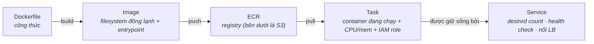

CS-P5 kết thúc bằng câu mở khoá phần này: **container là một process khoác cgroup và namespace** — không phải một VM nhỏ. Lambda (P07) chạy *function* của bạn; container chạy *process* của bạn, bất kỳ process nào, với toàn bộ môi trường đông lạnh thành một image. Phần này là chuỗi AWS đưa một Dockerfile thành một service tự lành: bốn danh từ, một quyết định launch, và câu hỏi EKS được trả lời thật thà.

## Chuỗi bốn danh từ

- **Image** — ý tưởng bò-đàn của S04-P03 hoàn thiện: AMI-cộng-user-data nén thành một artifact di động, có version. Build một lần, chạy giống hệt trên laptop, CI, hay production (kỷ luật lockfile của S02-P03, áp cho cả hệ điều hành).
- **ECR** — cái registry. Hai thói quen đáng trộm từ ngày đầu: bật **image scanning** (CVE trồi lên lúc push, không phải lúc audit) và đặt **lifecycle policy** (image không tag chất đống trong im lặng — catalog zombie của S07-P12, phiên bản container).
- **Task definition** — đơn vị của sự chạy: image nào, bao nhiêu CPU/memory (các bức tường cgroup từ CS-P5 — `OOMKilled` ở 512 MB được quyết định tại đây), environment, và quan trọng nhất là **task role**: mỗi task nhận IAM role riêng (pattern P02, ở độ hạt mịn nhất — service orders đọc được bucket *của nó* và không gì khác).
- **Service** — lớp bọc tự lành: "giữ 3 task chạy, đăng ký chúng với load balancer, thay bất kỳ con nào trượt health check." Một task chết lúc 3 giờ sáng được thay trong im lặng; service là lý do không ai bị page (việc bắt SIGTERM từ CS-P5 quyết định cú thay đó êm tới đâu).

## Quyết định launch: Fargate vs EC2

Cùng một task definition, hai cách có compute bên dưới:

| | **Fargate** | **EC2 launch type** |
|---|---|---|
| Bạn quản | Không gì dưới task | Các instance (vá, scale, xếp bin) |
| Giá | Theo task-giây, giá premium | Giá instance — rẻ hơn *nếu xếp khéo* |
| Hợp | Đa số service, tải bột phát, team nhỏ | Hạm đội lớn ổn định, task GPU, networking đặc biệt |

Mặc định thật thà là **Fargate**: phần giá premium mỗi đơn vị thường nhỏ hơn chi phí thời gian engineering (và công suất rảnh chưa xếp kín) mà instance tự-quản lặng lẽ ngốn — lập luận hoá-đơn-độ-phức-tạp của S07-P08, phiên bản container. Chọn EC2 launch type khi hạm đội đủ lớn và đủ ổn định để bài toán xếp bin thắng phép tính, hoặc khi cần tính năng mức instance (GPU, daemon agent). Và ở cả hai: **Fargate Spot / EC2 Spot cho workload chịu được ngắt** — các batch job idempotent của S02-P03 lại là khách hàng hoàn hảo.

Vị trí so với hàng xóm: Lambda cho keo dán hình-sự-kiện và API bột phát (phần rìa của P07), container cho **cái lõi ổn định** — service chạy dài, mọi thứ cần process bền (các server model của S03), những gì vượt tường 15-phút/payload của Lambda. Đúng đường cắt S07-P12 đã vẽ bằng giá.

## Bản triển khai chuẩn, lắp ráp hoàn chỉnh

Mọi thứ của series này ghép thành web service kinh điển:

**ALB** (public subnet, S04-P05) → **ECS service** (task trong private subnet, không public IP) → task role đúng nhu cầu S3/DynamoDB của nó (P02/P04/P06) → security group tham chiếu security group ("ALB-SG được chạm app-SG cổng 8080" — kiến-trúc-thành-luật của P05) → log về CloudWatch (P10 kế tiếp). Deploy mặc định là **rolling**: service khởi động task phiên bản mới, chờ health check, rút cạn con cũ — image hỏng trượt health check và cú rollout dừng lại thay vì hạ gục production. Bạn vừa thấy mọi mảnh của sơ đồ này được xây từ nguyên lý qua bảy phần.

## EKS: đoạn văn thật thà

Kubernetes (EKS) chạy cùng những container đó với một control plane giàu hơn, di động hơn, và nặng hơn rất nhiều. Chọn nó vì lý do thật: team *đã có sẵn* kỹ năng k8s, bạn cần hệ sinh thái (operator, Helm chart, service mesh), hoặc tính di động multi-cloud là yêu cầu thật — không phải yêu cầu trên slide. Ngoài ra, ECS+Fargate giao 90% giá trị với một phần nhỏ bề mặt vận hành (bài học mesh của S07-P07 vần điệu: nhận nuôi cỗ máy nặng vì nhu cầu tổ chức, không phải vì sân khấu hội thảo). Di cư về sau là việc thật nhưng có biên — image, kỷ luật registry, và các pattern IAM chuyển giao nguyên vẹn; thứ bị tráo chỉ là lớp bọc orchestration.

## Thực hành (40 phút, gần như miễn phí)

1. Build một image web app tí hon ở local; push lên ECR (`aws ecr get-login-password | docker login ...`).
2. Tạo một ECS cluster (Fargate), một task definition (256 CPU / 512 MB, image của bạn, task role đọc một bucket S3), và một service desired count 1 sau một ALB.
3. Mở URL của ALB; rồi `aws ecs stop-task` và xem service hồi sinh nó — tận mắt chứng kiến tự-lành.
4. Đổi tag image, redeploy, xem cú thay rolling. Rồi scale desired count về 0 và xoá — ALB là mảnh vẫn tính tiền khi rảnh.

## Điều cần nhớ

- Chuỗi là image → ECR → task → service: bò-đàn hoàn thiện, với task role là pattern P02 ở độ hạt mịn nhất.
- Fargate mặc định (phần premium rẻ hơn phần ops), EC2 launch type khi xếp bin hạm đội lớn ổn định thắng phép tính, Spot cho batch idempotent.
- Service tự lành và deploy rolling qua health check — graceful shutdown (CS-P5) quyết định độ êm.
- EKS dành cho team có kỹ năng k8s hoặc nhu cầu hệ sinh thái, không phải huy hiệu trưởng thành — ECS+Fargate là cái lõi mặc định thật thà, với Lambda ở rìa.

*Tiếp theo — Phần 9: SQS, SNS & EventBridge: tách rời hệ thống.*
