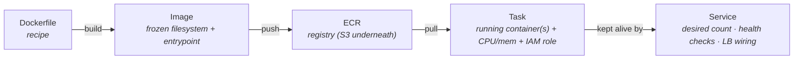

CS-P5 ended with the sentence that unlocks this part: **a container is a process wearing cgroups and namespaces** — not a small VM. Lambda (P07) runs your *function*; containers run your *process*, any process, with its whole environment frozen into an image. This part is the AWS chain that takes a Dockerfile to a self-healing service: four nouns, one launch decision, and the EKS question answered honestly.

## What you'll learn

- Read the four-noun chain (image → task definition → task → service) and say what each layer owns.
- Choose Fargate or EC2 launch type from workload shape, not from preference.
- Assemble the standard deployment from the pieces earlier parts already gave you.
- Answer the EKS question honestly for your own team.

**Prerequisites:** Part 2 (roles), Part 5 (VPC subnets and load balancers), Part 3 (instance sizing, for the EC2 launch type).

## 1. The four-noun chain



- **Image** — the cattle idea of S04-P03 perfected: AMI-plus-user-data compressed into a portable, versioned artifact. Build once, run identically on a laptop, CI, or production (the lockfile discipline of S02-P03, applied to the whole OS).
- **ECR** — the registry. Two habits worth stealing on day one: enable **image scanning** (CVEs surface at push time, not audit time) and set a **lifecycle policy** (untagged images pile up silently — S07-P12's zombie catalog, container edition).
- **Task definition** — the unit of running: which image(s), how much CPU/memory (the cgroup walls from CS-P5 — this is where `OOMKilled` at 512 MB is decided), environment, and crucially the **task role**: each task gets its own IAM role (P02's pattern, at its finest granularity — the orders service can read *its* bucket and nothing else).
- **Service** — the self-healing wrapper: "keep 3 tasks running, register them with the load balancer, replace any that fail health checks." A task dying at 3 a.m. is replaced silently; the service is why nobody gets paged (SIGTERM handling from CS-P5 decides whether that replacement is graceful).

## 2. The launch-type decision: Fargate vs EC2

Same task definition, two ways to get compute under it:

| | **Fargate** | **EC2 launch type** |
|---|---|---|
| You manage | Nothing below the task | The instances (patching, scaling, bin-packing) |
| Pricing | Per task-second, premium rate | Instance price — cheaper *if well-packed* |
| Fits | Most services, spiky loads, small teams | Large steady fleets, GPU tasks, special networking |

The honest default is **Fargate**: the per-unit premium is usually smaller than the cost of the engineering time (and the unpacked idle capacity) that self-managed instances quietly consume — S07-P08's complexity-bill argument, containerized. Choose EC2 launch type when the fleet is big and steady enough that bin-packing wins the arithmetic, or when you need instance-level features (GPUs, daemon agents). And on either: **Fargate Spot / EC2 Spot for interruptible workloads** — the S02-P03 idempotent batch jobs are again the perfect customers.

Where this sits against the neighbors: Lambda for event-shaped glue and spiky APIs (P07's edges), containers for **the steady core** — long-running services, anything needing a persistent process (S03's model servers), whatever exceeds Lambda's 15-minute/payload walls. Same split S07-P12 drew with pricing.

## 3. The standard deployment, assembled

Everything from this series composes into the canonical web service:

**ALB** (public subnets, S04-P05) → **ECS service** (tasks in private subnets, no public IPs) → task role for exactly its S3/DynamoDB needs (P02/P04/P06) → security groups referencing security groups ("ALB-SG may reach app-SG on 8080" — P05's architecture-as-rules) → logs to CloudWatch (P10 next). Deployments are **rolling by default**: the service starts new-version tasks, waits for health checks, drains old ones — a bad image fails its health check and the rollout stops instead of taking production down. You've now seen every piece of this diagram built from first principles across seven parts.

## 4. EKS: the honest paragraph

Kubernetes (EKS) runs the same containers with a richer, portable, far heavier control plane. Choose it for real reasons: the team *already* has k8s skills, you need the ecosystem (operators, Helm charts, service mesh), or multi-cloud portability is a genuine requirement — not a slide-deck one. Otherwise ECS+Fargate delivers 90% of the value with a fraction of the operational surface (S07-P07's mesh lesson rhymes: adopt heavy machinery because of your org's needs, not the conference stage). Migrating later is real work but bounded — the images, the registry discipline, and the IAM patterns all carry over unchanged; it's the orchestration wrapper that swaps.

## Practice (40 minutes — watch the service resurrect a task you killed)

The whole point of a *service* (rather than a task) is that it maintains desired state. Step 3 is where that stops being a slogan.

```bash
# 1. A tiny image, pushed to ECR
mkdir ecs-lab && cd ecs-lab
printf 'FROM public.ecr.aws/nginx/nginx:alpine\n' > Dockerfile
ACCT=$(aws sts get-caller-identity --query Account --output text)
REGION=$(aws configure get region)
aws ecr create-repository --repository-name ecs-lab >/dev/null
aws ecr get-login-password | docker login --username AWS --password-stdin $ACCT.dkr.ecr.$REGION.amazonaws.com
docker build -t ecs-lab . && docker tag ecs-lab:latest $ACCT.dkr.ecr.$REGION.amazonaws.com/ecs-lab:v1
docker push $ACCT.dkr.ecr.$REGION.amazonaws.com/ecs-lab:v1

# 2. Cluster + task definition (the TEMPLATE) + service (the DESIRED STATE)
aws ecs create-cluster --cluster-name lab >/dev/null
#    register a Fargate task definition: 256 CPU / 512 MB, your image, an execution role,
#    then create a service with --desired-count 1 in your public subnets.
#    (Console is fine here — the CLI JSON is long and not the lesson.)

# 3. THE LESSON: kill the task and watch desired state win
aws ecs list-tasks --cluster lab --query 'taskArns[0]' --output text     # note the task id
aws ecs stop-task --cluster lab --task <task-arn> >/dev/null
sleep 5;  aws ecs list-tasks --cluster lab --query 'taskArns'            # briefly empty or new arn
sleep 45; aws ecs list-tasks --cluster lab --query 'taskArns'            # a DIFFERENT task, running

# 4. Read the events log — the service narrates its own reconciliation
aws ecs describe-services --cluster lab --services <service-name> \
  --query 'services[0].events[:5].message'

# 5. Clean up: scale to 0, delete the service, then the cluster.
#    Remember the load balancer bills hourly even at zero tasks.
```

Expected results: after `stop-task`, listing tasks shows either nothing or a brand-new task ARN within a minute — you did not restart anything, and the replacement is a *different* task, not the one you killed. That's the reconciliation loop: the service compares desired count against reality and closes the gap, which is the same declarative idea Terraform and Kubernetes both run on. The events log in step 4 is worth reading once; it says in plain sentences what the scheduler decided and why, and it's the first place to look when a deployment stalls.

## Check yourself

1. What's the difference between a task definition, a task, and a service — and which one do you change to deploy new code?
2. Your team runs 40 microservices with spiky traffic and no one who wants to patch operating systems. Fargate or EC2 launch type, and why?
3. Your ECS service is stuck: desired count 2, running count 0, and no obvious error. Where do you look first?

<details><summary>See answers</summary>

1. The task definition is the immutable template (image, CPU, memory, roles, environment); a task is one running instance of that template; a service keeps N tasks running and replaces failures. To deploy new code you register a new task definition revision and update the service to it — you never mutate a running task.
2. Fargate. Spiky traffic means you'd be paying for idle EC2 capacity or writing scaling logic for the cluster itself, and "no one who wants to patch operating systems" is precisely the operational burden Fargate removes. EC2 launch type earns its complexity at steady high utilization, or when you need GPUs, specific instance types, or per-host tuning.
3. The service's events log — it states the reason in plain language, and the usual causes are all visible there: the task can't pull the image (registry permissions on the execution role), no capacity or no subnet with a route, the container exits immediately (application error, check the logs), or the load balancer health check fails so the task is killed and retried in a loop.

</details>

## Key takeaways

- The chain is image → ECR → task → service: cattle perfected, with per-task IAM roles as the finest-grained P02 pattern.
- Fargate by default (the premium is cheaper than the ops), EC2 launch type when bin-packing a large steady fleet wins, Spot for idempotent batch.
- Services self-heal and roll deployments through health checks — graceful shutdown (CS-P5) decides how gracefully.
- EKS is for teams with k8s skills or ecosystem needs, not a maturity badge — ECS+Fargate is the honest default core, with Lambda at the edges.

*Next up — Part 9: SQS, SNS & EventBridge: Decoupling Systems.*
