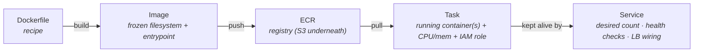

CS-P5 ended with the sentence that unlocks this part: **a container is a process wearing cgroups and namespaces** — not a small VM. Lambda (P07) runs your *function*; containers run your *process*, any process, with its whole environment frozen into an image. This part is the AWS chain that takes a Dockerfile to a self-healing service: four nouns, one launch decision, and the EKS question answered honestly.

## The four-noun chain

- **Image** — the cattle idea of S04-P03 perfected: AMI-plus-user-data compressed into a portable, versioned artifact. Build once, run identically on a laptop, CI, or production (the lockfile discipline of S02-P03, applied to the whole OS).
- **ECR** — the registry. Two habits worth stealing on day one: enable **image scanning** (CVEs surface at push time, not audit time) and set a **lifecycle policy** (untagged images pile up silently — S07-P12's zombie catalog, container edition).
- **Task definition** — the unit of running: which image(s), how much CPU/memory (the cgroup walls from CS-P5 — this is where `OOMKilled` at 512 MB is decided), environment, and crucially the **task role**: each task gets its own IAM role (P02's pattern, at its finest granularity — the orders service can read *its* bucket and nothing else).
- **Service** — the self-healing wrapper: "keep 3 tasks running, register them with the load balancer, replace any that fail health checks." A task dying at 3 a.m. is replaced silently; the service is why nobody gets paged (SIGTERM handling from CS-P5 decides whether that replacement is graceful).

## The launch-type decision: Fargate vs EC2

Same task definition, two ways to get compute under it:

| | **Fargate** | **EC2 launch type** |
|---|---|---|
| You manage | Nothing below the task | The instances (patching, scaling, bin-packing) |
| Pricing | Per task-second, premium rate | Instance price — cheaper *if well-packed* |
| Fits | Most services, spiky loads, small teams | Large steady fleets, GPU tasks, special networking |

The honest default is **Fargate**: the per-unit premium is usually smaller than the cost of the engineering time (and the unpacked idle capacity) that self-managed instances quietly consume — S07-P08's complexity-bill argument, containerized. Choose EC2 launch type when the fleet is big and steady enough that bin-packing wins the arithmetic, or when you need instance-level features (GPUs, daemon agents). And on either: **Fargate Spot / EC2 Spot for interruptible workloads** — the S02-P03 idempotent batch jobs are again the perfect customers.

Where this sits against the neighbors: Lambda for event-shaped glue and spiky APIs (P07's edges), containers for **the steady core** — long-running services, anything needing a persistent process (S03's model servers), whatever exceeds Lambda's 15-minute/payload walls. Same split S07-P12 drew with pricing.

## The standard deployment, assembled

Everything from this series composes into the canonical web service:

**ALB** (public subnets, S04-P05) → **ECS service** (tasks in private subnets, no public IPs) → task role for exactly its S3/DynamoDB needs (P02/P04/P06) → security groups referencing security groups ("ALB-SG may reach app-SG on 8080" — P05's architecture-as-rules) → logs to CloudWatch (P10 next). Deployments are **rolling by default**: the service starts new-version tasks, waits for health checks, drains old ones — a bad image fails its health check and the rollout stops instead of taking production down. You've now seen every piece of this diagram built from first principles across seven parts.

## EKS: the honest paragraph

Kubernetes (EKS) runs the same containers with a richer, portable, far heavier control plane. Choose it for real reasons: the team *already* has k8s skills, you need the ecosystem (operators, Helm charts, service mesh), or multi-cloud portability is a genuine requirement — not a slide-deck one. Otherwise ECS+Fargate delivers 90% of the value with a fraction of the operational surface (S07-P07's mesh lesson rhymes: adopt heavy machinery because of your org's needs, not the conference stage). Migrating later is real work but bounded — the images, the registry discipline, and the IAM patterns all carry over unchanged; it's the orchestration wrapper that swaps.

## Hands-on (40 minutes, mostly free)

1. Build any tiny web app image locally; push to ECR (`aws ecr get-login-password | docker login ...`).
2. Create an ECS cluster (Fargate), a task definition (256 CPU / 512 MB, your image, a task role with one S3 bucket read), and a service with desired count 1 behind an ALB.
3. Hit the ALB URL; then `aws ecs stop-task` and watch the service resurrect it — self-healing, observed.
4. Update the image tag, redeploy, watch the rolling replacement. Then scale desired count to 0 and delete — the ALB is the piece that bills while idle.

## Key takeaways

- The chain is image → ECR → task → service: cattle perfected, with per-task IAM roles as the finest-grained P02 pattern.
- Fargate by default (the premium is cheaper than the ops), EC2 launch type when bin-packing a large steady fleet wins, Spot for idempotent batch.
- Services self-heal and roll deployments through health checks — graceful shutdown (CS-P5) decides how gracefully.
- EKS is for teams with k8s skills or ecosystem needs, not a maturity badge — ECS+Fargate is the honest default core, with Lambda at the edges.

*Next up — Part 9: SQS, SNS & EventBridge: Decoupling Systems.*
