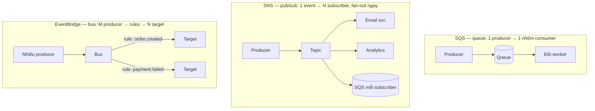

Cơn đau khai sinh: checkout của bạn gọi service hoá đơn, service hoá đơn gọi service email — một cách đồng bộ. Nhà cung cấp email có một phút tồi tệ, và đột nhiên *checkout* sập (bài học thread-bị-chặn của CS-P8, giờ trải dài qua nhiều service). Cách chữa là Observer pattern ở khoảng cách hệ thống (CS-P10): đặt một bộ đệm giữa "chuyện này đã xảy ra" và "các thứ phản ứng với nó." AWS đưa bạn ba hương vị của bộ đệm đó, và chọn giữa chúng là một quyết định, không phải ba sản phẩm để học thuộc.

## Bạn sẽ học được gì

- Chọn giữa queue, pub/sub và event bus trong một hơi thở, từ việc traffic cần làm gì.
- Giải thích at-least-once bằng cơ học, và vì sao idempotency thôi là tuỳ chọn.
- Cấu hình retry, backoff và dead-letter queue để lỗi trở nên nhìn thấy được thay vì vô tận.
- Đặt cảnh báo trên đúng tín hiệu thật sự báo trước rắc rối.

**Cần biết trước:** Phần 7 (handler hướng sự kiện) và Phần 2 (role). Bài học replication lag ở Phần 6 vần với bài này.

## 1. Ba hình dạng



- **SQS** là một **queue**: công việc nằm chờ tới khi *một* consumer xử lý nó. Đức tính của nó là đệm và điều tiết nhịp — một cơn spike traffic trở thành cái queue dài hơn, không phải một worker chết (chính cú san tải giữ cho đội máy right-size của S04-P03 trung thực; độ sâu queue cũng là tín hiệu autoscaling tự nhiên).
- **SNS** là **pub/sub**: một message, giao cho *tất cả* subscriber ngay. Combo production kinh điển là **SNS→SQS fan-out**: topic phát sóng, mỗi subscriber có queue *riêng*, nên một consumer chậm chỉ làm trễ chính nó.
- **EventBridge** là một **event bus**: nhiều producer, nhiều consumer, với *routing rule match theo nội dung event* — cộng bản năng schema registry (S07-P06) và event native từ chính các service AWS. Đây là lựa chọn "hệ thần kinh" khi số event vượt xa số luồng point-to-point.

Quyết định trong một hơi thở: **một consumer → SQS; phát sóng event của một producer → SNS(+SQS); nhiều-nhiều với routing theo nội dung → EventBridge.** Khi phân vân, bắt đầu với SQS — đó là thứ bạn không bao giờ hối hận vì đã sở hữu.

## 2. At-least-once: bản hợp đồng không ai đọc

Cả ba service này đều **at-least-once**: message trùng lặp không phải bug, đó là thiết kế. Cơ chế sinh ra chúng đáng hiểu một lần — SQS không xoá message khi consumer *đọc* nó; message trở nên vô hình trong một khoảng **visibility timeout** trong lúc consumer làm việc, và chỉ bị xoá khi consumer xác nhận. Crash trước khi xác nhận (hoặc làm lâu quá timeout) và message *hiện ra lại* — đó chính xác là thứ bạn muốn (không mất việc) và chính xác là thứ nhân đôi bạn (việc có thể đã xảy ra một phần).

Vì thế, luật sắt, lần xuất hiện thứ ba trong giáo trình này (pipeline của S02-P06, task của S02-P08, giờ là messaging): **mọi consumer phải idempotent.** Xử lý cùng message hai lần → cùng trạng thái cuối. Công cụ chuẩn: làm thao tác idempotent tự nhiên (set status = paid, upsert theo key), hoặc lưu vết message/business ID đã xử lý và bỏ qua bản lặp. Nếu consumer của bạn không idempotent, bạn không có một bug *có thể* xảy ra — bạn có một bug đã được lên lịch cho lần deploy xấu đầu tiên.

Chữ nhỏ liên quan hay cắn: **visibility timeout phải lớn hơn thời gian xử lý tệ nhất** (không thì bạn vừa xây một cỗ máy sinh bản trùng), và **thứ tự không được bảo đảm** ở queue standard — biến thể FIFO tồn tại và đánh đổi throughput lấy thứ tự, nhưng nước đi senior là thiết kế consumer *không cần* thứ tự toàn cục (state machine theo từng entity thắng mọi giả định về sequence).

## 3. Retry, backoff, và DLQ

Queue retry hộ bạn — đó là mục đích của nó — nhưng retry *không giới hạn* biến một poison message (payload hỏng, bug trong consumer) thành vòng lặp vô tận bỏ đói mọi thứ xếp sau. Cầu dao bắt buộc là **dead-letter queue**: sau N lần nhận thất bại (bắt đầu quanh 3–5), message chuyển sang DLQ thay vì quay vòng mãi mãi.

DLQ là thứ rỗng gánh nhiều trọng lượng nhất trong kiến trúc của bạn, và nó cần ba quyết định được chốt *trước* sự cố: một **alarm trên độ sâu** (DLQ khác rỗng là một cú page — nó là rọ "lỗi chung cuộc" của S02-P06, hiện hình), một **đường replay** (sửa consumer, rồi *re-drive* message quay lại — một thao tác có sẵn; cả failure mode trở thành: không mất gì, sửa, replay), và **retention** đủ dài để sống qua một kỳ nghỉ lễ. Consumer Lambda (S04-P07) cắm thẳng vào đây: event source mapping lo batching và retry, và điểm đến khi thất bại là — chính pattern DLQ này.

## 4. Giữ cho bộ đệm trung thực

- **Queue che giấu cái chết của consumer.** Gọi đồng bộ fail ầm ĩ; queue chỉ lặng lẽ dài ra. **Alarm trên tuổi của message cũ nhất** (độ ôi thiu — sự thật mà người dùng cảm nhận) hơn là trên độ sâu (thứ spike một cách chính đáng).
- **Event là bản hợp đồng** — kỷ luật schema của S02 áp dụng: version payload, thêm field thay vì tái sử dụng field cũ ("thêm, đừng tái sử dụng" của CS-P10, phiên bản messaging), và đặt schema event ở nơi cả team producer lẫn consumer đều thấy.
- **Chi phí tính theo request** (đồng hồ đo của S04-P01): polling và message tí hon cộng dồn chủ yếu thành *request*, nên hãy gộp send và receive theo lô khi độ trễ cho phép — phiên bản messaging của luật ít-request-to-hơn ở S04-P04.

## Thực hành (25 phút — cố tình nhận một message hai lần, rồi sống sót qua nó)

Toàn bộ phần này nằm trong free tier của SQS. Mục tiêu là *nhìn thấy* at-least-once xảy ra, vì đọc về nó thì chẳng thuyết phục được ai.

```bash
Q=$(aws sqs create-queue --queue-name lab-main --query QueueUrl --output text)
DLQ=$(aws sqs create-queue --queue-name lab-dlq  --query QueueUrl --output text)
DLQ_ARN=$(aws sqs get-queue-attributes --queue-url $DLQ --attribute-names QueueArn \
          --query Attributes.QueueArn --output text)

# 1. Đi dây dead-letter queue: sau 3 lần nhận mà không xử lý xong, message chuyển sang đó
aws sqs set-queue-attributes --queue-url $Q --attributes \
  "{\"RedrivePolicy\":\"{\\\"deadLetterTargetArn\\\":\\\"$DLQ_ARN\\\",\\\"maxReceiveCount\\\":\\\"3\\\"}\",\"VisibilityTimeout\":\"5\"}"

aws sqs send-message --queue-url $Q --message-body '{"order":"A-1"}' >/dev/null

# 2. NHẬN nó — nhưng ĐỪNG xoá. Đây là mô phỏng một consumer crash giữa chừng.
aws sqs receive-message --queue-url $Q --query 'Messages[].Body'     # nhận được lần 1
sleep 6                                                              # visibility timeout hết hạn
aws sqs receive-message --queue-url $Q --query 'Messages[].Body'     # CHÍNH MESSAGE ĐÓ, LẦN NỮA

# 3. Cứ tiếp tục không xoá. Quá maxReceiveCount là nó rời sang DLQ.
sleep 6; aws sqs receive-message --queue-url $Q >/dev/null
sleep 6; aws sqs receive-message --queue-url $Q >/dev/null
sleep 6
aws sqs receive-message --queue-url $Q  --query 'Messages[].Body'    # rỗng: queue chính đã sạch
aws sqs receive-message --queue-url $DLQ --query 'Messages[].Body'   # nó NẰM ĐÂY, chờ một con người

# 4. Metric báo trước rắc rối là TUỔI, không phải số lượng
aws sqs get-queue-attributes --queue-url $Q --attribute-names \
  ApproximateNumberOfMessages ApproximateAgeOfOldestMessage --query Attributes

aws sqs delete-queue --queue-url $Q; aws sqs delete-queue --queue-url $DLQ
```

Kết quả mong đợi: bước 2 là trọn bài học — chính message đó quay lại sau khi visibility timeout hết hạn, mà không ai gửi lại nó cả. Không gì fail, không gì cấu hình sai; đó *chính là* at-least-once, và đó là lý do handler của bạn phải an toàn khi chạy hai lần trên cùng một message. Bước 3 cho thấy dead-letter queue làm đúng việc của nó: một message không bao giờ thành công được thì thôi quay vòng vô tận và đáp xuống chỗ mà con người tìm ra được. Một DLQ rỗng là thứ yên tâm nhất trên dashboard, còn một DLQ không rỗng là thứ nhiều thông tin nhất.

## Tự kiểm tra

1. Consumer thanh toán của bạn thỉnh thoảng tính tiền khách hai lần, và log cho thấy cùng một message ID được xử lý hai lượt. Cái queue có hỏng không?
2. Bạn có dead-letter queue đã cấu hình và bốn tháng nay không ai nhìn vào nó. Trạng thái khả dĩ là gì, và cạnh nó cần có thứ gì?
3. Queue của bạn có 50.000 message và cả team hoảng. Queue của đồng nghiệp có 12 message và họ thư thái. Ai mới nên lo?

<details><summary>Xem đáp án</summary>

1. Không — đó là bản hợp đồng đã ghi rõ. At-least-once nghĩa là một message có thể được giao nhiều hơn một lần bất cứ khi nào consumer không kịp xoá nó, và chuyện đó xảy ra khi crash, khi xử lý chậm, khi timeout. Cách sửa nằm ở phía bạn: làm handler idempotent, thường bằng cách ghi lại các message ID đã xử lý hoặc khoá tác dụng phụ theo key (một lần tính tiền cho mỗi order ID) để lần lặp lại thành vô hiệu.
2. Nhiều khả năng nó không rỗng và đầy những lỗi không ai biết — nghĩa là công việc thật đã âm thầm ngừng xảy ra từ nhiều tháng trước. Cạnh một DLQ cần có cảnh báo trên độ sâu của nó (chỉ cần có message là đáng báo), và một đường replay có ghi chép để ai đó sửa nguyên nhân rồi đẩy các message trở lại.
3. Hoàn toàn tuỳ vào *tuổi* của message cũ nhất, không phải số lượng. Một queue 50.000 message đang chảy nhanh (cũ nhất 3 giây) là bộ đệm khoẻ mạnh đang hấp thụ một đợt bùng. Một queue 12 message mà cái cũ nhất đã 40 phút thì consumer đang kẹt hoặc đang fail — con số nhỏ mới là con số đáng báo động. Hãy cảnh báo theo tuổi, không theo độ sâu.

</details>

## Điều cần nhớ

- Một quyết định, ba hình dạng: SQS cho một consumer, SNS(+SQS fan-out) cho phát sóng, EventBridge cho nhiều-nhiều với routing theo nội dung — phân vân thì mặc định SQS.
- At-least-once là bản hợp đồng: cơ chế visibility timeout bảo đảm thỉnh thoảng có bản trùng, nên mọi consumer phải đậu bài test xử-lý-hai-lần.
- Retry có giới hạn + DLQ + alarm + đường replay — chốt trước sự cố — biến poison message từ một cú outage thành quy trình sửa-và-redrive thường lệ.
- Alarm theo tuổi message cũ nhất, coi payload event là hợp đồng có version, và gộp request theo lô: cái queue lặng lẽ dài ra là failure mode cần thiết kế chống lại.

*Tiếp theo — Phần 10: CloudWatch & X-Ray: nhìn thấy hệ thống của bạn.*
