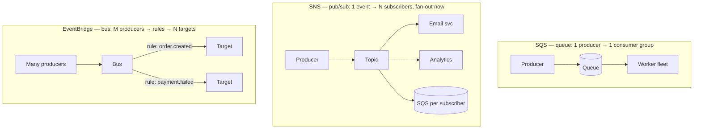

The birth pain: your checkout calls the invoice service, which calls the email service — synchronously. The email provider has a bad minute, and suddenly *checkout* is down (CS-P8's blocked-thread lesson, now spanning services). The fix is the Observer pattern at system distance (CS-P10): put a buffer between "this happened" and "things react to it." AWS gives you three flavors of that buffer, and choosing among them is one decision, not three products to memorize.

## The three shapes

- **SQS** is a **queue**: work sits until *one* consumer processes it. Its virtues are buffering and pacing — a traffic spike becomes a longer queue, not a dead worker (the load-leveling that keeps S04-P03's right-sized fleet honest; queue depth is also the natural autoscaling signal).
- **SNS** is **pub/sub**: one message, delivered to *all* subscribers now. The canonical production combo is **SNS→SQS fan-out**: the topic broadcasts, each subscriber gets its *own* queue, so a slow consumer delays only itself.
- **EventBridge** is an **event bus**: many producers, many consumers, with *routing rules matching event content* — plus the schema registry instinct (S07-P06) and native events from AWS services themselves. It's the "nervous system" choice when events outnumber point-to-point flows.

The decision in one breath: **one consumer → SQS; broadcast one producer's events → SNS(+SQS); many-to-many with content routing → EventBridge.** When unsure, start with SQS — it's the one you'll never regret owning.

## At-least-once: the contract nobody reads

Every one of these services is **at-least-once**: duplicates are not a bug, they are the design. The mechanism that produces them is worth understanding once — SQS doesn't delete a message when a consumer *reads* it; the message becomes invisible for a **visibility timeout** while the consumer works, and is deleted only when the consumer confirms. Crash before confirming (or outlive the timeout) and the message *reappears* — which is exactly what you want (no lost work) and exactly what duplicates you (the work may have partially happened).

Therefore the iron rule, third appearance in this curriculum (S02-P06's pipelines, S02-P08's tasks, now messaging): **every consumer must be idempotent.** Process the same message twice → same end state. The standard tools: make the operation naturally idempotent (set status = paid, upsert by key), or track processed message/business IDs and skip repeats. If your consumer isn't idempotent, you don't have a bug that *might* happen — you have a bug scheduled for your first bad deploy.

Related fine print that bites: **visibility timeout must exceed your worst-case processing time** (or you've built a duplicate generator), and **ordering is not guaranteed** in standard queues — FIFO variants exist and trade throughput for order, but the senior move is designing consumers that don't *need* global order (per-entity state machines beat sequence assumptions).

## Retry, backoff, and the DLQ

The queue retries for you — that's the point — but *unbounded* retry turns one poison message (malformed payload, bug in the consumer) into an infinite loop that starves everything behind it. The mandatory circuit breaker is the **dead-letter queue**: after N failed receives (start around 3–5), the message moves to a DLQ instead of cycling forever.

The DLQ is the most load-bearing empty thing in your architecture, and it needs three decisions made *before* the incident: an **alarm on its depth** (a non-empty DLQ is a page — it's your S02-P06 "final failure" basket, materialized), a **replay path** (fix the consumer, then *re-drive* messages back — a built-in operation; the whole failure mode becomes: nothing lost, fix, replay), and **retention** long enough to survive a long weekend. Lambda consumers (S04-P07) plug straight into this: event source mappings handle batching and retries, and the failure destination is — the same DLQ pattern.

## Making the buffer honest

- **A queue hides consumer death.** Synchronous calls fail loudly; a queue just grows. **Alarm on age of oldest message** (staleness, the user-facing truth) more than on depth (which spikes legitimately).
- **Events are contracts** — S02's schema discipline applies: version your payloads, add fields instead of repurposing them (CS-P10's "add, don't repurpose," messaging edition), and put the event schema where both producer and consumer teams can see it.
- **Cost is per-request** (S04-P01's meter): polling and tiny messages add up mostly as *requests*, so batch sends and receives where latency allows — the messaging edition of S04-P04's fewer-larger-requests rule.

## Key takeaways

- One decision, three shapes: SQS for one consumer, SNS(+SQS fan-out) for broadcast, EventBridge for many-to-many with content routing — default to SQS when unsure.
- At-least-once is the contract: visibility timeout mechanics guarantee occasional duplicates, so every consumer must pass the process-twice test.
- Bounded retries + DLQ + alarm + replay path — decided before the incident — turn poison messages from an outage into a routine fix-and-redrive.
- Alarm on oldest-message age, treat event payloads as versioned contracts, and batch requests: a silent growing queue is the failure mode to design against.

*Next up — Part 10: CloudWatch & X-Ray: See Your System.*
