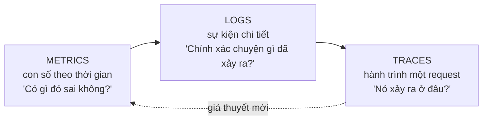

Mọi thứ bạn xây trong series này tới giờ đều có thể chết trong im lặng. Đội EC2 (P03) có thể nghiến ở 100% CPU, Lambda (P07) có thể bị throttle, cái queue (P09) có thể lặng lẽ dài ra suốt sáu tiếng — và không có observability thì hệ thống monitoring của bạn là *người dùng của bạn*, còn dashboard là mạng xã hội. Phần này là tầng nhìn thấy: ba loại tín hiệu thật sự trả lời gì, một thói quen logging khiến mọi thứ khác chạy được, và cách thiết kế alarm mà bạn sẽ không học cách phớt lờ.

## Ba tín hiệu, ba câu hỏi



- **Metrics** là các con số rẻ tiền theo thời gian (CPU, số request, tỷ lệ lỗi, độ sâu queue). Chúng là tầng *phát hiện*: tổng hợp, luôn bật, alarm được. Chúng nói cho bạn *rằng* có gì đó sai và đại khái ở đâu — không bao giờ nói vì sao.
- **Logs** là tầng *giải thích*: từng sự kiện với chi tiết đầy đủ. Đắt để lưu (hoá đơn observability nằm ở đây), đủ giàu để debug.
- **Traces** (họ X-Ray) trả lời câu hỏi microservice: một request đi qua load balancer, hai service, một queue, một database — *chặng nào* đốt mất 3 giây? Một trace là màn đo `curl -w` của CS-P6, lan truyền xuyên cả hệ phân tán của bạn qua một correlation ID.

Vòng lặp debug chạy từ trái sang phải: alarm trên metric → lọc log theo khung thời gian → trace cho request chậm/lỗi. Team chỉ có log thì làm khảo cổ; team chỉ có metric thì biết mình sập nhưng không biết vì sao.

## Structured logging: thói quen đá đỉnh vòm

Mọi thứ hạ nguồn phụ thuộc vào một quyết định trong code ứng dụng của bạn: **log JSON, mỗi sự kiện một dòng, kèm correlation ID.**

```json
{"level": "ERROR", "ts": "2026-08-04T03:12:09Z", "request_id": "r-8f3a",
 "route": "/checkout", "duration_ms": 4210, "error": "payment_timeout"}
```

Log văn xuôi (`"có gì đó sai sai :("`) dành cho con người đọc một dòng; structured log dành cho *máy trả lời câu hỏi*: CloudWatch Logs Insights khi đó tính được "p95 duration theo route trong một giờ qua" hay "mọi sự kiện của request r-8f3a" — chính là bản năng SQL của S02 chĩa vào dữ liệu vận hành. Hai luật đi kèm: **lan truyền request ID** qua mọi chặng (mỗi service log nó; message trong queue mang nó theo — đó là trace của kỹ sư nhà nghèo, và trace xịn xây trên đúng ý tưởng này), và **không bao giờ log secret hay PII thô** (CS-P11: log là một data store với quyền truy cập *lỏng nhất* công ty; một token trong dòng log là một token đã lộ).

Biết các mặc định của platform: Lambda tự log stdout; container (P08) đẩy stdout qua log driver — "in JSON ra stdout" là trọn vẹn phần tích hợp. Và đặt **retention cho mọi log group** ngay ngày tạo: log mặc định giữ-mãi-mãi, và kho log không giới hạn là hoá đơn versioning của S07-P12 mặc áo observability.

## Metrics và dashboard đáng có

CloudWatch tặng không metrics hạ tầng (CPU, network, độ sâu queue); những cái quan trọng nhất bạn phải **tự phát ra** — đơn hàng đặt thành công, thanh toán thất bại, độ tươi báo cáo — vì metric *business* phát hiện thứ metric hạ tầng không thể: cú deploy mà CPU đẹp hoàn hảo và số đơn hoàn tất bằng không. Phát chúng qua metric filter trên structured log (không thêm code path) hoặc embedded metrics format.

Với dashboard, cưỡng lại ngôi đền 40 widget. Pattern thực chiến là một màn hình mỗi service trả lời bốn câu hỏi — bản nén RED/USE: **rate, errors, duration** cho các thứ chạy theo request; **utilization, saturation, errors** cho tài nguyên (bài học load của P05: saturation — cái run queue — đau trước khi utilization đau). Percentile, không phải trung bình: p50 kể trải nghiệm điển hình, **p99 kể sự thật về những người dùng khổ nhất** — trung bình 200ms giấu cú checkout 8 giây đang đuổi khách của bạn.

## Alarm mà bạn sẽ không học cách phớt lờ

Failure mode của monitoring không phải quá ít alarm — mà là *quá nhiều*: một channel với 50 ô vuông đỏ mỗi ngày huấn luyện mọi người mute nó, và sự cố thật trôi qua không ai đọc (kỷ luật phân rọ của S02-P08, phiên bản cloud). Luật thiết kế:

- **Alarm theo triệu chứng, không theo nguyên nhân.** Page khi "p99 latency > 2s", "tỷ lệ lỗi > 1%", "tuổi message cũ nhất > 15 phút" (P09) — những thứ người dùng cảm nhận. CPU cao mà latency bình thường là một *sự thật*, không phải một *sự cố*; nó lên dashboard, không lên pager.
- **Mọi cú page phải hành động được.** Nếu phản ứng với một alarm là "ack rồi đi tiếp," xoá nó hoặc hạ cấp thành ticket. Alarm là bản hợp đồng: *nó nổ, nghĩa là một con người phải làm gì đó ngay.*
- **Alarm cả sự vắng mặt**: cron không chạy, file hằng ngày không tới, alarm "mất heartbeat" — phát hiện chết-trong-im-lặng là chỗ hệ dựa queue (P09) và pipeline batch (cú trễ SLA của S02-P08) hỏng không tiếng động.
- **Composite alarm cắt noise**: page khi *cả* tỷ lệ lỗi *và* latency cùng xấu; mỗi cái đơn lẻ là sự thật cho dashboard.

Khép vòng bằng ý thức chi phí: observability là một dòng hoá đơn thật (theo GB ingest, theo metric, theo dashboard), và lăng kính S07-P12 áp vào — sample log debug, giữ INFO gọn, giữ ERROR lâu hơn DEBUG. Nhìn thấy mọi thứ mãi mãi là một hoá đơn, không phải một đức hạnh.

## Điều cần nhớ

- Metrics phát hiện, logs giải thích, traces định vị — vòng debug chạy alarm → lọc log → trace, và bạn cần đủ ba tầng từ rẻ tới đắt.
- Structured JSON log với request ID lan truyền là thói quen đá đỉnh vòm: biến log thành database query được, mở đường cho tracing — và không bao giờ chứa secret.
- Tự phát metric business, vẽ percentile thay vì trung bình, và giữ dashboard ở một màn RED/USE mỗi service.
- Alarm theo triệu chứng người dùng, mọi cú page phải hành động được, alarm cả sự vắng mặt, và đặt log retention từ ngày đầu — một hệ monitoring bạn đã học cách phớt lờ nguy hiểm hơn là không có.

*Tiếp theo — Phần 11: Infrastructure as Code với Terraform.*
