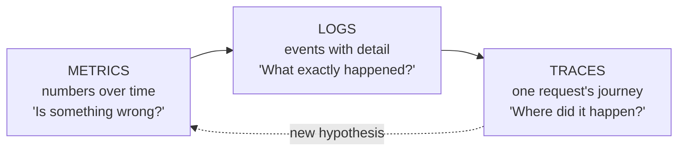

Everything you've built in this series so far can fail silently. The EC2 fleet (P03) can grind at 100% CPU, the Lambda (P07) can throttle, the queue (P09) can quietly grow for six hours — and without observability, your monitoring system is *your users*, and your dashboard is Twitter. This part is the seeing layer: what the three signal types actually answer, the one logging habit that makes everything else work, and how to design alarms you won't learn to ignore.

## What you'll learn

- Map the three signals to the three questions an incident actually asks.
- Emit structured logs with a request ID, so one command reconstructs a whole request.
- Build a dashboard that answers "is it healthy?" in one screen per service.
- Write alarms on symptoms people won't learn to ignore.

**Prerequisites:** Part 7 or Part 8 (something running that emits logs). Part 5's incident vocabulary helps.

## 1. Three signals, three questions



- **Metrics** are cheap numbers over time (CPU, request count, error rate, queue depth). They're the *detection* layer: aggregated, always-on, alarm-able. They tell you *that* something is wrong and roughly where — never why.
- **Logs** are the *explanation* layer: individual events with full detail. Expensive to store (this is where the observability bill lives), rich enough to debug from.
- **Traces** (X-Ray-style) answer the microservice question: one request touched the load balancer, two services, a queue, and a database — *which hop* burned the 3 seconds? A trace is CS-P6's `curl -w` timing breakdown, propagated across your whole distributed system via a correlation ID.

The debugging loop runs left to right: an alarm on a metric → filtered logs for the window → a trace for the slow/failed request. Teams that only have logs do archaeology; teams that only have metrics know they're down but not why.

## 2. Structured logging: the keystone habit

Everything downstream depends on one decision made in your application code: **log JSON, one event per line, with a correlation ID.**

```json
{"level": "ERROR", "ts": "2026-08-04T03:12:09Z", "request_id": "r-8f3a",
 "route": "/checkout", "duration_ms": 4210, "error": "payment_timeout"}
```

Prose logs (`"something went wrong :("`) are for humans reading one line; structured logs are for *machines answering questions*: CloudWatch Logs Insights can then compute "p95 duration by route for the last hour" or "all events for request r-8f3a" — which is your S02's SQL instinct pointed at operational data. The two companion rules: **propagate the request ID** through every hop (each service logs it; the queue message carries it — it's the poor engineer's trace, and traces are built on the same idea), and **never log secrets or raw PII** (CS-P11: logs are a data store with the *weakest* access controls in your company; a token in a log line is a leaked token).

Know the platform defaults: Lambda logs stdout automatically; containers (P08) ship stdout via their log driver — "print JSON to stdout" is the whole integration. And set **retention on every log group** the day it's created: logs default to keep-forever, and unbounded log storage is S07-P12's versioning bill wearing an observability costume.

## 3. Metrics and dashboards worth having

CloudWatch gives you infrastructure metrics free (CPU, network, queue depth); the ones that matter most you **emit yourself** — orders placed, payments failed, report freshness — because *business* metrics detect what infrastructure metrics can't: the deploy where CPU is perfect and zero orders complete. Emit them via metric filters on your structured logs (no extra code path) or the embedded metrics format.

For dashboards, resist the 40-widget shrine. The working pattern is one screen per service answering four questions — the RED/USE compression: **rate, errors, duration** for request-driven things; **utilization, saturation, errors** for resources (P05's load lesson: saturation — the run queue — hurts before utilization does). Percentiles, not averages: p50 tells you the typical experience, **p99 tells you the truth about your worst users** — a 200ms average hides the 8-second checkout that's costing you customers.

## 4. Alarms you won't learn to ignore

The failure mode of monitoring isn't too few alarms — it's *too many*: a channel with 50 daily red squares trains everyone to mute it, and the real incident scrolls past unread (S02-P08's basket discipline, cloud edition). Design rules:

- **Alarm on symptoms, not causes.** Page on "p99 latency > 2s" and "error rate > 1%" and "oldest message age > 15 min" (P09) — the things users feel. High CPU with normal latency is a *fact*, not an *incident*; it goes on the dashboard, not the pager.
- **Every page must be actionable.** If the response to an alarm is "acknowledge and move on," delete it or demote it to a ticket. An alarm is a contract: *this fired, so a human must do something now.*
- **Alarm on absence too**: the cron that didn't run, the daily file that didn't arrive, the "heartbeat missing" alarm — silent-death detection is where queue-based systems (P09) and batch pipelines (S02-P08's SLA miss) fail quietly.
- **Composite alarms cut noise**: page when *both* error rate and latency degrade; either alone is a dashboard fact.

Close the loop with cost awareness: observability is a real line item (per-GB ingestion, per-metric, per-dashboard), and the S07-P12 lens applies — sample debug logs, keep INFO terse, retain ERROR longer than DEBUG. Seeing everything forever is a bill, not a virtue.

## Practice (25 minutes — make one request traceable, then query it like a database)

The habit that changes your on-call life is structured logs plus a request ID. Prove it to yourself on a local file first, then apply the same query in CloudWatch Logs Insights.

```python
# app.py — emit JSON, one line per event, with a request id on every line
import json, logging, sys, time, uuid, random

log = logging.getLogger("app"); log.setLevel(logging.INFO)
h = logging.StreamHandler(sys.stdout); h.setFormatter(logging.Formatter("%(message)s")); log.addHandler(h)

def emit(**fields): log.info(json.dumps({"ts": round(time.time(), 3), **fields}))

def handle_request(path):
    rid = str(uuid.uuid4())[:8]                        # the thread that ties everything together
    t0 = time.time()
    emit(rid=rid, event="request_start", path=path)
    time.sleep(random.uniform(0.01, 0.2))
    emit(rid=rid, event="db_query", table="orders", ms=round(random.uniform(3, 90), 1))
    status = 500 if random.random() < 0.2 else 200
    if status == 500:
        emit(rid=rid, event="error", kind="UpstreamTimeout", detail="payments api did not respond")
    emit(rid=rid, event="request_end", path=path, status=status,
         ms=round((time.time() - t0) * 1000, 1))

for _ in range(50):
    handle_request(random.choice(["/orders", "/orders/42", "/health"]))
```

```bash
python app.py > app.log

# 1. Reconstruct ONE request end to end — impossible with unstructured logs
FAILED=$(jq -r 'select(.event=="request_end" and .status==500) | .rid' app.log | head -1)
jq -c "select(.rid==\"$FAILED\")" app.log          # the whole story of one request, in order

# 2. Logs become queryable data: error rate, by kind
jq -r 'select(.event=="error") | .kind' app.log | sort | uniq -c

# 3. p50 vs p99 — the number that matters is not the average
jq -s '[.[] | select(.event=="request_end") | .ms] | sort
       | {p50: .[(length*0.50|floor)], p95: .[(length*0.95|floor)], p99: .[(length*0.99|floor)],
          avg: (add/length | .*10|round|./10)}' app.log

# 4. Slowest endpoints, the way a dashboard would group them
jq -s 'group_by(.path)[] | select(.[0].path != null)
       | {path: .[0].path, n: length}' app.log | head
```

Expected results: step 1 is the moment the habit pays for itself — one `jq` filter reconstructs everything that happened during a single failed request, in order, including the upstream error that caused it. With plain text logs, that same reconstruction means grepping timestamps and guessing which lines belong together. Step 3 shows why p99 rather than the average is the number to alarm on: the average hides the slow tail that your unhappiest users actually experience. The same four queries work in CloudWatch Logs Insights with `filter` and `stats` — the skill transfers because the *log shape* is what made it possible, not the tool.

## Check yourself

1. A user reports "the site was slow around 2 p.m." and your logs are plain text lines. Why is this hard, and what would have made it easy?
2. Your dashboard shows average response time at 120 ms and everyone is relaxed, but support keeps getting complaints. What are you not looking at?
3. Your team has 40 alarms and silences most of them. What's the rule for deciding which ones survive?

<details><summary>See answers</summary>

1. Hard because there's no thread tying one request's lines together — you're grepping a time range and guessing which lines belong to the same request, across concurrent traffic. A request ID on every structured log line makes it one filter, and the fields (path, status, duration) make it aggregatable rather than readable-only.
2. The distribution. The average is dominated by fast requests; the users complaining are in the tail. Look at p95 and p99, and break them down by endpoint — a single slow path can generate all your complaints while barely moving the mean.
3. An alarm must be actionable and about a symptom users feel: a page fires only when someone must do something now, for something that is actually affecting service. Alarms on causes ("CPU above 80%") fire when nothing is wrong; alarms nobody acts on train the team to ignore all of them, which is worse than having none.

</details>

## Key takeaways

- Metrics detect, logs explain, traces locate — the debug loop runs alarm → filtered logs → trace, and you need all three layers cheap-to-expensive.
- Structured JSON logs with a propagated request ID are the keystone habit: they turn logs into a queryable database and make tracing possible — and they never contain secrets.
- Emit business metrics yourself, chart percentiles not averages, and keep dashboards to one RED/USE screen per service.
- Alarm on user symptoms, make every page actionable, alarm on absence, and set log retention day one — a monitoring system you've learned to ignore is more dangerous than none.

*Next up — Part 11: Infrastructure as Code with Terraform.*
