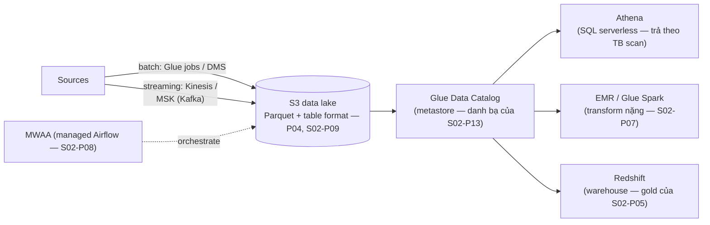

Nếu anh em đã đọc Lộ trình Data Engineer (S02), phần này là một *bảng dịch*: mỗi khái niệm bạn đã sở hữu có một tên sản phẩm AWS, một mô hình giá, và vài cái bẫy. Nếu bạn đến từ phía AWS, nó là tấm bản đồ ngược — và S02 là nơi mỗi ý tưởng được trình bày đầy đủ. Dù đi đường nào, kiến trúc là một bức hình, và nó chính là lakehouse của S02-P09 đeo bảng tên AWS.

## Tấm bản đồ

Chiếc hộp gánh trọng lượng là chiếc kém hào nhoáng nhất: **Glue Data Catalog** là metastore dùng chung — định nghĩa bảng trên các file S3 — cho phép Athena, Spark, và Redshift cùng đọc *chung một bộ bảng*. Đó là "format là bản hợp đồng" của S02-P09 hiện hình cụ thể: các engine hoán đổi được vì cái catalog thì không đổi.

## Bảng dịch

- **Kinesis ↔ Kafka (S02-P10)**: cùng mô hình log — shard là partition, iterator age là consumer lag, reshard là nỗi đau đổi-số-partition. Kinesis là lựa chọn native ít-ops; **MSK** là managed Kafka khi bạn muốn hệ sinh thái. Quyết định là "managed-first" của S02-P10, áp hai lần.
- **Glue jobs ↔ Spark (S02-P07)**: Spark serverless — không cluster phải nuôi, giá theo DPU-giờ. Mọi thứ từ P07 chuyển giao (shuffle, skew, cỡ partition); cái bẫy mới là *cold start và billing tối thiểu* khiến các job tí hon chạy dày đắt một cách bất xứng — gom chúng theo lô (bản năng S04-P09).
- **Athena ↔ DuckDB/Trino (S07-P08)**: SQL tương tác serverless trên lake. Giá của nó *chính là* áp lực thiết kế của nó — bên dưới.
- **Redshift ↔ warehouse (S02-P05)**: columnar MPP cho lớp gold và concurrency BI. Chỉ dẫn thật thà 2026: bắt đầu với Athena trên các table format mở; đón Redshift khi concurrency BI và hiệu năng workload-đã-model đòi hỏi — không phải bước một. Lakehouse *là* mặc định bây giờ; warehouse là một tối ưu.
- **MWAA ↔ Airflow (S02-P08)**: lập lịch managed, lập luận "scheduler là hạ tầng production" của S02-P08 được giải bằng cuốn séc.

## Cái hoá đơn thiết kế lại bảng của bạn

Giá của Athena — **đô la theo TB scan** — là người thầy giỏi nhất cho các bài học storage của S02, vì mọi sai lầm trở thành một dòng hoá đơn: lưu CSV thay vì Parquet và bạn scan gấp 10× (phép toán columnar của S02-P09, xuất hoá đơn); bỏ partitioning và mọi query full-scan cả lịch sử (pruning của S02-P07, xuất hoá đơn); để small files chất đống và bạn trả thêm chi phí request S3 (căn bệnh của S02-P09, xuất hoá đơn). Cách chữa chính xác là giáo trình S02 — Parquet, partition theo cột filter phổ biến, compact định kỳ — và vòng phản hồi ngắn tuyệt đẹp: sửa layout, nhìn chi phí mỗi query rơi 10–100×. Đặt **scan limit theo workgroup** ngay ngày tạo workgroup: một cú `SELECT *` trên năm năm lịch sử là câu chuyện hoá đơn tuần-đầu-dùng-Athena kinh điển, và cái limit biến nó thành một error message thay vì một hoá đơn (bản năng billing-alarm của S04-P02, phiên bản query).

## Pattern serverless lake

Kiến trúc tham chiếu cho team nhỏ — từng mảnh từ chính series này, không server nào ở đâu cả:

S3 landing (lifecycle rule của P04 trên raw) → S3-event hoặc lịch kích một **Glue job** (P07 serverless, hoặc Lambda thường cho file nhỏ — S04-P07) ghi Parquet vào một table format → **catalog** cập nhật → **Athena** phục vụ analyst và dashboard; **MWAA** (hoặc Step Functions cho chuỗi đơn giản) orchestrate; check quality (S02-P12) chạy như các task trong cùng DAG. Đức tính của stack này là kinh tế học S04-P07: volume thấp thì gần như không tốn gì và *scale về không*; trần của nó là khi job Spark cần tune sâu hơn mức Glue lộ ra (→ EMR) hoặc concurrency BI vượt Athena (→ Redshift). Cả hai cuộc di cư đều rẻ *vì dữ liệu không hề di chuyển* — cùng file S3, cùng catalog, khác engine. Đó là thuộc tính lối-thoát của S07-P03, và là trọn lý do để khăng khăng dùng format mở từ ngày một.

Hai cây cầu khép bài. **Security không đổi**: bucket policy + role least-privilege theo từng job (P02), CMK trên các prefix nhạy cảm (P12), tầng Lake Formation cho quyền mịn khi cần kiểm soát mức cột (masking của S02-P13, phiên bản AWS). Và **ops cũng vậy**: mọi Glue job và Kinesis consumer theo luật S04-P10 — structured log, alarm trên iterator age (chính là consumer lag), và alarm freshness data SLA trên các bảng gold, vì một data platform xanh-nhưng-ôi vẫn trượt bài test niềm tin của S02-P12 như thường.

## Điều cần nhớ

- Một sơ đồ, đủ bảng tên: Kinesis/MSK là cái log, Glue là Spark serverless, Athena là SQL-trên-lake, Redshift là warehouse, MWAA là Airflow — và Glue Catalog là bản hợp đồng khiến engine hoán đổi được.
- Giá theo-TB-scan của Athena xuất hoá đơn cho mọi sai lầm storage: Parquet + partitioning + compaction cắt chi phí query 10–100×, và scan limit theo workgroup biến chuyện-hoá-đơn thành error message.
- Mặc định serverless lake (S3 + Glue + Athena, scale về không); thêm EMR hay Redshift khi tuning hay concurrency đòi — dữ liệu không di chuyển, nên nâng cấp là đổi engine, không phải migration.
- Khái niệm S02 và kỷ luật S04 ghép nguyên vẹn: least-privilege theo job, CMK cho dữ liệu nhạy cảm, alarm iterator-age và freshness — xanh-nhưng-ôi vẫn trượt bài test niềm tin.

*Tiếp theo — Phần 14: AWS cho AI: Bedrock & SageMaker.*
