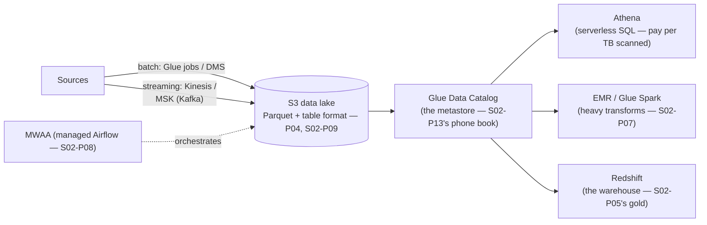

If you've read the Data Engineer Roadmap (S02), this part is a *translation table*: every concept you already own has an AWS product name, a pricing model, and a couple of traps. If you came from the AWS side, it's the reverse map — and S02 is where each idea gets its full treatment. Either way, the architecture is one picture, and it's the S02-P09 lakehouse wearing AWS name tags.

## The map

The load-bearing box is the least glamorous one: the **Glue Data Catalog** is the shared metastore — table definitions over S3 files — that lets Athena, Spark, and Redshift all read *the same tables*. That's S02-P09's "format is the contract" made concrete: the engines are interchangeable because the catalog isn't.

## The translation table

- **Kinesis ↔ Kafka (S02-P10)**: same log model — shards are partitions, iterator age is consumer lag, resharding is the partition-count pain. Kinesis is the low-ops native choice; **MSK** is managed Kafka when you want the ecosystem. The decision is S02-P10's "managed-first" applied twice.
- **Glue jobs ↔ Spark (S02-P07)**: serverless Spark — no cluster to keep alive, priced per DPU-hour. Everything from P07 transfers (shuffles, skew, partition sizing); the trap that's new is *cold starts and minimum billing* making tiny frequent jobs disproportionately expensive — batch them (the S04-P09 instinct).
- **Athena ↔ DuckDB/Trino (S07-P08)**: serverless interactive SQL over the lake. Its pricing *is* its design pressure — see below.
- **Redshift ↔ the warehouse (S02-P05)**: columnar MPP for the gold layer and BI concurrency. The honest 2026 guidance: start with Athena over open table formats; adopt Redshift when BI concurrency and modeled-workload performance demand it — not as step one. The lakehouse *is* the default now; the warehouse is an optimization.
- **MWAA ↔ Airflow (S02-P08)**: managed scheduling, the S02-P08 "scheduler is production infrastructure" argument resolved with a checkbook.

## The bill that redesigns your tables

Athena's pricing — **dollars per TB scanned** — is the single best teacher of S02's storage lessons, because every mistake becomes a line item: store CSV instead of Parquet and you scan 10× more (S02-P09's columnar math, invoiced); skip partitioning and every query full-scans history (S02-P07's pruning, invoiced); let small files accumulate and you pay S3 request overhead on top (S02-P09's disease, invoiced). The fixes are exactly the S02 curriculum — Parquet, partition by the common filter, compact regularly — and the feedback loop is beautifully short: fix the layout, watch the per-query cost drop 10–100×. Set a **per-workgroup scan limit** the day you create the workgroup: one `SELECT *` over five years of history is the classic first-week-of-Athena bill story, and the limit turns it into an error message instead (S04-P02's billing-alarm instinct, query edition).

## The serverless lake pattern

The reference architecture for a small team — each piece from this series, no servers anywhere:

S3 landing (P04 lifecycle rules on raw) → S3-event or schedule kicks a **Glue job** (P07 serverless, or plain Lambda for small files — S04-P07) writing Parquet into a table format → **catalog** updated → **Athena** serves analysts and dashboards; **MWAA** (or Step Functions for simple chains) orchestrates; quality checks (S02-P12) run as tasks in the same DAG. This stack's virtue is S04-P07's economics: at low volume it costs almost nothing and *scales to zero*; its ceiling is when Spark jobs need tuning beyond what Glue exposes (→ EMR) or BI concurrency outgrows Athena (→ Redshift). Both migrations are cheap *because the data never moves* — same S3 files, same catalog, different engine. That's the S07-P03 exit-ramp property, and it's the whole reason to insist on open formats from day one.

Two closing bridges. **Security is unchanged**: bucket policies + least-privilege roles per job (P02), CMKs on sensitive prefixes (P12), Lake Formation-tier fine-grained access when column-level control matters (S02-P13's masking, AWS edition). And **so is ops**: every Glue job and Kinesis consumer follows the S04-P10 rules — structured logs, alarm on iterator age (that's consumer lag), and a data SLA freshness alarm on the gold tables, because a data platform that's green-but-stale fails S02-P12's trust test all the same.

## Key takeaways

- One diagram, all name tags: Kinesis/MSK are the log, Glue is serverless Spark, Athena is SQL-over-the-lake, Redshift is the warehouse, MWAA is Airflow — and the Glue Catalog is the contract that makes engines interchangeable.
- Athena's per-TB-scanned pricing invoices every storage mistake: Parquet + partitioning + compaction cut query costs 10–100×, and workgroup scan limits turn bill stories into error messages.
- Default to the serverless lake (S3 + Glue + Athena, scales to zero); add EMR or Redshift when tuning or concurrency demands — the data never moves, so the upgrade is an engine swap, not a migration.
- S02 concepts and S04 disciplines compose unchanged: least-privilege per job, CMKs on sensitive data, iterator-age and freshness alarms — green-but-stale still fails the trust test.

*Next up — Part 14: AWS for AI: Bedrock & SageMaker.*
