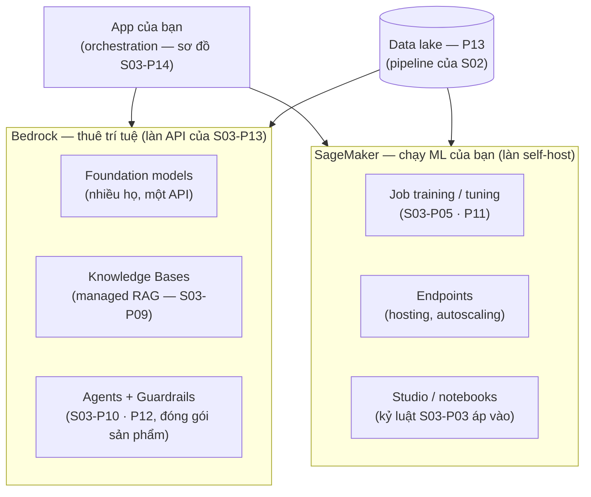

Như P13, phần này là một bảng dịch — lần này cho Lộ trình AI Engineer (S03). Câu chuyện AI của AWS năm 2026 là hai platform với một đường cắt sạch: **Bedrock cho bạn thuê trí tuệ** (truy cập managed tới các foundation model — nhánh API của quyết định S03-P13), **SageMaker chạy ML của bạn** (hạ tầng để train và host model riêng — nhánh self-host, với các cạnh sắc đã được mài tròn). Biết *bài toán của mình thuộc platform nào* là phần lớn của quyết định kiến trúc.

## Bạn sẽ học được gì

- Đặt hai platform AI lên một tấm bản đồ, và biết mỗi cái trả lời câu hỏi nào.
- Đọc Bedrock như tập hợp các thuộc tính enterprise mà nếu không có bạn phải tự xây.
- Nhận ra khi nào tự chạy weights là lựa chọn đúng — và nó buộc bạn gánh những gì.
- Nhìn ra cái platform *bao quanh* các model mới là phần thật sự quyết định thành bại.

**Cần biết trước:** Phần 2 (role), Phần 13 (nền dữ liệu mà các model này đọc từ đó). Phía model thì series AI roadmap phủ.

## 1. Tấm bản đồ

## 2. Bedrock: bảng dịch

- **Một API, nhiều họ model** — pattern router của S03-P13 có nhà native: đổi model là đổi một tham số, khiến luật S03-P12 ("không eval, không upgrade") rẻ để tuân thủ. Nhưng thứ Bedrock thật sự *bán* là các thuộc tính enterprise: **traffic ở trong ranh giới AWS của bạn** (kết nối private qua endpoint của P05 — không nhảy ra internet công cộng), **dữ liệu của bạn không được dùng để train** các model bên dưới, truy cập đi qua **IAM** (P02 — API model thừa kế hệ danh tính của bạn thay vì thêm một API key phải rotate, nhảy cóc luôn bậc thang secrets của P12), và **CloudTrail log mọi cú invoke** (sàn audit của P12 phủ luôn các cú gọi AI, miễn phí).
- **Knowledge Bases = S03-P09 dạng checkbox**: trỏ vào tài liệu (trong lake P13), nó chunk, embed, retrieve. Cách đọc thật thà: đây là *máy tăng tốc demo-tới-v1*; S03-P09 đã dạy bạn các núm vặn (chunking, hybrid, reranking, eval) — khi recall@k nói mặc định managed không còn đủ, bạn biết chính xác mình vừa vượt cỡ núm nào. Cùng phán quyết cho **Agents và Guardrails**: S03-P10/P12 đóng gói — giàn giáo tốt, và golden set của bạn (S03-P12) vẫn là người quyết chúng có tốt *cho bạn* không.
- **Fine-tuning không cần GPU**: job customization managed (tầng hình-LoRA của S03-P11) — dataset vào S3, adapter ra, không sở hữu cluster nào.

## 3. SageMaker: khi bạn tự chạy weights

SageMaker là hình hài nhánh self-host của S03-P13 khi AWS vận hành bộ máy: **training job** bật GPU lên, chạy, và *tự tắt* (bài học P03 rằng compute ngồi không là tiền cháy — được kiến trúc cưỡng chế; spot instance cho training ngắt được cắt chi phí theo kiểu S04-P03, và checkpointing khiến cú ngắt sống sót được — bài học S02-P11 mặc áo ML); **endpoint** host model với autoscaling và rolling deploy (pipeline của S01-P12, cho weights) — gồm cả endpoint *serverless* cho traffic spiky (kinh tế scale-về-không của P07 áp vào inference); và lời cảnh báo thật thà của S03-P13 phát biểu lại bằng giá AWS: **một endpoint là một nhà máy** — instance luôn-bật tính tiền theo giờ. Sự cố hoá đơn AI kinh điển không phải token Bedrock; là cái endpoint dev bị quên chạy ro ro suốt một tháng. Tag, alarm, và *xoá* (kỷ luật P10; bản năng "xoá thứ đi" của S02-P14).

**Quyết định, phát biểu lại bằng ngôn ngữ AWS**: Bedrock cho tới khi phép toán S03-P13 lật — volume hẹp cao bền vững (model nhỏ đã tune trên một endpoint bạn giữ bận), sàn latency, hoặc họ model Bedrock không có. Và router lai (20/80 của S03-P13) map gọn: Bedrock cho 20% frontier, model đã tune host trên SageMaker cho 80% thường nhật.

## 4. Cái platform quanh các model

Ba ghi chú khép bài biến đây thành một chương *platform* thay vì một tour sản phẩm. **Phần dữ liệu là việc của P13**: Knowledge Bases đọc từ lake, training job đọc Parquet từ S3, và cổng quality của S02 (S02-P12) canh thứ đi vào — lời cảnh báo của S03-P14 ("một nửa sự cố AI là sự cố dữ liệu") rơi xuống đây với đầy đủ trọng lượng. **Security ghép nối, không đổi**: role least-privilege theo workload (P02), CMK trên model artifact và dữ liệu training (P12), endpoint private (P05), và Bedrock Guardrails là một *lớp* trong defense-in-depth của S03-P14 — không phải món thay thế cho authorization-lúc-retrieval, thứ vẫn là việc của bạn. **Observability cũng ghép nối**: metric token và log invoke chảy vào CloudWatch (P10) — tag theo feature, alarm cost-per-day, canh p99 gồm cả retrieval — chiếc dashboard của S03-P13, lắp từ các mảnh bạn đã có.

## Thực hành (25 phút — định giá quyết định trước khi ra quyết định)

Câu hỏi managed-hay-tự-host trong bài này trả lời được bằng số học, và làm phép tính đó một lần sẽ đổi hẳn cách cuộc trò chuyện diễn ra:

**Phần 1 — hình dạng tải (10 phút).** Điền bằng con số thật từ mức dùng của bạn, hoặc ước lượng bạn sẵn sàng bảo vệ:

| Đầu vào | Con số của bạn | Nó đến từ đâu |
|---|---|---|
| Số request mỗi tháng | | analytics hoặc đếm log |
| Token input trung bình | | hãy ĐO, đừng ước lượng |
| Token output trung bình | | hãy đo |
| Số request đồng thời lúc đỉnh | | con số quyết định cỡ phần cứng |
| Số giờ mỗi ngày traffic gần bằng không | | con số giết chết phương án tự host |

**Phần 2 — hai khoản chi phí (10 phút).** Chi phí API là số request nhân token nhân đơn giá. Tự host là số giờ instance nhân đơn giá, *cộng* giờ công kỹ thuật để vận hành nó — và nó tính tiền y hệt dù bạn gửi một request hay một triệu. Tính cả hai. Rồi tính điểm giao: bao nhiêu request mỗi tháng thì tự host mới rẻ hơn?

**Phần 3 — cột trung thực (5 phút).** Cạnh con số tự host, hãy viết ai vận hành nó lúc 3 giờ sáng, ai đi vá nó, và chuyện gì xảy ra khi traffic bùng. Cột đó không phải một dòng chi phí, nhưng nó là lý do điểm giao trong thực tế nằm cao hơn hẳn chỗ mà phép số học đặt nó.

Kết quả mong đợi: điểm giao thường rơi cao hơn nhiều so với người ta tưởng, và dòng quyết định là "số giờ mỗi ngày traffic gần bằng không" — một endpoint tự host tính tiền qua từng giờ trong số đó, và đó là lý do một nhà máy chạy 30% công suất thua việc đi thuê. Khi tự host *thật sự* thắng, đó là vì workload đều đặn khối lượng lớn, hoặc vì một yêu cầu mà phép số học không nắm bắt: dữ liệu không được rời hạ tầng của bạn, một model bạn tự fine-tune, hay một sàn latency mà API không đáp ứng nổi. Những lý do đó chính đáng — chỉ cần chắc rằng lý do ghi trên giấy là một trong số đó, chứ không phải một sở thích khoác áo kinh tế học.

## Tự kiểm tra

1. Một team đề xuất tự host model open-weights để "tiết kiệm tiền API". Bạn xin xem cái gì?
2. Vì sao giá trị của một platform AI thường đến từ những mảnh KHÔNG PHẢI model?
3. Endpoint inference của bạn chạy 24/7 trong khi traffic chỉ tới trong giờ hành chính. Sửa thế nào?

Xem đáp án

1. Hình dạng tải — số request mỗi tháng, token mỗi request, mức đồng thời lúc đỉnh, và mỗi ngày có bao nhiêu giờ traffic gần bằng không. Rồi hai khoản chi phí đặt cạnh nhau, cộng thêm ai vận hành cái endpoint đó. Giá API co về không còn tự host thì không, nên câu trả lời thường xoay quanh mức sử dụng chứ không quanh đơn giá mỗi token mà ai cũng trích dẫn.
2. Vì một model không có retrieval, không eval, không phân quyền, không log và không đường deploy thì là một demo. Chính các mảnh đó quyết định hệ thống có đúng, có audit được và có cải thiện được không — và đó là nơi giờ công kỹ thuật đổ vào. Đổi model là một thay đổi cấu hình; xây cái platform bao quanh chúng mới là dự án.
3. Hãy scale nó xuống hoặc chuyển sang serverless ngoài giờ hành chính — bạn đang trả tiền cho khoảng hai phần ba mỗi ngày ở mức sử dụng bằng không. Nếu workload chịu được cold start, serverless inference gỡ bỏ hoàn toàn chi phí nằm không; nếu không chịu được, một lịch thu nhỏ công suất ban đêm cũng gom được phần lớn khoản tiết kiệm.

## Điều cần nhớ

- Hai platform, một đường cắt: Bedrock thuê trí tuệ (làn API), SageMaker chạy ML của bạn (làn self-host) — và phép toán S03-P13 nói khi nào băng qua.
- Sản phẩm thật của Bedrock là thuộc tính enterprise: kết nối private, không train trên dữ liệu của bạn, auth IAM-native, audit CloudTrail — với Knowledge Bases/Agents/Guardrails là các pattern S03 đóng gói mà bạn đã biết hết núm vặn.
- Endpoint SageMaker là nhà máy tính tiền theo giờ — spot + checkpoint cho training, serverless cho inference spiky, và xoá cái endpoint dev bị quên trước khi nó thành chuyện-hoá-đơn.
- Platform quanh các model chính là series này: lake P13 nuôi nó, security P02/P12 bọc nó, observability P10 canh nó — AI trên AWS là sự ghép nối, không phải một bộ môn mới.

*Tiếp theo — Phần 15: Well-Architected: thiết kế hệ thống thật.*
