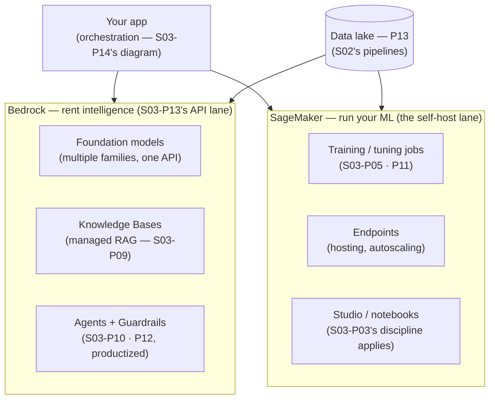

Like P13, this part is a translation table — this time for the AI Engineer Roadmap (S03). AWS's AI story in 2026 is two platforms with a clean split: **Bedrock rents you intelligence** (managed access to foundation models — the API side of S03-P13's decision), **SageMaker runs your ML** (infrastructure for training and hosting your own — the self-host side, with the sharp edges rounded). Knowing *which platform your problem belongs to* is most of the architecture decision.

## The map

## Bedrock: the translation

- **One API, many model families** — the router pattern of S03-P13 gets a native home: swapping models is a parameter change, which makes the S03-P12 rule ("no eval, no upgrade") cheap to obey. What Bedrock actually *sells*, though, is enterprise properties: **traffic stays inside your AWS boundary** (private connectivity via the P05 endpoints — no public internet hop), **your data isn't used to train** the underlying models, access runs through **IAM** (P02 — your model API inherits your identity system instead of another API key to rotate, P12's secrets ladder skipped entirely), and **CloudTrail logs every invocation** (P12's audit floor covers AI calls for free).
- **Knowledge Bases = S03-P09 as a checkbox**: point at documents (in the P13 lake), it chunks, embeds, and retrieves. The honest read: it's the *demo-to-v1 accelerator*; S03-P09 taught you the dials (chunking, hybrid, reranking, eval) — when recall@k says the managed defaults aren't enough, you'll know exactly which dial you've outgrown. Same verdict for **Agents and Guardrails**: productized S03-P10/P12 — great scaffolding, and your golden set (S03-P12) still decides whether they're good *for you*.
- **Fine-tuning without GPUs**: managed customization jobs (the S03-P11 LoRA-shaped tier) — dataset in S3, adapter out, no cluster owned.

## SageMaker: when you run the weights

SageMaker is what the self-host branch of S03-P13 looks like with AWS operating the machinery: **training jobs** that spin up GPUs, run, and *terminate* (the P03 lesson that idle compute is burned money — enforced by architecture; spot instances for interruptible training cut costs the S04-P03 way, and checkpointing makes interruption survivable — S02-P11's lesson in ML clothes); **endpoints** that host models with autoscaling and rolling deploys (S01-P12's pipeline, for weights) — including *serverless* endpoints for spiky traffic (P07's scale-to-zero economics applied to inference); and the honest warning from S03-P13 restated with AWS pricing: **an endpoint is a factory** — always-on instances billed hourly. The classic AI bill incident isn't Bedrock tokens; it's the forgotten dev endpoint humming for a month. Tag, alarm, and *delete* (P10's discipline; S02-P14's "delete things" instinct).

**The decision, restated in AWS terms**: Bedrock until the S03-P13 math flips — sustained narrow high volume (tuned small model on an endpoint you keep busy), latency floors, or model families Bedrock doesn't carry. And the hybrid router (S03-P13's 20/80) maps cleanly: Bedrock for the frontier 20%, a SageMaker-hosted tuned model for the routine 80%.

## The platform around the models

Three closing notes that make this a *platform* chapter rather than a product tour. **The data side is P13's job**: Knowledge Bases read from the lake, training jobs read Parquet from S3, and S02's quality gates (S02-P12) guard what goes in — the S03-P14 warning ("half of AI incidents are data incidents") lands here with force. **Security composes, unchanged**: least-privilege roles per workload (P02), CMKs on model artifacts and training data (P12), private endpoints (P05), and Bedrock Guardrails as one *layer* of S03-P14's defense-in-depth — not a substitute for retrieval-time authorization, which remains your job. **Observability composes too**: token metrics and invocation logs flow into CloudWatch (P10) — tag by feature, alarm on cost-per-day, watch p99 including retrieval — the S03-P13 dashboard, built from parts you already have.

## Key takeaways

- Two platforms, one split: Bedrock rents intelligence (API lane), SageMaker runs your ML (self-host lane) — and the S03-P13 decision math tells you when to cross.
- Bedrock's real product is enterprise properties: private connectivity, no training on your data, IAM-native auth, CloudTrail audit — with Knowledge Bases/Agents/Guardrails as productized S03 patterns whose dials you already know.
- SageMaker endpoints are factories billed hourly — spot + checkpoints for training, serverless for spiky inference, and delete the forgotten dev endpoint before it becomes the bill story.
- The platform around the models is this series: P13's lake feeds it, P02/P12's security wraps it, P10's observability watches it — AI on AWS is composition, not a new discipline.

*Next up — Part 15: Well-Architected: Designing Real Systems.*
