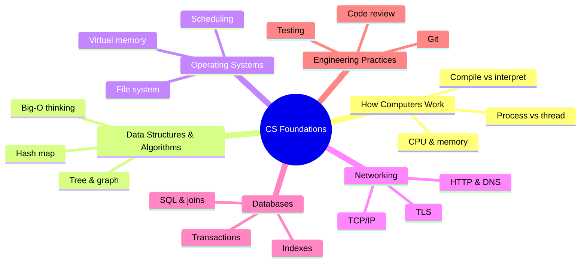

Bốn năm đại học CNTT để lại hàng trăm slide bài giảng, hàng chục đồ án, và — nói thật lòng — rất nhiều thứ bạn sẽ không bao giờ đụng lại. Nhưng ẩn trong đó có một phần lõi nhỏ mà bạn sẽ dùng **mỗi ngày đi làm** trong suốt sự nghiệp.

Series này chính là phần lõi đó. Không phải bản tóm tắt giáo trình — mà là phần chắt lọc những gì vẫn còn giá trị rất lâu sau khi các kỳ thi đã trôi vào quên lãng, gắn thẳng vào những tình huống bạn thực sự cần đến nó: debug một endpoint chậm, đọc một sự cố production, thiết kế schema, review code của đồng nghiệp.

## Bạn sẽ học được gì

- Gọi tên 6 trụ kiến thức CS sống lâu hơn mọi framework.
- Giải thích được vì sao fundamentals vẫn đáng đầu tư giữa thời AI.
- Tự chấm điểm mạnh/yếu của bản thân trên 6 trụ.
- Nắm thứ tự đọc series và biết trụ nào nằm ở phần nào.

**Cần biết trước:** không cần gì — đây là điểm xuất phát của cả giáo trình.

## 1. Sao phải học fundamentals, giữa thời AI?

Câu hỏi rất chính đáng. AI viết code được rồi. Framework thì hai năm đổi một lần. Vì sao phải bỏ công đọc 12 bài về nền tảng?

Vì fundamentals chính là phần **không** đổi:

- Framework bạn học năm nay sẽ thành legacy sau năm năm. TCP, B-tree và Big-O thì không.
- AI viết code rất nhanh — nhưng để **đánh giá** đoạn code đó (đúng không? an toàn không? hiệu quả không?) bạn cần đúng những mental model mà series này xây.
- Mọi bug khó bạn từng gặp đều nằm **bên dưới** framework: memory, concurrency, network, database. Engineer hiểu tầng bên dưới sẽ tự gỡ được; engineer không hiểu thì đứng im.

Fundamentals sinh lãi kép. Framework thì khấu hao.

## 2. Bản đồ: sáu trụ kiến thức

Mọi thứ đáng giữ lại từ tấm bằng CNTT gói gọn trong sáu trụ:

Từng trụ cho bạn điều gì, và series đi qua nó ở đâu:

### Trụ 1 — Máy tính hoạt động thế nào — *Phần 2*

CPU, memory, và chuyện gì thực sự xảy ra giữa lúc gõ `python app.py` và lúc pixel hiện lên màn hình. Trụ này giải thích mọi bí ẩn performance bạn sẽ debug: vì sao vòng loop chậm, vì sao process bị kill, vì sao "trên máy em chạy bình thường".

### Trụ 2 — Data structures & algorithms — *Phần 3–4*

Không phải competitive programming — mà là năm cấu trúc bạn dùng cả sự nghiệp (array, hash map, tree, graph, queue) và **Big-O như một lối tư duy**. Bạn sẽ học cách nhận ra O(n²) vô tình ẩn trong code thường ngày, kiểu vòng loop gọi query ở mỗi vòng lặp.

### Trụ 3 — Operating systems — *Phần 5*

Process, scheduling, virtual memory, file descriptor. Nghe hàn lâm cho đến lần đầu production ném vào mặt bạn `OOMKilled` hay `too many open files`. Container không làm OS biến mất — container **chính là** một khái niệm của OS.

### Trụ 4 — Networking — *Phần 6*

Chuyện gì thực sự xảy ra khi bạn gõ Enter trên một URL: DNS, TCP, TLS, HTTP. Mọi hệ thống bạn xây từ giờ đều là hệ phân tán; network là nơi hỏng hóc "sáng tạo" nhất. Biết suy luận về nó — và debug bằng `curl` — là một siêu năng lực.

### Trụ 5 — Databases — *Phần 7*

Relational model, index thực sự hoạt động ra sao, transaction đảm bảo điều gì. Database giữ toàn bộ trạng thái của business; đây là 20% kiến thức database gánh 80% công việc hằng ngày của bạn.

### Trụ 6 — Engineering practices — *Phần 8–12*

Concurrency không nước mắt, Git và code review như kỹ năng nghề nghiệp, design pattern dùng có chừng mực, security cơ bản, và cuối cùng là cây cầu từ đồ án sinh viên đến hệ thống production. Trụ này là ranh giới giữa "biết code" và "được tin giao production".

## 3. Cách dùng series này

- **Đọc theo thứ tự.** Các phần xây chồng lên nhau — bản đồ ở trên đồng thời là dependency graph.
- **Mỗi phần một lần ngồi.** Mỗi bài thiết kế để đọc trong 10–15 phút, rồi áp dụng.
- **Áp dụng trong vòng một tuần.** Sau mỗi phần, tìm một chỗ trong công việc hiện tại mà khái niệm đó xuất hiện. Kiến thức không gắn vào trải nghiệm sẽ bay hơi.
- **Đừng học thuộc — hãy kết nối.** Mục tiêu là một mental model mách bạn *nhìn vào đâu* khi có thứ gì đó hỏng.

## Thực hành (10 phút)

Tự chấm điểm trước khi bắt đầu. Với mỗi trụ, cho mình một điểm:

- **0** — mình chưa giải thích nổi cho một bạn junior.
- **1** — mình hiểu ý tưởng nhưng chưa debug được bằng nó.
- **2** — mình đã từng dùng nó để sửa một sự cố thật.

Rồi làm hai việc:

1. Ghi ra 2 trụ điểm thấp nhất. Đọc kỹ nhất các phần tương ứng trong series.
2. Nhớ lại 3 bug/sự cố khó gần nhất. Mỗi cái thuộc trụ nào? (Đa số mọi người phát hiện bug của mình dồn đúng vào các trụ điểm thấp nhất.)

## Tự kiểm tra

1. Lỗi production `too many open files` thuộc trụ nào trong 6 trụ?
2. Vì sao fundamentals "sinh lãi kép" còn framework "khấu hao"?
3. AI viết hộ bạn một function. Bạn dùng những trụ nào để đánh giá nó có an toàn để merge không?

Xem đáp án

1. Hệ điều hành (Phần 5) — file descriptor là tài nguyên của OS.
2. Framework bị thay vài năm một lần nên kiến thức mất giá; fundamentals (TCP, B-tree, Big-O) nằm dưới mọi framework mới, nên mỗi năm kinh nghiệm đều xây tiếp trên nó.
3. Tối thiểu: cấu trúc dữ liệu & thuật toán (có hiệu quả không?), database (query có hợp lý không?), security trong kỹ năng kỹ sư (input xử lý an toàn chưa?) — đánh giá code chính là nơi fundamentals kiếm cơm.

## Điều cần nhớ

- Giá trị bền của tấm bằng CNTT gói trong sáu trụ: máy tính, data structures, OS, network, database, engineering practices.
- Fundamentals sinh lãi kép trong khi framework khấu hao — đây là khoản đầu tư sự nghiệp tốt nhất, nhất là trong thời AI.
- Series đi qua sáu trụ theo đúng thứ tự phụ thuộc, mỗi bài một chủ đề gọn.

**Đi tiếp sau series này:** [Lộ trình Data Engineer](/vi/series/de-roadmap), [Lộ trình AI Engineer](/vi/series/ai-roadmap), hoặc [AWS từ cơ bản đến nâng cao](/vi/series/aws-zero-to-advanced) — cả ba đều đứng trên phần nền tảng xây ở đây.

*Tiếp theo — Phần 2: Máy tính thực sự chạy code của bạn như thế nào.*
