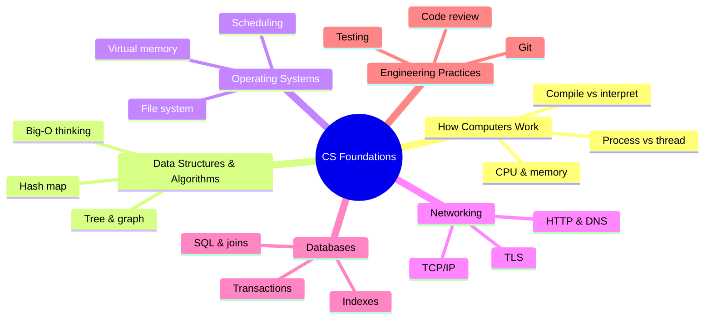

Bốn năm đại học CNTT để lại hàng trăm slide bài giảng, hàng chục đồ án, và — nói thật lòng — rất nhiều thứ bạn sẽ không bao giờ đụng lại. Nhưng ẩn trong đó có một phần lõi nhỏ mà bạn sẽ dùng **mỗi ngày đi làm** trong suốt sự nghiệp.

Series này chính là phần lõi đó. Không phải bản tóm tắt giáo trình — mà là phần chắt lọc những gì vẫn còn giá trị rất lâu sau khi các kỳ thi đã trôi vào quên lãng, gắn thẳng vào những tình huống bạn thực sự cần đến nó: debug một endpoint chậm, đọc một sự cố production, thiết kế schema, review code của đồng nghiệp.

## Sao phải học fundamentals, giữa thời AI?

Câu hỏi rất chính đáng. AI viết code được rồi. Framework thì hai năm đổi một lần. Vì sao phải bỏ công đọc 12 bài về nền tảng?

Vì fundamentals chính là phần **không** đổi:

- Framework bạn học năm nay sẽ thành legacy sau năm năm. TCP, B-tree và Big-O thì không.
- AI viết code rất nhanh — nhưng để **đánh giá** đoạn code đó (đúng không? an toàn không? hiệu quả không?) bạn cần đúng những mental model mà series này xây.
- Mọi bug khó bạn từng gặp đều nằm **bên dưới** framework: memory, concurrency, network, database. Engineer hiểu tầng bên dưới sẽ tự gỡ được; engineer không hiểu thì đứng im.

Fundamentals sinh lãi kép. Framework thì khấu hao.

## Bản đồ: sáu trụ kiến thức

Mọi thứ đáng giữ lại từ tấm bằng CNTT gói gọn trong sáu trụ:

Từng trụ cho bạn điều gì, và series đi qua nó ở đâu:

### 1. Máy tính hoạt động thế nào — *Phần 2*

CPU, memory, và chuyện gì thực sự xảy ra giữa lúc gõ `python app.py` và lúc pixel hiện lên màn hình. Trụ này giải thích mọi bí ẩn performance bạn sẽ debug: vì sao vòng loop chậm, vì sao process bị kill, vì sao "trên máy em chạy bình thường".

### 2. Data structures & algorithms — *Phần 3–4*

Không phải competitive programming — mà là năm cấu trúc bạn dùng cả sự nghiệp (array, hash map, tree, graph, queue) và **Big-O như một lối tư duy**. Bạn sẽ học cách nhận ra O(n²) vô tình ẩn trong code thường ngày, kiểu vòng loop gọi query ở mỗi vòng lặp.

### 3. Operating systems — *Phần 5*

Process, scheduling, virtual memory, file descriptor. Nghe hàn lâm cho đến lần đầu production ném vào mặt bạn `OOMKilled` hay `too many open files`. Container không làm OS biến mất — container **chính là** một khái niệm của OS.

### 4. Networking — *Phần 6*

Chuyện gì thực sự xảy ra khi bạn gõ Enter trên một URL: DNS, TCP, TLS, HTTP. Mọi hệ thống bạn xây từ giờ đều là hệ phân tán; network là nơi hỏng hóc "sáng tạo" nhất. Biết suy luận về nó — và debug bằng `curl` — là một siêu năng lực.

### 5. Databases — *Phần 7*

Relational model, index thực sự hoạt động ra sao, transaction đảm bảo điều gì. Database giữ toàn bộ trạng thái của business; đây là 20% kiến thức database gánh 80% công việc hằng ngày của bạn.

### 6. Engineering practices — *Phần 8–12*

Concurrency không nước mắt, Git và code review như kỹ năng nghề nghiệp, design pattern dùng có chừng mực, security cơ bản, và cuối cùng là cây cầu từ đồ án sinh viên đến hệ thống production. Trụ này là ranh giới giữa "biết code" và "được tin giao production".

## Cách dùng series này

- **Đọc theo thứ tự.** Các phần xây chồng lên nhau — bản đồ ở trên đồng thời là dependency graph.
- **Mỗi phần một lần ngồi.** Mỗi bài thiết kế để đọc trong 10–15 phút, rồi áp dụng.
- **Áp dụng trong vòng một tuần.** Sau mỗi phần, tìm một chỗ trong công việc hiện tại mà khái niệm đó xuất hiện. Kiến thức không gắn vào trải nghiệm sẽ bay hơi.
- **Đừng học thuộc — hãy kết nối.** Mục tiêu là một mental model mách bạn *nhìn vào đâu* khi có thứ gì đó hỏng.

## Điều cần nhớ

- Giá trị bền của tấm bằng CNTT gói trong sáu trụ: máy tính, data structures, OS, network, database, engineering practices.
- Fundamentals sinh lãi kép trong khi framework khấu hao — đây là khoản đầu tư sự nghiệp tốt nhất, nhất là trong thời AI.
- Series đi qua sáu trụ theo đúng thứ tự phụ thuộc, mỗi bài một chủ đề gọn.

**Đi tiếp sau series này:** [Lộ trình Data Engineer](/vi/series/de-roadmap), [Lộ trình AI Engineer](/vi/series/ai-roadmap), hoặc [AWS từ cơ bản đến nâng cao](/vi/series/aws-zero-to-advanced) — cả ba đều đứng trên phần nền tảng xây ở đây.

*Tiếp theo — Phần 2: Máy tính thực sự chạy code của bạn như thế nào.*
