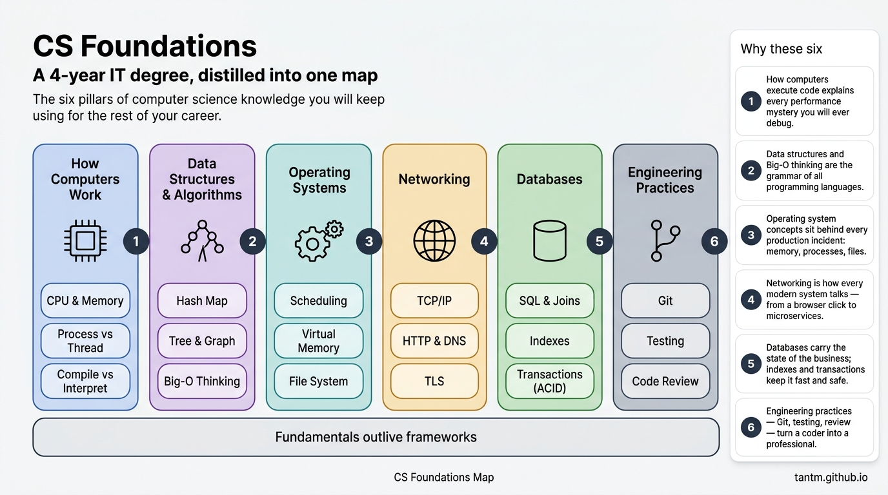
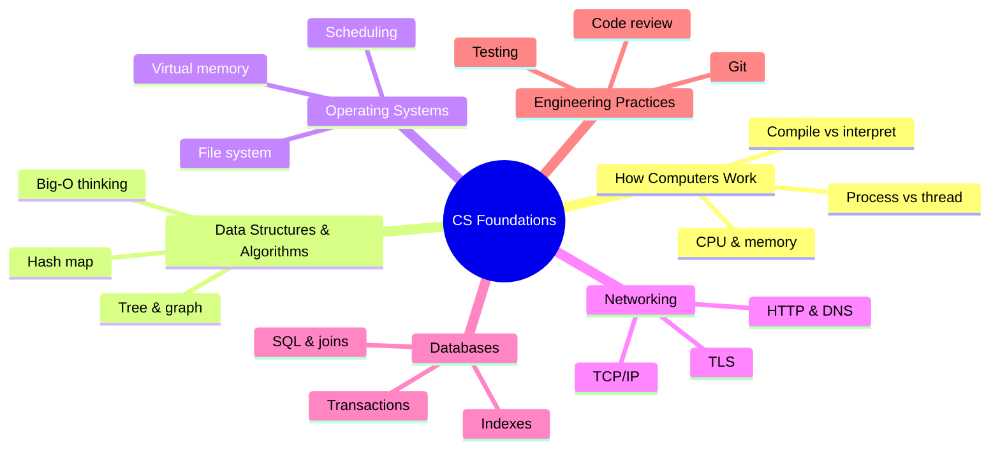
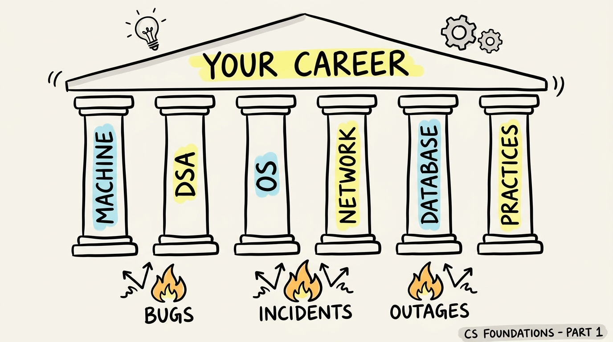

Four years of a computer science degree produce hundreds of lecture slides, dozens of assignments, and — if we are honest — a lot of material you will never touch again. But buried in there is a small core that you will use **every single working day** for the rest of your career.

This series is that core. Not a summary of a curriculum — a distillation of what still matters after the exams are long forgotten, connected to the situations where you will actually need it: debugging a slow endpoint, reading a production incident, designing a schema, reviewing a colleague's code.

## What you'll learn

- Name the six pillars of CS knowledge that outlive every framework.
- Explain why fundamentals still pay off in the age of AI assistants.
- Map your own strengths and gaps onto the six pillars.
- Know the reading order of this series and where each pillar is covered.

**Prerequisites:** none — this is the starting point of the whole curriculum.

## 1. Why fundamentals, in the age of AI?

It is a fair question. AI assistants can write the code. Frameworks change every two years. Why invest in 12 posts of fundamentals?

Because fundamentals are exactly the part that **doesn't** change:

- The framework you learn this year will be legacy in five. TCP, B-trees, and Big-O will not.
- AI writes code fast — but *judging* that code (is it correct? safe? efficient?) requires the mental models this series builds.
- Every hard bug you will ever face lives **below** the framework: memory, concurrency, the network, the database. Engineers who understand the layer below get unstuck; engineers who don't stay stuck.

Fundamentals compound. Frameworks depreciate.

## 2. The map: six pillars

Everything worth keeping from a CS degree fits into six pillars:

Here is what each pillar gives you, and where the series covers it.

### Pillar 1 — How computers work — *Part 2*

CPU, memory, and what actually happens between `python app.py` and pixels on a screen. This pillar explains every performance mystery you will ever debug: why the loop is slow, why the process was killed, why "it works on my machine".

### Pillar 2 — Data structures & algorithms — *Parts 3–4*

Not competitive programming — the five structures you will use for the rest of your career (array, hash map, tree, graph, queue) and **Big-O as a way of thinking**. You will learn to spot the accidental O(n²) hiding in everyday code, like a loop that calls a query on every iteration.

### Pillar 3 — Operating systems — *Part 5*

Processes, scheduling, virtual memory, file descriptors. Sounds academic until the first time production throws `OOMKilled` or `too many open files` at you. Containers did not make the OS go away — a container **is** an OS concept.

### Pillar 4 — Networking — *Part 6*

What really happens when you hit Enter on a URL: DNS, TCP, TLS, HTTP. Every system you will ever build is distributed now; the network is the part that fails creatively. Being able to reason about it — and debug it with `curl` — is a superpower.

### Pillar 5 — Databases — *Part 7*

The relational model, how indexes actually work, what a transaction guarantees. Databases carry the state of the business; this is the 20% of database knowledge that powers 80% of your daily work.

### Pillar 6 — Engineering practices — *Parts 8–12*

Concurrency without tears, Git and code review as professional skills, design patterns used with judgment, security basics, and finally the bridge from school project to production system. This pillar is what separates "can code" from "can be trusted with production".

## 3. How to use this series

- **Read in order.** The parts build on each other — the map above is also a dependency graph.
- **One part, one sitting.** Each post is designed to be read in 10–15 minutes, then applied.
- **Apply within a week.** After each part, find one place in your current work where the concept shows up. Knowledge you don't attach to experience evaporates.
- **Don't memorize — connect.** The goal is a mental model that tells you *where to look* when something breaks.

## Practice (10 minutes)

Grade yourself before you start. For each pillar, give yourself a score:

- **0** — I couldn't explain this to a junior.
- **1** — I get the idea but couldn't debug with it.
- **2** — I have used this to fix a real problem.

Then do two things:

1. Write down your two lowest-scoring pillars. Read those parts of the series most carefully.
2. Recall your last three difficult bugs or incidents. Which pillar did each one live in? (Most people discover their bugs cluster in exactly their lowest-scored pillars.)

## Check yourself

1. Which of the six pillars does a `too many open files` production error belong to?
2. Why do fundamentals "compound" while frameworks "depreciate"?
3. An AI assistant wrote a function for you. Which pillars do you draw on to judge whether it is safe to merge?

See answers

1. Operating systems (Part 5) — file descriptors are an OS resource.
2. Frameworks get replaced every few years, so their knowledge loses value; fundamentals (TCP, B-trees, Big-O) sit under every new framework, so every year of experience keeps building on them.
3. At minimum: data structures & algorithms (is it efficient?), databases (does it query sanely?), security from engineering practices (is input handled safely?) — judging code is exactly where fundamentals earn their keep.

## Key takeaways

- A CS degree's lasting value fits into six pillars: machine, data structures, OS, network, database, and engineering practices.
- Fundamentals compound while frameworks depreciate — they are the best career investment you can make, especially in the AI era.
- This series walks the six pillars in dependency order, one focused part at a time.

**Where to next after this series:** the [Data Engineer Roadmap](/series/de-roadmap), the [AI Engineer Roadmap](/series/ai-roadmap), or [AWS from Zero to Advanced](/series/aws-zero-to-advanced) — all three assume the foundations built here.

*Next up — Part 2: How Computers Actually Run Your Code.*
