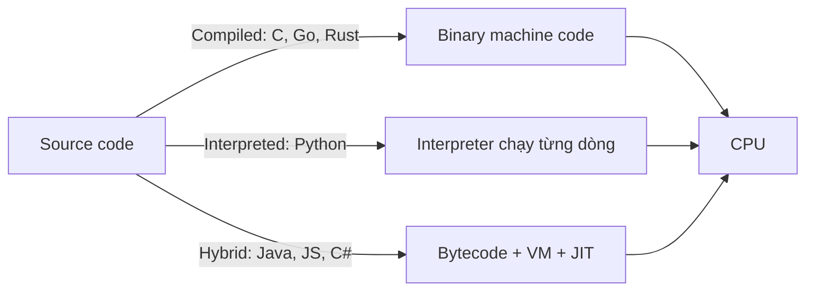

Bạn gõ `python app.py` và nhấn Enter. Nửa giây sau, chữ hiện lên màn hình. Chuyện xảy ra ở giữa khoảng đó là mental model hữu ích nhất của nghề software engineering — vì khi mọi thứ chậm đi, crash, hay chỉ "chạy trên máy em", câu trả lời gần như luôn nằm trong khoảng trống ấy.

Phần này xây model đó theo bốn lớp: cỗ máy, bộ nhớ, chương trình, và process.

## Bạn sẽ học được gì

- Nắm model 4 lớp về cách code thật sự chạy: máy, memory, dịch code, process.
- Giải thích vì sao truy cập RAM, disk, network chênh nhau hàng bậc độ lớn.
- Phân biệt I/O-bound với CPU-bound — phép phân biệt hiệu năng hữu ích nhất.
- Dùng `top`/`htop` xem model này sống động trên chính máy bạn.

**Cần biết trước:** Bài 1 (tấm bản đồ). Không cần nền tảng hệ thống — đây là tầng trệt.

## 1. Lớp 1 — Cỗ máy: một đầu bếp, mặt bàn, và nhà kho

Rút gọn máy tính còn ba phần:

- **CPU** — đầu bếp. Thực thi hàng tỷ instruction mỗi giây, nhưng mỗi core chỉ làm một việc một lúc.
- **RAM (memory)** — mặt bàn bếp. Với tay là tới, diện tích có hạn, mất điện là sạch trơn.
- **Disk** — nhà kho. Rộng mênh mông và lưu vĩnh viễn, nhưng mỗi chuyến đi kho lâu vô cùng so với với tay lên bàn.

Con số quan trọng hơn phép ví von. Bậc độ lớn xấp xỉ:

| Truy cập | Thời gian | Nếu 1 CPU cycle = 1 giây |
|---|---|---|
| CPU register | ~1 ns | vài giây |
| RAM | ~100 ns | ~2 phút |
| Đọc SSD | ~100 µs | ~1 ngày |
| Network call (cùng region) | ~1 ms | ~2 tuần |

Bảng này giải thích phần lớn công việc tối ưu bạn sẽ làm: **code nhanh nhất là code ở càng cao trên bảng càng tốt.** Vòng loop đọc từ RAM thắng vòng loop đọc từ disk; một network call gộp thắng một nghìn call lẻ. Khi senior nói "đây là N+1 query", họ đang đọc to bảng này lên.

## 2. Lớp 2 — Memory: stack và heap

Bộ nhớ chương trình có hai vùng làm việc:

- **Stack** — nhỏ, nhanh, tự quản lý. Chứa function call, biến local. Vào function → push một frame; return → pop ra. Đệ quy quá sâu → *stack overflow* (giờ bạn biết trang web kia lấy tên từ đâu).
- **Heap** — to, linh hoạt, quản lý thủ công hoặc bằng garbage collector. Chứa object, list, mọi thứ chưa biết trước kích thước hay vòng đời.

Vì sao phải quan tâm? Vì hai loại sự cố production phổ biến nhất đều là chuyện memory:

- **Leak:** object cứ bị giữ tham chiếu (một cache global, một listener quên gỡ) → heap phình mãi → process chậm dần rồi chết. Trên Linux, OOM killer của kernel chọn process của bạn mà xử — chính là dòng `OOMKilled` khét tiếng trong log container.
- **Khựng vì garbage collection:** ở ngôn ngữ có GC (Python, Java, Go, JS), phải có ai đó dọn heap. Khi nó chạy sai thời điểm, p99 latency của bạn vọt lên "không lý do". Lý do chính là bác lao công.

## 3. Lớp 3 — Từ source code đến instruction

CPU không hiểu Python hay Java. Phải có bộ phận phiên dịch:



- Ngôn ngữ **compiled** dịch hết từ trước → chạy nhanh, build chậm, binary theo từng platform.
- Ngôn ngữ **interpreted** vừa chạy vừa dịch → khởi động tức thì, loop chậm (mỗi dòng nộp thuế phiên dịch ở mỗi vòng lặp).
- **Hybrid**: compile ra bytecode, chạy trên virtual machine, và **JIT** (just-in-time compiler) biến các đoạn nóng thành machine code ngay khi đang chạy — vì thế service Java chậm phút đầu rồi nhanh hẳn lên.

Hệ quả thực dụng: một vòng loop tính toán thuần Python có thể chậm hơn 100 lần cùng vòng loop viết bằng C — và đó là lý do numpy (ruột là C đã compile) tồn tại. Bạn sẽ gặp lại điều này trong series AI: đoạn Python bạn viết chỉ là chiếc điều khiển từ xa mỏng đặt trên các kernel đã compile.

## 4. Lớp 4 — Process và thread

Chạy chương trình, OS bọc nó trong một **process**: không gian memory riêng, file handle riêng, cách ly với phần còn lại. Bên trong một process có thể có nhiều **thread**: các worker dùng chung memory.

- **Process cách ly nhau** — một cái crash, những cái khác sống. Nói chuyện giữa chúng thì tốn kém (pipe, socket, serialization).
- **Thread là bạn cùng phòng** — nói chuyện rẻ (memory chung), nhưng chia đồ nguy hiểm (hai thread cùng ghi một biến = race condition — Phần 8 dành trọn cho nỗi đau này).

Chỗ hiểu về scheduling giải thích câu "sao server chậm": máy 8 core chỉ *chạy* được 8 thread cùng lúc. Còn lại **xếp hàng chờ**. Nhưng đây mới là cú twist nuôi sống cả ngành backend hiện đại:

> Phần lớn việc của server là **chờ** — chờ database, chờ network, chờ disk. Thread đang chờ thì không cần core.

Đó là lý do một server Node.js đơn thread hay Python async tung hứng được hàng nghìn connection: chúng không bao giờ để core ngồi không trong lúc chờ I/O. Và cũng là lý do việc **nặng CPU** (parse, nén, ML inference) cần chiến lược ngược hẳn — thêm core, không phải thêm async.

Trước mọi hệ thống chậm, hỏi đúng một câu: **nó đang chờ (I/O-bound) hay đang tính (CPU-bound)?** Thuốc của bên này là độc của bên kia.

## 5. Debug bằng model này

Lần tới gặp thứ gì đó chậm, đi từng lớp:

1. `top` / `htop`: CPU 100%? → CPU-bound: profile vòng loop nóng. CPU rảnh mà vẫn chậm? → I/O-bound: tìm xem nó chờ cái gì.
2. Memory leo dốc đều? → leak. Hình răng cưa? → GC bình thường.
3. Hàng nghìn thread? → thuế context-switch. Một thread 100% trên máy 16 core? → nghẽn đơn thread.

Bốn phép kiểm, một mental model, xử được đa số sự cố.

## Thực hành (10 phút)

Xem 4 lớp sống động:

```bash
# 1. Mở góc nhìn cỗ máy
htop            # hoặc: top

# 2. Tạo một process CPU-bound và xem một core chạm 100%
python3 -c "while True: pass" &
# trong htop: tìm process python — CPU ~100%, state R (running)

# 3. Tạo một process I/O-bound và thấy sự khác biệt
python3 -c "import time; time.sleep(600)" &
# trong htop: CPU ~0%, state S (sleeping) — chờ không phải là làm

# 4. Dọn dẹp
kill %1 %2
```

Kết quả mong đợi: vòng lặp bận ghim một core ở 100% trong khi anh ngủ dùng ~0% — khác biệt nhìn-thấy-được giữa CPU-bound và I/O-bound, trên chính máy bạn.

## Tự kiểm tra

1. API của bạn tốn 90% thời gian request để chờ một query database. Nó CPU-bound hay I/O-bound, và mua CPU nhanh hơn có giúp không?
2. Đọc disk chậm hơn đọc RAM khoảng bao nhiêu? Vì sao khoảng cách đó định hình cách chương trình cache dữ liệu?
3. Trong `htop`, một process ở state S và CPU gần 0, nhưng người dùng kêu "chậm". Bạn điều tra lớp nào?

<details><summary>Xem đáp án</summary>

1. I/O-bound — CPU đang rảnh trong lúc chờ. CPU nhanh hơn gần như không đổi gì; query nhanh hơn (index!) hoặc ít round-trip hơn mới là cách sửa.
2. Hàng bậc độ lớn (~100.000× so với RAM cho đĩa quay; vẫn ~1.000× cho SSD). Khoảng cách đó là lý do chương trình giữ dữ liệu nóng trong cache RAM, và thiết kế "đọc disk mỗi lần" chết dưới tải.
3. Nó đang chờ một thứ gì đó — I/O: database, network, một cái lock. Điều tra thứ nó đang bị chặn (state S nghĩa là "ngủ tới khi có sự kiện"), không phải CPU.

</details>

## Điều cần nhớ

- Performance chủ yếu là chuyện **dữ liệu nằm ở đâu**: register → RAM → disk → network, mỗi bậc chậm hơn ~100–1000 lần.
- Sự cố memory có hai vị: leak (heap phình mãi → OOM) và GC pause (latency giật cục).
- Compiled vs interpreted vs JIT giải thích chênh lệch tốc độ giữa các ngôn ngữ — và lý do numpy/Spark tồn tại.
- Hỏi "đang chờ hay đang tính?" trước khi tối ưu bất cứ thứ gì: I/O-bound và CPU-bound có thuốc chữa ngược nhau.

*Tiếp theo — Phần 3: Data structures dùng cả sự nghiệp.*
