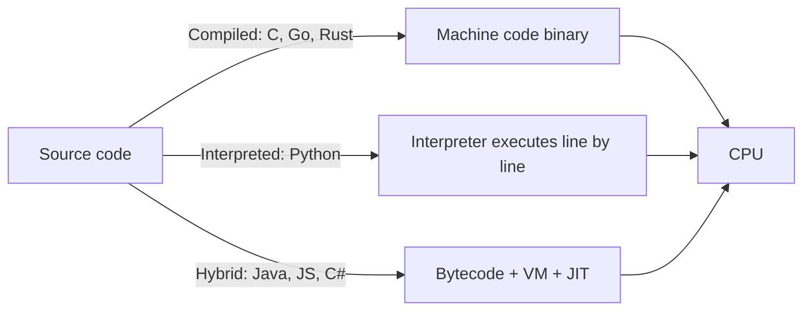

You type `python app.py` and press Enter. Half a second later, text appears on screen. What happened in between is the single most useful mental model in software engineering — because when things get slow, crash, or "work on my machine" only, the answer almost always lives in this gap.

This part builds that model in four layers: the machine, the memory, the program, and the process.

## What you'll learn

- Hold a four-layer model of how your code actually runs: machine, memory, translation, processes.
- Explain why RAM access, disk access, and network calls differ by orders of magnitude.
- Tell I/O-bound from CPU-bound — the single most useful performance distinction.
- Use `top`/`htop` to see the model live on your own machine.

**Prerequisites:** Part 1 (the map). No systems background needed — this is the ground floor.

## 1. Layer 1 — The machine: one chef, a counter, and a warehouse

Strip a computer to three parts:

- **CPU** — the chef. Executes billions of tiny instructions per second, but only one thing at a time per core.
- **RAM (memory)** — the kitchen counter. Fast to reach, limited in size, wiped clean when the power goes.
- **Disk** — the warehouse. Huge and permanent, but a trip there takes ages compared to the counter.

The numbers matter more than the metaphor. Rough orders of magnitude:

| Access | Time | If 1 CPU cycle = 1 second |
|---|---|---|
| CPU register | ~1 ns | seconds |
| RAM | ~100 ns | ~2 minutes |
| SSD read | ~100 µs | ~1 day |
| Network call (same region) | ~1 ms | ~2 weeks |

This table explains most performance work you will ever do: **the fastest code is the code that stays high on this table.** A loop that reads from RAM beats a loop that reads from disk; a batch of one network call beats a thousand small ones. When a senior says "that's an N+1 query problem", they are reading this table out loud.

## 2. Layer 2 — Memory: the stack and the heap

Your program's memory has two working areas:

- **The stack** — small, fast, automatically managed. Function calls, local variables. Enter a function → a frame is pushed; return → it's popped. Recurse too deep → *stack overflow* (now you know where the website got its name).
- **The heap** — big, flexible, manually or garbage-collector managed. Objects, lists, anything whose size or lifetime isn't known upfront.

Why care? Because two of the most common production incidents are memory stories:

- **The leak:** objects keep getting referenced (a global cache, a listener never removed) → the heap grows forever → the process slows, then dies. On Linux, the kernel's OOM killer picks your process and kills it — the infamous `OOMKilled` in container logs.
- **The garbage-collection pause:** in GC languages (Python, Java, Go, JS), someone has to clean the heap. When it runs at the wrong moment, your p99 latency spikes for "no reason". The reason is the janitor.

## 3. Layer 3 — From source code to instructions

The CPU doesn't understand Python or Java. Something has to translate:



- **Compiled** languages translate everything upfront → fast execution, slower build, binary per platform.
- **Interpreted** languages translate as they go → instant start, slower loops (every line pays translation tax on every pass).
- **Hybrid**: compile to bytecode, run on a virtual machine, and a **JIT** (just-in-time compiler) turns hot paths into machine code while running — which is why a Java service is slow for the first minute and fast after.

Practical consequence: a tight numeric loop in pure Python can be 100× slower than the same loop in C — and why numpy (whose insides are compiled C) exists at all. You will meet this again in the AI series: the Python you write is a thin remote control over compiled kernels.

## 4. Layer 4 — Processes and threads

Run your program and the OS wraps it in a **process**: its own memory space, its own file handles, isolated from everyone else. Inside a process you can have multiple **threads**: workers sharing the same memory.

- **Processes are isolated** — one crashes, others live. Communication between them costs (pipes, sockets, serialization).
- **Threads are roommates** — cheap to talk (shared memory), dangerous to share (two threads writing the same variable = race condition — Part 8 is entirely about this pain).

The scheduling insight that explains "why is my server slow": your 8-core machine can *run* only 8 threads at once. Everything else **waits in line**. But here is the twist that powers all of modern backend engineering:

> Most server work is **waiting** — for the database, for the network, for the disk. A thread that waits doesn't need a core.

That's why a single-threaded Node.js server or Python's async can juggle thousands of connections: they never let a core sit idle while waiting on I/O. And it's why **CPU-bound** work (parsing, compression, ML inference) needs a completely different strategy — more cores, not more async.

Ask this one question about any slow system: **is it waiting (I/O-bound) or computing (CPU-bound)?** The fix for one makes the other worse.

## 5. Debugging with this model

Next time something is slow, walk the layers:

1. `top` / `htop`: CPU at 100%? → CPU-bound: profile the hot loop. CPU idle but slow? → I/O-bound: find what it's waiting for.
2. Memory climbing steadily? → leak. Sawtooth pattern? → normal GC.
3. Thousands of threads? → context-switching tax. One thread at 100% on a 16-core box? → single-threaded bottleneck.

Four checks, one mental model, most incidents.

## Practice (10 minutes)

Watch the four layers live:

```bash
# 1. Open the machine view
htop            # or: top

# 2. Create a CPU-bound process and watch one core hit 100%
python3 -c "while True: pass" &
# in htop: find the python process — CPU ~100%, state R (running)

# 3. Create an I/O-bound process and see the difference
python3 -c "import time; time.sleep(600)" &
# in htop: CPU ~0%, state S (sleeping) — waiting is not working

# 4. Clean up
kill %1 %2
```

Expected result: the busy loop pins one core at 100% while the sleeper uses ~0% — the visible difference between CPU-bound and I/O-bound, on your own machine.

## Check yourself

1. Your API spends 90% of its request time waiting on a database query. Is it CPU-bound or I/O-bound, and does buying a faster CPU help?
2. Roughly how much slower is a disk read than a RAM read? Why does that shape how programs cache data?
3. In `htop`, a process shows state S and near-zero CPU, yet users say "it's slow". Which layer do you investigate?

<details><summary>See answers</summary>

1. I/O-bound — the CPU is idle while waiting. A faster CPU changes almost nothing; a faster query (index!) or fewer round-trips is the fix.
2. Orders of magnitude (~100,000× vs RAM for spinning disks; still ~1,000× for SSDs). That gap is why programs keep hot data in RAM caches and why "read it from disk every time" designs die under load.
3. It's waiting on something — I/O: the database, the network, a lock. Investigate what it's blocked on (the S state says "sleeping until an event"), not the CPU.

</details>

## Key takeaways

- Performance is mostly about **where your data lives**: register → RAM → disk → network, each step ~100–1000× slower.
- Memory incidents come in two flavors: leaks (heap grows forever → OOM) and GC pauses (latency spikes).
- Compiled vs interpreted vs JIT explains cross-language speed differences — and why numpy/Spark exist.
- Ask "waiting or computing?" before optimizing anything: I/O-bound and CPU-bound problems have opposite cures.

*Next up — Part 3: Data Structures You'll Use for the Rest of Your Career.*
