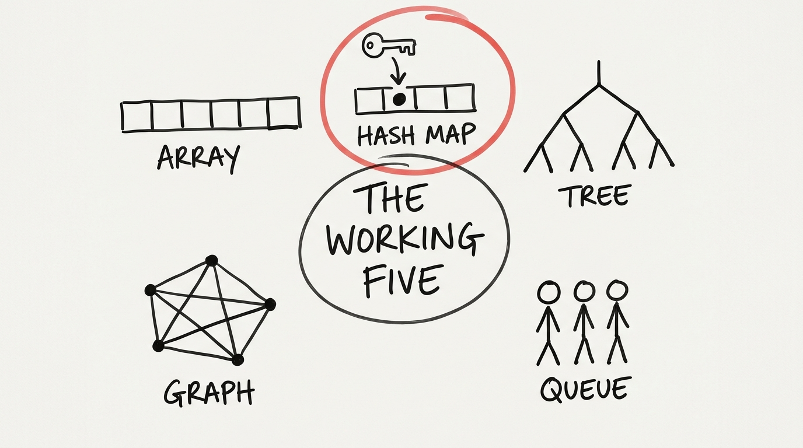

Giáo trình đại học dạy cả một sở thú cấu trúc dữ liệu — red-black tree, Fibonacci heap, skip list. Rồi bạn đi làm và phát hiện bộ đồ nghề thật sự chỉ có năm món: **array, hash map, tree, graph, queue**. Kỹ năng đáng giá không phải là tự cài chúng từ đầu; mà là **nhận ra bài toán của mình bí mật là cấu trúc nào** — và nhìn thấy chúng ẩn trong mọi tool bạn đang dùng.

## Bạn sẽ học được gì

- Ghép mỗi cấu trúc trong năm món với danh tính một dòng của nó — và với các tool nơi nó đang sống sẵn.
- Áp nước đi tối ưu đáng giá nhất: dựng hash index, rồi tra.
- Giải thích vì sao database index trả lời trong mili-giây (B-tree) và vì sao pipeline có vòng lặp không chạy được (topological sort).
- Dùng bảng nhận diện để gọi tên cấu trúc ẩn trong một bài toán rối.

**Cần biết trước:** Phần 2 (vì sao bố trí bộ nhớ và call stack quan trọng). Ví dụ bằng Python, nhưng chuyển sang ngôn ngữ nào cũng được.

## 1. Array / list — "mọi thứ xếp thành hàng"

Bộ nhớ liền mạch, truy cập theo vị trí tức thì (`arr[i]` là O(1)), duyệt từ đầu tới cuối rất rẻ — mà sau Phần 2, bạn biết điều đó còn có nghĩa là thân thiện với CPU cache.

Một hành vi đáng khắc cốt: **chèn vào cuối = rẻ; chèn vào giữa = đắt** (mọi thứ phía sau phải xê dịch). Một list triệu phần tử mà phải chèn giữa liên tục là chọn sai cấu trúc — cơn đau đó đang bảo bạn với sang chỗ khác.

Bạn đang dùng nó ở đâu: mọi `list` Python, mọi cột pandas, mọi file Parquet (columnar = mỗi cột một array — chính là lý do analytics trên Parquet nhanh).

## 2. Hash map — "mọi thứ gọi theo tên"

Cấu trúc hữu ích nhất của nghề lập trình. Key → hash function → ngăn chứa. Tra, thêm, xoá: O(1) trung bình.

```python
seen = set()          # một hash map mặc áo hoá trang
for row in rows:
    if row.id in seen:   # O(1) — triệu dòng, triệu lần kiểm tra rẻ
        continue
    seen.add(row.id)
```

Cú nâng cấp kinh điển nó mang lại — biến O(n²) thành O(n):

```python
# Chậm: với mỗi order, quét toàn bộ customers  → O(n·m)
# Nhanh: đánh index customers theo id một lần, rồi tra  → O(n + m)
by_id = {c.id: c for c in customers}
for o in orders:
    o.customer = by_id.get(o.customer_id)
```

Pattern đó — **dựng index, rồi tra** — là một nửa của mọi bài tối ưu thực dụng. Nó cũng chính là việc database làm khi hash-join hai bảng, chính là `dict`/`set` của Python, chính là Redis (một hash map có cắm dây mạng), và chính là broadcast join của Spark trên cluster.

Hai cái giá cần nhớ: không có thứ tự nghĩa lý gì, và tất cả sống trong RAM.

## 3. Tree — "phân cấp, hoặc giữ thứ tự"

Tree xuất hiện trong hai bộ áo:

- **Phân cấp:** file system, tài liệu JSON, HTML DOM, sơ đồ tổ chức. Duyệt chúng là sân nhà của đệ quy (và là nơi stack overflow của Phần 2 trú ngụ nếu bạn quên base case).
- **Thứ tự ở quy mô lớn — B-tree:** lý do `WHERE id = 42` trên một tỷ dòng trả về trong vài mili-giây. Một cái cây bè và nông, mỗi node chứa nhiều key đã sắp xếp: vài bước nhảy từ gốc xuống lá thay vì quét cả bảng. **Mọi database index bạn từng tạo đều là một cái cây như thế.**

B-tree cũng giải thích các hành vi index bạn từng gặp: range query nhanh (các lá nối nhau theo thứ tự — cứ đi dọc dải băng), và composite index trên `(a, b)` không phục vụ được query chỉ lọc `b` — cây được sắp theo `a` trước. Đó không phải mẹo vặt database; đó là cấu trúc dữ liệu lộ hình.

## 4. Graph — "mọi thứ trỏ vào nhau"

Node + edge: mạng xã hội, dependency giữa service, DAG Airflow, foreign key giữa các bảng, lineage trong data catalog.

Là engineer thực chiến, bạn cần đúng hai thuật toán:

- **Traversal (BFS/DFS):** "từ đây với tới được những gì?" — phân tích ảnh hưởng ("bảng này hỏng thì dashboard nào chết?"), crawl, tìm cụm liên thông.
- **Topological sort:** "phải chạy theo thứ tự nào?" — cách mọi orchestrator (Airflow, dbt, Make) xếp lịch một DAG, và lý do một **vòng lặp** (A cần B cần A) là án tử tức thì cho định nghĩa pipeline: không tồn tại thứ tự hợp lệ.

Nếu model được một bài toán rối thành graph, bạn thường khỏi phải phát minh thuật toán — một trong hai món trên đã giải sẵn.

## 5. Queue — "mọi thứ xếp hàng"

FIFO: bên sản xuất nối vào đuôi, bên tiêu thụ lấy từ đầu. Cấu trúc của sự **tách rời**: hai bên không còn phải chạy cùng tốc độ hay cùng thời điểm.

Một ý tưởng, ba kích cỡ:

| Quy mô | Hoá thân |
|---|---|
| Trong một process | `collections.deque`, frontier của BFS |
| Giữa các process | task queue (Celery, background job) |
| Giữa các hệ thống | Kafka, SQS — queue được làm bền và phân tán |

Khi Phần 10 của DE Roadmap nói "Kafka là một cái log", mental model của bạn bắt đầu từ đây: một queue mà nhiều consumer đọc theo nhịp riêng của mình. (Hai người anh em đáng biết tên: **stack** — LIFO, lịch sử undo, call stack — và **priority queue** — "khẩn nhất trước", scheduler và bài toán top-K.)

## 6. Bảng nhận diện

| Bạn bắt gặp mình nói… | Với tới |
|---|---|
| "với mỗi X, tìm Y của nó" | Hash map (dựng index, rồi tra) |
| "cái này trùng không?" | Hash set |
| "tra theo khoảng / giữ thứ tự" | Tree (hoặc DB index — cùng một thứ) |
| "mấy thứ này phụ thuộc nhau" | Graph + topo sort |
| "sản xuất nhanh hơn tiêu thụ" | Queue |
| "cứ duyệt hết một lượt" | Array — và thế là ổn |

## Thực hành (20 phút — một file, không thư viện)

Sinh dataset giả và cảm nhận hai cấu trúc kiếm cơm thế nào:

```python
import random, time
customers = [{"id": i, "name": f"c{i}"} for i in range(20_000)]
orders = [{"id": i, "customer_id": random.randrange(20_000)} for i in range(20_000)]

# 1. Cách chậm — tìm kiếm trong vòng loop
t = time.perf_counter()
slow = [next(c for c in customers if c["id"] == o["customer_id"]) for o in orders]
print("nested loop:", round(time.perf_counter() - t, 2), "s")

# 2. Cách hash-index
t = time.perf_counter()
by_id = {c["id"]: c for c in customers}
fast = [by_id[o["customer_id"]] for o in orders]
print("hash index:", round(time.perf_counter() - t, 4), "s")

# 3. Topological sort trong 10 dòng — xếp thứ tự các bước pipeline:
deps = {"report": {"clean"}, "clean": {"extract"}, "dashboard": {"report"}, "extract": set()}
order, done = [], set()
while len(order) < len(deps):
    ready = [k for k, v in deps.items() if v <= done and k not in done]
    if not ready: raise SystemExit("cycle!")   # thử thêm: deps["extract"] = {"dashboard"}
    order += ready; done |= set(ready)
print("run order:", order)
```

Kết quả mong đợi: nested loop tốn vài giây; hash index tốn vài mili-giây — nước đi O(n²) → O(n), cảm nhận trên chính máy bạn. Bước 3 in ra một thứ tự chạy hợp lệ; thêm vòng lặp gợi ý vào và nó chết với `cycle!` — chính xác lý do Airflow từ chối DAG có vòng.

## Tự kiểm tra

1. Report của bạn join orders với customers bằng loop lồng loop và tốn nhiều phút. Nước đi sửa một phát là gì, và tool nào làm đúng việc đó ở quy mô database?
2. Composite index trên `(country, city)` không tăng tốc `WHERE city = 'Hanoi'`. Cấu trúc nào giải thích vì sao?
3. Định nghĩa pipeline của đồng đội fail với "cycle detected." Về mặt cấu trúc nghĩa là gì, và vì sao không có cách sửa nào ngoài phá vòng?

<details><summary>Xem đáp án</summary>

1. Dựng hash index một lần (`{id: customer}`), rồi tra theo từng order — O(n·m) thành O(n+m). Hash join của database làm chính xác nước đi này khi join hai bảng.
2. B-tree: nó sắp theo `country` trước, `city` sau. Các key cùng city rải rác khắp mọi country, nên cây không thu hẹp được phạm vi tìm — cấu trúc, chứ không phải database, đặt ra luật này.
3. Graph phụ thuộc có vòng (A cần B cần A), nên không tồn tại thứ tự topo — nghĩa đen là không có chuỗi nào để mọi bước chạy sau dependency của nó. Không phải bài toán tuning; bản thân định nghĩa tự mâu thuẫn.

</details>

## Điều cần nhớ

- Năm cấu trúc phủ cả sự nghiệp: array (hàng), hash map (theo tên), tree (phân cấp/thứ tự), graph (phụ thuộc), queue (xếp hàng).
- Cú thắng thực dụng lớn nhất là một nước đi: thay "tìm kiếm trong vòng loop" bằng "dựng hash index, rồi tra" — O(n²) → O(n).
- Database index là B-tree; orchestrator là graph + topological sort; Kafka là queue bền. Tool chính là cấu trúc, phóng to lên.
- Kỹ năng = nhận ra bài toán của mình bí mật là cấu trúc nào. Bảng ở trên là toàn bộ bí kíp.

*Tiếp theo — Phần 4: Big-O là tư duy, không phải mẹo phỏng vấn.*
